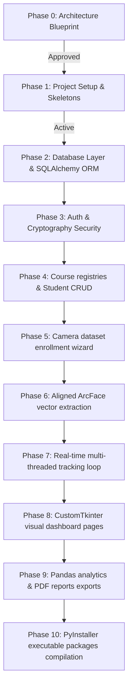

# AI-Powered Face Recognition Attendance System

[](https://www.python.org/)
[](https://opensource.org/licenses/MIT)
[](https://github.com/psf/black)
[](https://github.com/astral-sh/ruff)

An enterprise-grade, contactless, AI-powered desktop attendance tracking system using **Python 3.12+**, **InsightFace** neural networks, **SQLAlchemy**, and **CustomTkinter**.

---

## 📸 System Previews
> *[Screenshots and Dashboard Previews Placeholder]*
> *This section will be populated with interface screenshots in subsequent phases of UI development.*

---

## 📖 Project Overview
Traditional attendance recording systems (manual rolls, card swipes, barcodes) suffer from buddy punching (proxy logs), physical hardware wears, and significant timing overhead. 

This repository implements a **decoupled, multi-threaded facial tracking terminal** designed for schools, universities, training institutes, and modern workspaces. Utilizing RetinaFace for alignment and ArcFace feature extraction, the system automatically checks in students in real time as they walk past the camera feed, ignoring duplicate matches and logging transaction audits.

---

## ⚡ Core Features (Planned)
*   **Asynchronous Processing**: Camera reading and face inference run on background threads keeping visual updates at a smooth 30+ FPS.
*   **Decoupled Strategy**: Core AI extraction adapters (`IFaceEngine`) are decoupled from databases and GUI widgets using Dependency Inversion.
*   **Database Portability**: Runs locally on a serverless SQLite file for developers, and supports remote PostgreSQL setups for enterprise multi-camera deployments.
*   **Analytics Reports**: Built-in Pandas summaries calculating monthly metrics, outputting reports as styled Excel files and formatted PDFs.
*   **Enterprise Security**: Implements bcrypt credentials hashing, SQL injection parameterized queries, and GDPR biometric data policies.

---

## 🛠️ Technology Stack
*   **Language**: Python 3.12+
*   **Computer Vision**: OpenCV (`opencv-python`)
*   **Face Recognition Inference**: InsightFace (ArcFace model weights loaded on ONNX Runtime)
*   **Graphical Interface**: CustomTkinter
*   **Database Management**: SQLite (development) / PostgreSQL (production) with SQLAlchemy ORM
*   **Testing Suite**: pytest (unit & repository integration coverage)
*   **Formatters & Linters**: Black, Ruff, mypy (strict type annotations)

---

## 📂 Repository Folder Structure

The project foundation is configured using a clean-package directory structure:

```text
Face-Recognition-Attendance-System/
├── docs/                      # Architectural designs and guides
├── configs/                   # Production configuration templates
├── database/                  # SQLite storage, backups, and dataset crops
├── logs/                      # System diagnostic logs & audit trails
├── models/                    # AI ONNX model files directory
├── requirements/              # Segmented dependency listings
├── scripts/                   # Workspace installer automation scripts
├── src/                       # Source code root
│   ├── main.py                # Main bootstrap script
│   ├── core/                  # Configurations, constants & models
│   ├── gui/                   # CustomTkinter widgets & view panels
│   ├── controllers/           # UI State handlers & event routers
│   ├── services/              # Pure domain logic coordinates
│   └── utils/                 # Multi-threading managers
├── tests/                     # Test suites (PyTest conftests)
├── pyproject.toml             # Ruff, Black, mypy, pytest configs
├── requirements.txt           # Master runtime dependencies installer
└── Makefile                   # Automation shortcut commands
```

---

## 🗺️ Development Roadmap



Detailed phase details, dependencies, complexity limits, and success metrics are documented in the [Development Roadmap Guide](file:///c:/GitHub/Attendence-System-Uning-Face-Recognition/docs/Roadmap.md).

---

## 📚 Technical Documentation Directory

For deep architectural insights, review the documentation files under the `docs/` workspace folder:

*   **[Introduction & Limitations](file:///c:/GitHub/Attendence-System-Uning-Face-Recognition/docs/Introduction.md)**: Goals, benefits, and lighting thresholds limits.
*   **[Functional & Non-Functional Requirements](file:///c:/GitHub/Attendence-System-Uning-Face-Recognition/docs/Requirements.md)**: Response latencies, security benchmarks, and capacity scopes.
*   **[Software Architecture Layout](file:///c:/GitHub/Attendence-System-Uning-Face-Recognition/docs/Architecture.md)**: Layer descriptions, dependencies boundaries, and queues managers.
*   **[Development Environment Setup](file:///c:/GitHub/Attendence-System-Uning-Face-Recognition/docs/DEVELOPMENT_SETUP.md)**: Virtual environment configurations, path setups, and folder creations.
*   **[Database Schema & ER Model](file:///c:/GitHub/Attendence-System-Uning-Face-Recognition/docs/DatabaseDesign.md)**: 3NF tables definitions, column types, foreign key constraints, and relational maps.
*   **[Application Workflow](file:///c:/GitHub/Attendence-System-Uning-Face-Recognition/docs/Workflow.md)**: Process chart mapping boots to reports exports.
*   **[Biometric Pipeline & UI Layouts](file:///c:/GitHub/Attendence-System-Uning-Face-Recognition/docs/SystemDesign.md)**: 7-stage recognition mechanics (detection, alignment, matching, cooldown) and frame mockups.
*   **[Git Workflow & Commit Rules](file:///c:/GitHub/Attendence-System-Uning-Face-Recognition/docs/GIT_WORKFLOW.md)**: Conventions, tags, and pull request rules.
*   **[Contributing Guide](file:///c:/GitHub/Attendence-System-Uning-Face-Recognition/docs/CONTRIBUTING.md)**: Submission guidelines for open-source contributors.
*   **[Coding Standards](file:///c:/GitHub/Attendence-System-Uning-Face-Recognition/docs/CodingStandards.md)**: PEP 8, PEP 257 docstrings, type hinting, and naming conventions.

---

## 🚀 Workspace Installation (Placeholder)
> *Installation instructions and model download scripts will be added in subsequent phases once logic is implemented.*

---

## 🤝 Contributing
Contributions are welcome! Please read the [Contributing Guide](file:///c:/GitHub/Attendence-System-Uning-Face-Recognition/docs/CONTRIBUTING.md) and the [Git Workflow Guide](file:///c:/GitHub/Attendence-System-Uning-Face-Recognition/docs/GIT_WORKFLOW.md) before submitting Pull Requests.

---

## 📄 License
This project is licensed under the MIT License - see the [LICENSE](file:///c:/GitHub/Attendence-System-Uning-Face-Recognition/LICENSE) file for details.
