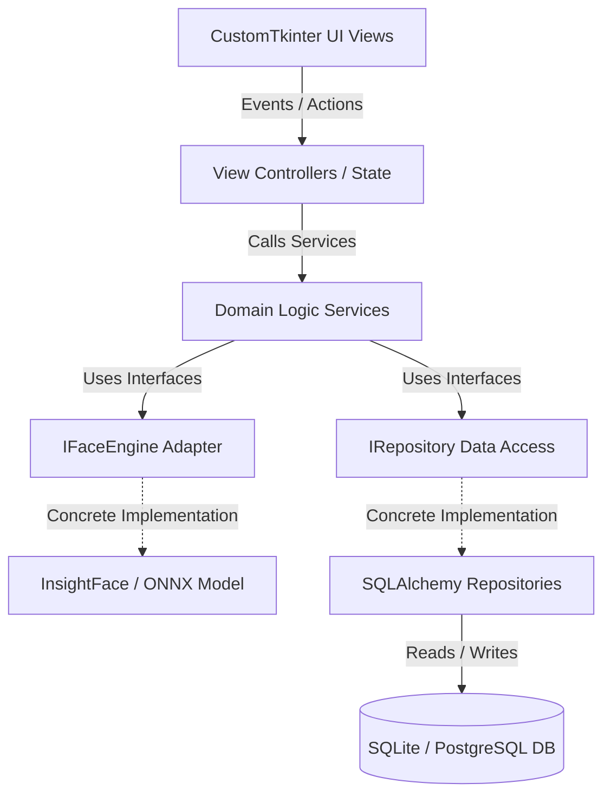

# Face Recognition Attendance System - Architecture Summary

This document summarizes the architectural design decisions and components of the Face Recognition Attendance System.

---

## 1. Architectural Philosophy

The application utilizes **Clean Architecture** patterns. The system is split into distinct logical boundaries, ensuring that changes to low-level details (e.g., database tools or facial models) do not affect core business rules.



### 1.1 Key Layers
- **Presentation Layer (`src/gui/`)**: Builds the desktop interface. It maps frames, canvas drawings, forms, and alerts. It does not calculate mathematical thresholds or write records directly.
- **Controller/Orchestrator Layer (`src/controllers/`)**: Manages UI state changes and routes visual events to underlying services.
- **Service Layer (`src/services/`)**: Enforces validation logic, logs actions, calculates dates and attendance statuses, and manages cooldown timers.
- **Data Access Layer (`src/repositories/` & `src/database/`)**: Manages connection strings, configures tables, and executes SQL queries through repository patterns.
- **Core Engine Layer (`src/core/recognition/`)**: Encapsulates camera capture workers and InsightFace vector extractions.

---

## 2. Decoupling & Interface Segregation (SOLID)

To support unit testing, components are decoupled using **Dependency Inversion**:
- The `StudentService` does not instantiate an `InsightFace` object directly. Instead, it accepts an implementation matching the `IFaceEngine` interface via dependency injection:
  ```python
  class StudentService(IStudentService):
      def __init__(self, face_engine: IFaceEngine, student_repo: IStudentRepository):
          self.face_engine = face_engine
          self.student_repo = student_repo
  ```
- This allows test suites to inject mock objects, verifying student registrations without opening camera frames or loading deep-learning weights.

---

## 3. Multithreaded Process Flow

To prevent GUI lag, execution tasks are delegated across three independent threads:
1. **Main UI Thread**: Coordinates CustomTkinter rendering. Reads from a thread-safe update queue to display names and green boxes.
2. **Camera Frame Reader Thread**: Reads raw frames from the device buffer at 33ms intervals, saving them in a frame queue.
3. **AI Inference Thread**: Fetches frames from the frame queue, runs face detection and vector matching, and pushes matching names into the update queue.
