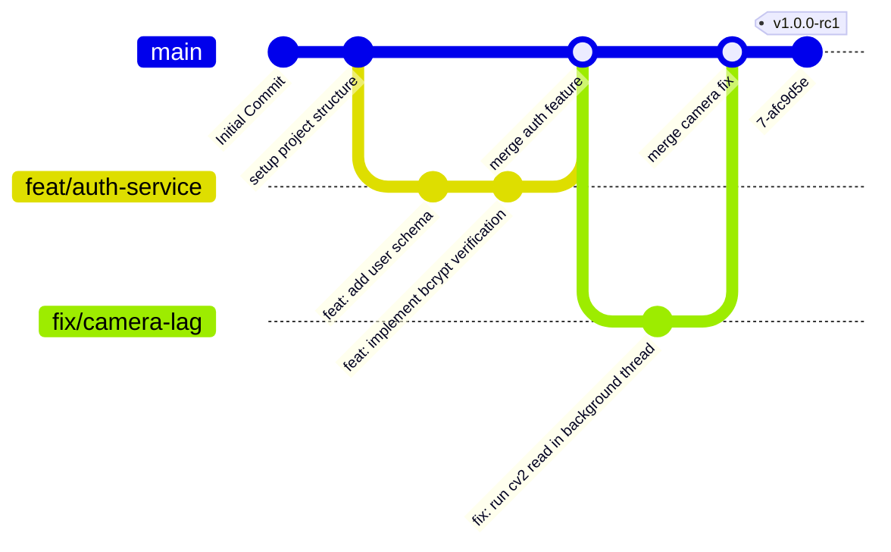

# Face Recognition Attendance System - Coding Standards

This document establishes the code quality guidelines, style guides, and version control procedures for the project. Adhering to these standards ensures the codebase remains maintainable, readable, and professional.

---

## 1. Code Style & Formats

The project conforms strictly to the **PEP 8** style guide for Python code and **PEP 257** for docstring conventions.

### 1.1 Naming Conventions
We follow Pythonic casing conventions across all modules:

| Code Element | Naming Case | Example | Description |
| :--- | :--- | :--- | :--- |
| **Packages / Modules** | `lowercase` | `src.core.face_engine` | Keep names short; avoid underscores if possible. |
| **Classes** | `PascalCase` | `StudentRepository` | Capitalize first letters; avoid abbreviations. |
| **Functions / Methods** | `snake_case` | `verify_and_log()` | Verb-based descriptive names. |
| **Variables / Arguments** | `snake_case` | `student_code` | Self-documenting nouns. |
| **Constants** | `UPPERCASE_SNAKE` | `MATCH_THRESHOLD` | Placed at module level or inside configurations. |
| **Interfaces (ABCs)** | `PascalCase` with `I` | `IFaceEngine` | Prefixed with `I` to denote abstract base interfaces. |

### 1.2 Type Hinting
All function signatures must define input and output type hints. This enables linting tools (such as `mypy`) to catch type errors before execution:
```python
# Standard Type Hinting Example
def calculate_similarity(vector_a: np.ndarray, vector_b: np.ndarray) -> float:
    """
    Computes dot-product similarity between two normalized embeddings.
    """
    return float(np.dot(vector_a, vector_b))
```

### 1.3 Docstrings
Every class, public method, and module must contain a triple-quoted docstring describing its responsibility, parameters, and return types:
```python
class StudentRepository(BaseRepository):
    """
    Concrete SQL implementation handling data operations for Student entities.
    """

    def get_by_code(self, student_code: str) -> Optional[Student]:
        """
        Retrieves a student record matching the unique code.

        :param student_code: Unique text identifier of the student.
        :return: Student ORM entity if found, None otherwise.
        """
        pass
```

---

## 2. Git Conventions

We follow the **Conventional Commits 1.0.0** specification for formatting commit logs. This supports automated changelog generation and maintains a clean commit history.

### 2.1 Commit Message Format
```text
<type>(<scope>): <description>

[optional body]

[optional footer(s)]
```

### 2.2 Allowed Commit Types (`<type>`)
- `feat`: A new user-facing feature (e.g., `feat(ui): add visual dashboard charts`).
- `fix`: A bug fix (e.g., `fix(cv): resolve camera frame lock issue`).
- `docs`: Documentation updates only (e.g., `docs(db): update ER diagram`).
- `style`: Code formatting changes (whitespace, semi-colons) that do not affect compilation.
- `refactor`: Code changes that neither fix a bug nor add a feature.
- `test`: Adding missing tests or correcting existing tests.
- `chore`: Updates to build scripts, configurations, or dependencies.

### 2.3 Example Commits
```text
feat(cv): integrate ONNX-backed InsightFace inference

Configured dynamic DLL search paths and loaded RetinaFace model using ONNX runtime.
Closes #12
```

---

## 3. Branching & Merging Strategy

The repository follows a **Trunk-Based Development** model with short-lived feature branches, facilitating continuous integration (CI).



- **Protected Branch**: The `main` branch is protected. Direct pushes are disabled.
- **Pull Requests (PRs)**: All additions are developed on dedicated branches (`feat/feature-name` or `fix/bug-name`) and merged into `main` via Pull Requests.
- **CI Pipelines**: Every PR triggers GitHub Actions workflows to:
  1. Check code formatting using `black` and `flake8`.
  2. Run the test suite via `pytest`.
  3. Enforce that all tests pass before allowing a merge.
