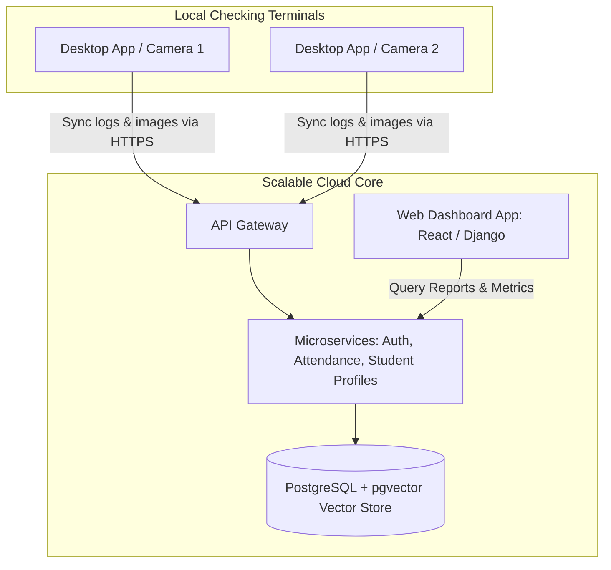
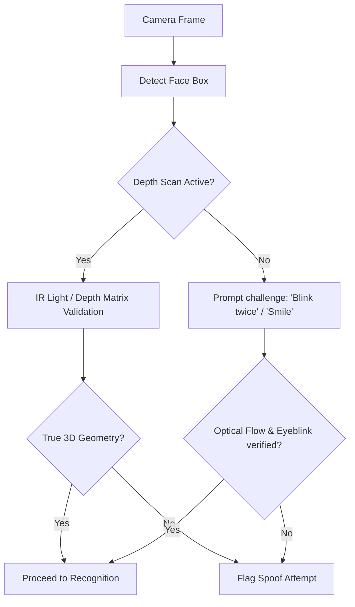

# Face Recognition Attendance System - Future Scope

This document outlines the long-term vision and technical scalability pathways for the Face Recognition Attendance System. It details how the core system can expand from a local desktop tool to an enterprise-wide ecosystem.

---

## 1. Enterprise Integration & Cloud Scaling

### 1.1 Cloud Sync & Centralized Vector Storage
- **Architecture**: Move from a local database to a cloud-based relational database (e.g., AWS RDS PostgreSQL) utilizing the **`pgvector`** extension.
- **Biometric Matching at Scale**: Instead of local comparison, face vectors extracted by local edge clients are pushed to a centralized API. The backend database performs rapid nearest-neighbor vector scans using Hierarchical Navigable Small World (HNSW) indexing to match identities across thousands of students in milliseconds.

### 1.2 Web-Based Portals (SaaS Architecture)
Migrate student registration and administrative dashboards to web portals (e.g., Next.js frontend + FastAPI backend):
- **Teacher Portal**: Allows professors to view live dashboards from their own laptops, mark class sessions active, register schedule exceptions, and review attendance alerts.
- **Student Portal**: Allows students to log in securely, view their personal attendance percentages, apply for excused absences, upload medical certificates, and update their profile photos (triggering vector regenerations).

---

## 2. Advanced Hardware & Sensor Integrations

### 2.1 Multi-Camera Networks & Edge Processing
- **Distributed Camera Networks**: Connect multiple IP cameras positioned at different building entrances to a single local server running an asynchronous processing pool.
- **Edge Deployment**: Package the core detection/embedding pipeline to run on small, low-power edge accelerators (such as the NVIDIA Jetson Orin Nano). These edge devices perform face detection and vector extraction locally, sending only the 512-byte float vector to the central server, minimizing network bandwidth usage.

### 2.2 Hybrid Credentials (MFA)
Enhance matching speeds and security using Multi-Factor Authentication:
- **RFID Swipes**: Students swipe their RFID cards first. The system fetches their specific face embedding from the database and compares it *only* to the face currently in front of the camera. This reduces search time from $O(N)$ (where $N$ is all students) to $O(1)$ (1-to-1 verification), eliminating false matches.
- **QR Codes**: Students scan a dynamic QR code generated on their mobile phones to check in, combined with the camera scan.

---

## 3. High-Security Face Anti-Spoofing (Liveness)

To prevent spoofing attempts, future releases will integrate two layers of liveness validation:

1. **Hardware-Based Anti-Spoofing**: Interface with depth-sensing cameras (e.g., Intel RealSense) or infrared (IR) sensors to analyze the 3D geometry of the object, ensuring it is a human head and not a flat piece of paper or mobile screen.
2. **Software-Based Anti-Spoofing**: Implement optical flow monitoring and texture classification networks (e.g., MiniFASNet) to evaluate micro-movements, eye blinks, and surface light reflection values in real time.

---

## 4. AI-Driven Attendance Analytics
- **Absenteeism Prediction**: Run predictive models (e.g., XGBoost, Random Forests) analyzing historic attendance patterns, course schedules, and seasons to predict students at risk of dropping out or failing courses due to low attendance.
- **Schedule Optimization**: Analyze attendance rates across different times of the day to help administration optimize course schedules, moving historically low-attendance subjects to better time slots.
