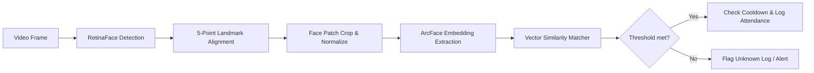
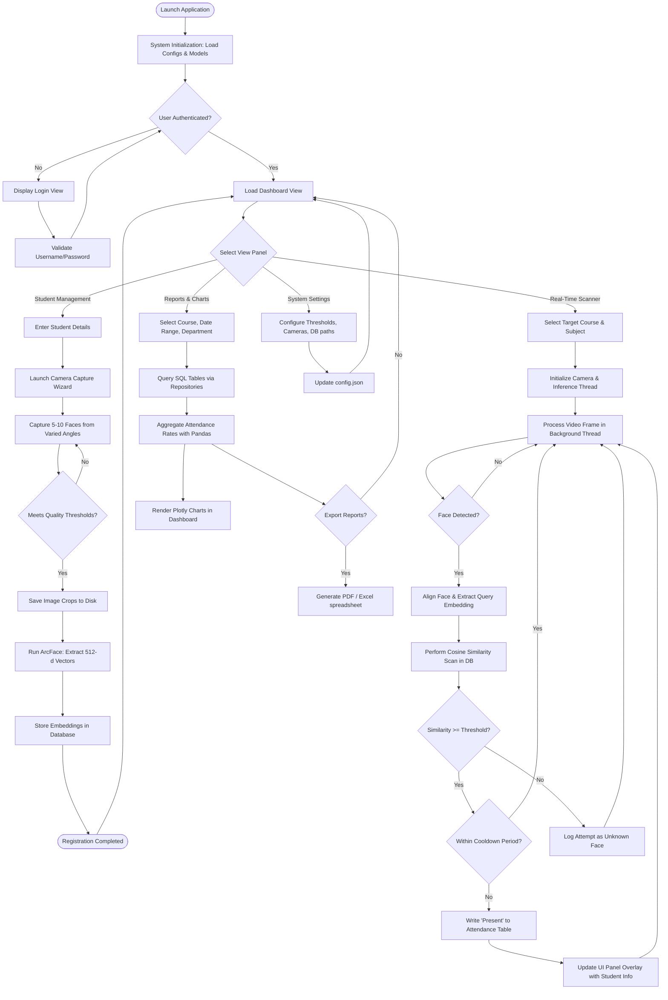
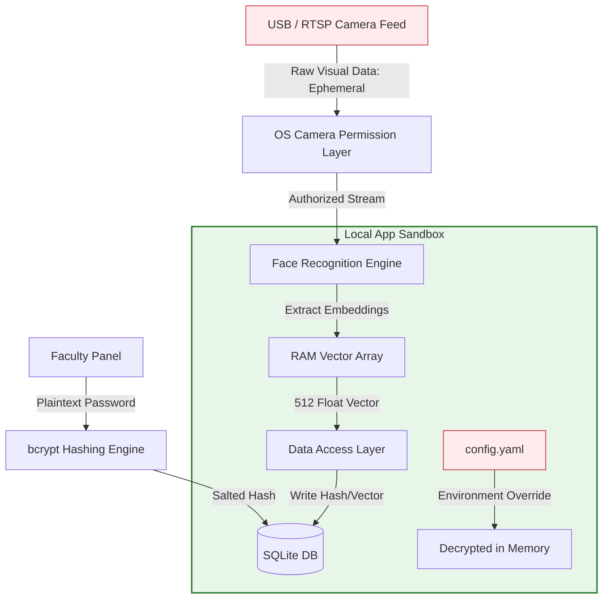

# Face Recognition Attendance System - System Diagrams Index

This document provides a single-point compilation of all system diagrams created for the Face Recognition Attendance System. Developers, project managers, and contributors can copy these definitions to generate updated visuals or documentation assets.

---

## 1. System Architecture Layout
- **Source Document**: [Architecture.md](file:///c:/GitHub/Attendence-System-Uning-Face-Recognition/docs/Architecture.md)
- **Description**: Displays the structural boundaries, layer separation (Presentation, Services, Core, Data Access, Storage), and directional dependencies.

```mermaid
graph TD
    %% Layer definitions
    subgraph Presentation_Layer [Presentation Layer GUI]
        UI[CustomTkinter Main Application]
        VC[View Controllers / State Managers]
        CAM_P[Camera Preview Widget]
        DASH_W[Dashboard & Report Widgets]
    end

    subgraph Service_Layer [Business Logic & Service Layer]
        AUTH_S[Authentication Service]
        STUD_S[Student & Dataset Service]
        ATT_S[Attendance Processing Service]
        REP_S[Report & Analytics Service]
    end

    subgraph Core_Engine [Face Recognition Engine]
        FE_INT[IFaceEngine Interface]
        IFE_IMP[InsightFace Engine Implementation]
        ONNX[ONNX Runtime / CUDA Inference]
    end

    subgraph Data_Access [Data Access Layer ORM]
        REPO[Repository Pattern API]
        SQLA[SQLAlchemy Session Manager]
    end

    subgraph Storage_Layer [Storage Layer]
        DB[(SQLite / PostgreSQL Database)]
        DS[Disk Storage - Raw Dataset Images]
    end

    subgraph Cross_Cutting [Infrastructure & Cross-Cutting Concerns]
        CONF[Configuration Manager]
        LOG[Logging System File/Console]
        TH_M[Threading / Worker Queue Manager]
    end

    %% Dependency Connections
    UI --> VC
    VC --> CAM_P
    VC --> DASH_W
    
    %% Presentation calls Service
    VC --> AUTH_S
    VC --> STUD_S
    VC --> ATT_S
    VC --> REP_S

    %% Service Layer dependencies
    STUD_S --> FE_INT
    ATT_S --> FE_INT
    FE_INT <|-- IFE_IMP
    IFE_IMP --> ONNX

    %% Service calls Repositories
    STUD_S --> REPO
    ATT_S --> REPO
    AUTH_S --> REPO
    REP_S --> REPO

    %% Repo interacts with Database
    REPO --> SQLA
    SQLA --> DB
    STUD_S --> DS

    %% Cross-cutting usages
    VC -.-> TH_M
    STUD_S -.-> CONF
    FE_INT -.-> CONF
    REPO -.-> CONF
    
    classDef layer fill:#f9f9f9,stroke:#333,stroke-width:2px;
    classDef component fill:#e1f5fe,stroke:#0288d1,stroke-width:1px;
    class Presentation_Layer,Service_Layer,Core_Engine,Data_Access,Storage_Layer,Cross_Cutting layer;
    class UI,VC,CAM_P,DASH_W,AUTH_S,STUD_S,ATT_S,REP_S,FE_INT,IFE_IMP,ONNX,REPO,SQLA,DB,DS,CONF,LOG,TH_M component;
```

---

## 2. Entity-Relationship (ER) Schema
- **Source Document**: [DatabaseDesign.md](file:///c:/GitHub/Attendence-System-Uning-Face-Recognition/docs/DatabaseDesign.md)
- **Description**: Defines database structure, foreign keys, cardinality connections, and indices.

```mermaid
erDiagram
    DEPARTMENTS ||--o{ COURSES : "contains"
    DEPARTMENTS ||--o{ FACULTY : "employs"
    COURSES ||--o{ STUDENTS : "enrolls"
    COURSES ||--o{ SUBJECTS : "teaches"
    FACULTY ||--o{ SUBJECTS : "teaches"
    
    USERS }|--|| ROLES : "has"
    ROLES ||--o{ ROLE_PERMISSIONS : "defines"
    PERMISSIONS ||--o{ ROLE_PERMISSIONS : "assigned_to"
    USERS ||--o| FACULTY : "links_to"

    STUDENTS ||--o{ FACE_EMBEDDINGS : "has"
    STUDENTS ||--o{ ATTENDANCE : "marked_for"
    STUDENTS ||--o{ ATTENDANCE_LOGS : "triggered"
    SUBJECTS ||--o{ ATTENDANCE : "logged_under"
    USERS ||--o{ ATTENDANCE : "marked_by"

    DEPARTMENTS {
        int id PK
        string name
        string code UNIQUE
    }

    COURSES {
        int id PK
        string name
        string code UNIQUE
        int department_id FK
    }

    SUBJECTS {
        int id PK
        string name
        string code UNIQUE
        int course_id FK
        int faculty_id FK
    }

    ROLES {
        int id PK
        string name UNIQUE
        string description
    }

    PERMISSIONS {
        int id PK
        string name UNIQUE
        string description
    }

    ROLE_PERMISSIONS {
        int role_id PK, FK
        int permission_id PK, FK
    }

    USERS {
        int id PK
        string username UNIQUE
        string password_hash
        string email UNIQUE
        int role_id FK
        boolean is_active
    }

    FACULTY {
        int id PK
        int user_id FK
        string employee_code UNIQUE
        string first_name
        string last_name
        int department_id FK
    }

    STUDENTS {
        int id PK
        string student_code UNIQUE
        string first_name
        string last_name
        int department_id FK
        int course_id FK
        boolean is_active
    }

    FACE_EMBEDDINGS {
        int id PK
        int student_id FK
        blob embedding_blob
        string file_path
        datetime created_at
    }

    ATTENDANCE {
        int id PK
        int student_id FK
        int subject_id FK
        date date
        time time_in
        string status
        int marked_by_user_id FK
    }

    ATTENDANCE_LOGS {
        int id PK
        int student_id FK
        float similarity_score
        int matched_embedding_id FK
        datetime timestamp
        string image_path
        string status
    }
```

---

## 3. Computer Vision Frame Pipeline
- **Source Document**: [SystemDesign.md](file:///c:/GitHub/Attendence-System-Uning-Face-Recognition/docs/SystemDesign.md)
- **Description**: Represents raw camera data conversions through the detection and embedding extraction layers.



---

## 4. Application Operational Workflow
- **Source Document**: [Workflow.md](file:///c:/GitHub/Attendence-System-Uning-Face-Recognition/docs/Workflow.md)
- **Description**: Follows the operational path of users from registration wizard inputs to reports extraction actions.



---

## 5. Security & Sandbox Boundary
- **Source Document**: [Security.md](file:///c:/GitHub/Attendence-System-Uning-Face-Recognition/docs/Security.md)
- **Description**: Outlines the security barriers protecting visual, biometric, configuration, and hashed credential components.


