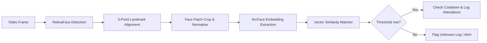

# Face Recognition Attendance System - System Design

This document details the face recognition pipeline and the user interface planning for the desktop application.

---

## 1. Face Recognition Pipeline

The computer vision pipeline is built using **OpenCV** and the **InsightFace** library (with ONNX Runtime execution). It handles frames through sequential stages to translate visual camera input into verified database logs.



### 1.1 Image Capture & Frame Ingestion
- **Source**: Frame buffers are read asynchronously from USB Webcams or IP cameras via OpenCV `cv2.VideoCapture`.
- **Pre-processing**: Captured frames are resized to a maximum width of 1280px (maintaining aspect ratio) to limit CPU load while preserving high-enough resolution for distant face detection.

### 1.2 Face Detection (RetinaFace)
- **Model**: We utilize **RetinaFace-500m** (or the lightweight MobileNet version for low-end CPUs).
- **Task**: Locates bounding boxes of faces in the frame and extracts 5 primary facial landmarks: Left Eye, Right Eye, Nose Tip, Left Mouth Corner, Right Mouth Corner.
- **Why RetinaFace**: Unlike traditional Haar Cascades or HOG detectors, RetinaFace detects heavily rotated faces, partially occluded profiles (e.g., hands on face, long hair), and functions under varying illumination levels.

### 1.3 Face Alignment (Affine Transformation)
- **Problem**: In natural video streams, students approach the camera at different angles. Comparing unaligned faces leads to poor recognition.
- **Solution**: The system calculates a similarity affine transformation matrix based on the coordinates of the 5 landmarks. The face is rotated, scaled, and cropped to a standard $112 \times 112$ pixel size where the eyes are aligned along a horizontal axis.

### 1.4 Embedding Extraction (ArcFace)
- **Model**: **ArcFace (ResNet50 / ResNet100)** optimized as an ONNX model.
- **Task**: The model projects the $112 \times 112$ aligned face image into a high-dimensional vector space.
- **Output**: A **512-dimensional vector** of floating-point values representing the distinctive features of the face. The vector is normalized to unit length ($L_2$ norm = 1).

### 1.5 Embedding Storage
- **Format**: The 512-d array is serialized using NumPy `tobytes()` and written as a binary `BLOB` (SQLite) or `BYTEA` (PostgreSQL) directly in the `face_embeddings` table.
- **Index**: Embbedings are mapped to `student_id`.

### 1.6 Recognition & Matching Logic
- **Vector Math**: Since embeddings are $L_2$ normalized, the **Cosine Similarity** between query vector $Q$ and database vector $D$ is calculated simply via their **Dot Product**:
  $$\text{Similarity} = \sum_{i=1}^{512} Q_i \cdot D_i$$
- **Matching Threshold**: A configurable threshold is applied:
  - **Match Found**: $\text{Similarity} \ge \text{Threshold}$ (Default: `0.65`).
  - **Unknown Face**: $\text{Similarity} < \text{Threshold}$.
- **Decision Matrix & Low Confidence**:
  - If a match is found with high confidence ($>0.75$), it is processed immediately.
  - If the match is borderline ($0.65 \le \text{Similarity} < 0.75$), the system monitors the next 3 consecutive frames. If the identity remains consistent, it registers the check-in; otherwise, it treats it as low confidence and holds the status.
  - If the match is below $0.65$, it is labeled "Unknown".

### 1.7 Duplicate Detection & Cooling-off
- **Cooling-off Period**: To prevent logging multiple check-ins as a student stands in front of the camera, a temporal limit (e.g., 30 minutes) is enforced.
- **Implementation**: The service queries the `attendance` table:
  ```sql
  SELECT EXISTS(
      SELECT 1 FROM attendance 
      WHERE student_id = :student_id 
        AND subject_id = :subject_id 
        AND date = :current_date 
        AND time_in > :cooldown_limit
  )
  ```
  If this returns true, the duplicate check-in is discarded.

### 1.8 Future Liveness Detection (Anti-Spoofing)
To prevent presentation attacks (e.g., printing a photo of a student or holding a tablet screen in front of the lens), the system is architected to integrate **Liveness Detection**:
- **Texture Analysis**: Analysing structural surface details using Local Binary Patterns (LBP) to detect screen reflection patterns.
- **Landmark Motion Validation**: Forcing dynamic user challenges (e.g., "Blink your eyes" or "Turn your head slowly") to verify a live 3D face is present before extracting the vector.

---

## 2. UI Planning & Screen Layouts

The application is structured as a single-window desktop application with a responsive **Sidebar Navigation** panel on the left and a dynamic **Content Frame** on the right.

### 2.1 Screen Registry
The application implements 12 distinct views:

| Page / Screen | Purpose | Primary Widgets & Controls |
| :--- | :--- | :--- |
| **Login** | Gateway credentials page. | Username/Password entry fields, login button, logo overlay, database status indicator. |
| **Dashboard** | Main overview panel. | Aggregate metrics (Present today, Absent, Low attendance warning count), recent log stream, Quick Actions buttons. |
| **Students** | Registry directories. | Filterable table, "Add Student" button, status change toggle (Active/Inactive), dataset edit controls. |
| **Faculty** | Faculty manager list (Admin-only).| Employee directory grid, class allocations manager, permissions setup. |
| **Courses** | Organization structure page. | Add/edit courses, link subjects to courses. |
| **Attendance** | Active tracking panel. | Subject dropdown selection, Camera video preview canvas, real-time logging scroll list, start/stop buttons. |
| **Reports** | Data extraction tool. | Filters (Subject, Date, Student), data table, "Export PDF" and "Export Excel" buttons. |
| **Settings** | Configuration panel. | Camera device selection slider, RTSP URL textbox, similarity threshold slider, DB URI settings. |
| **Camera Configuration** | Dedicated feed tuner. | Visual calibration lines (grids), exposure controls, resolution dropdown. |
| **Dataset Capturer** | Enrollment helper wizard. | Live crop canvas showing progress bar (e.g., 1/10 photos), head rotation prompt overlays, quality metric scores. |
| **Logs View** | System Diagnostic monitor. | Real-time scroll feed from `app_system.log` and `face_recognition.log` for troubleshooting. |
| **About** | System properties. | License details, version info, framework diagnostics, system requirements checks. |

### 2.2 Wireframe Blueprint (Main Layout)
Below is the structural layout template used for the CustomTkinter frames:

```text
+------------------------------------------------------------------------------------+
|  [Brand Logo]   |  Page Title: Real-Time Attendance Scan           [User: Prof. J] |
|-----------------|------------------------------------------------------------------|
|  (o) Dashboard  |                                                                  |
|  ( ) Students   |  +-------------------------------------+   +------------------+  |
|  ( ) Faculty    |  |                                     |   | Live Logs        |  |
|  (*) Scan Panel |  |                                     |   | [10:02] John D.  |  |
|  ( ) Reports    |  |          [ OpenCV Canvas ]          |   | [10:04] Mary L.  |  |
|  ( ) Settings   |  |          (Green / Red Box)          |   | [10:05] Unknown  |  |
|  ( ) Logs       |  |                                     |   |                  |  |
|  ( ) About      |  |                                     |   |                  |  |
|                 |  +-------------------------------------+   +------------------+  |
|                 |  [Select Subject: Math-101 v] [Start Camera] [Stop Camera]       |
|                 |                                                                  |
|                 |  Status: System running at 32 FPS, Model Loaded: ArcFace (ONNX)  |
+------------------------------------------------------------------------------------+
```
