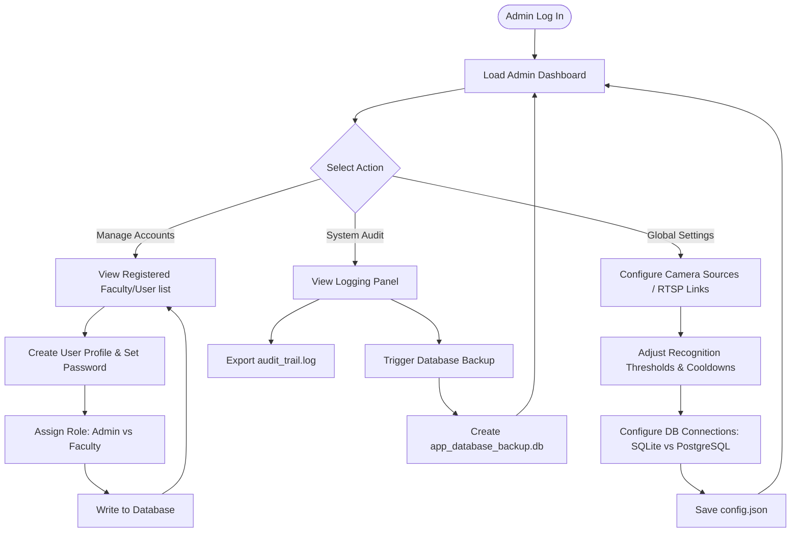
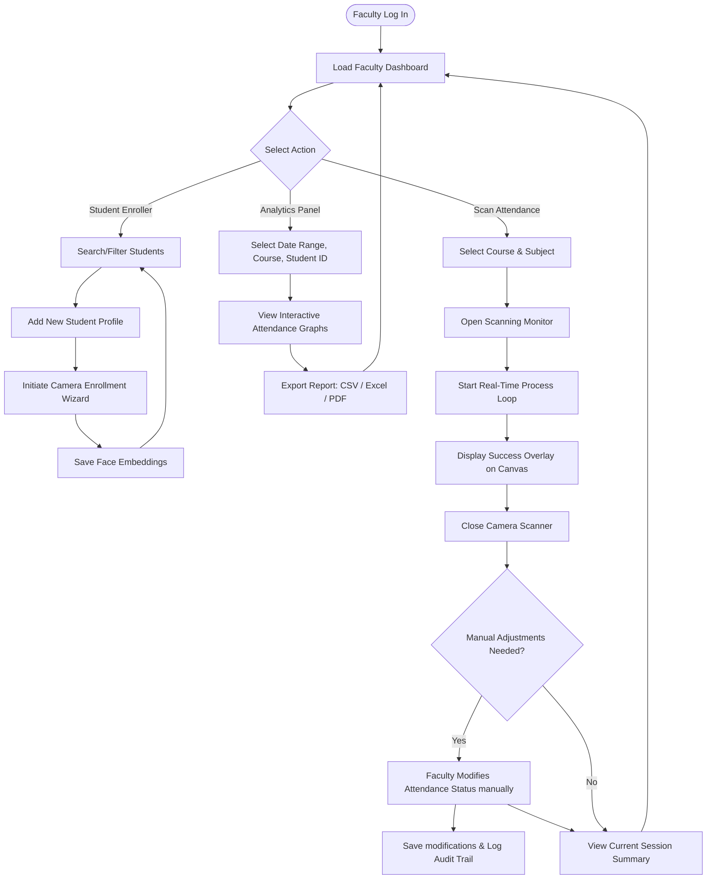
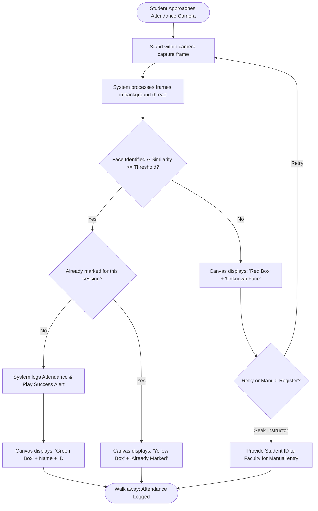

# Face Recognition Attendance System - User Flows

This document details the distinct workflows and interactions for each user role: **Administrator**, **Faculty Member**, and **Student**. These flows map the visual transitions and functional steps of the application's graphical interface.

---

## 1. System Administrator Flow

The System Administrator handles configuration, directory updates, user role assignments, and system-wide audit tracking.

---

## 2. Faculty User Flow

Faculty members manage courses, subjects, student registrations, run daily camera tracking panels, and download reports.

---

## 3. Student Interaction Flow

Students are the subjects of verification. They do not log into the application; instead, their interaction is contactless via the face recognition terminal.

