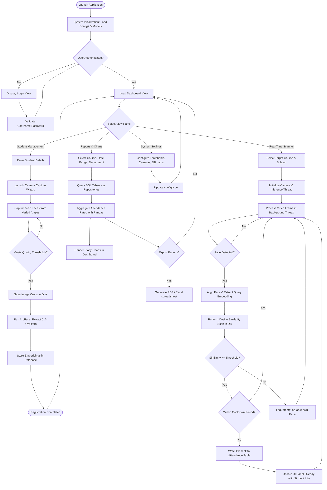

# Face Recognition Attendance System - Application Workflow

This document charts the operational workflows of the Face Recognition Attendance System, from administrative setups to automated camera tracking.

---

## 1. System-Wide Operational Workflow

The diagram below maps the complete path an administrator or faculty member traverses when using the application.

---

## 2. Key Workflow Phases Explained

### 2.1 System Initialization
Upon boot, the application:
1. Loads configuration values from `config/config.default.yaml` (or custom user config overrides).
2. Initializes the logging system.
3. Loads the deep-learning models (RetinaFace for detection, ArcFace for recognition) into the ONNX Runtime context. This ensures a fast startup during view transitions, as model load times can take 2-4 seconds.

### 2.2 Student Biometric Registration
This phase creates the face database:
1. **Details Entry**: Faculty input the student's text records (IDs, Course, etc.).
2. **Dynamic Capture**: The camera widget launches. It guides the user to rotate their head slightly. The system extracts frames at defined intervals where a face is detected.
3. **Validation**: Frames are discarded if the face angle is too extreme, if lighting is insufficient, or if multiple faces are in the frame.
4. **Vector Serialization**: The face patches are aligned, and the 512 float values are generated and saved.

### 2.3 Real-Time Recognition & Marking
The core tracking pipeline:
1. **Asynchronous Ingestion**: The camera worker pushes 30 FPS frames into the processing queue.
2. **Detection & Extraction**: A frame is pulled, landmarks are extracted, the face is warped (aligned), and an embedding vector is generated.
3. **Similarity Search**: The vector is compared against all registered vectors using dot product similarity ($A \cdot B$ since vectors are normalized to unit length).
4. **Cool-down Check**: If a student is recognized, the database is queried. If they were marked present in the current subject session within the last 30 minutes, the log is skipped to prevent database clutter.

### 2.4 Reporting
1. Users filter records using dropdown select inputs (Department, Course, Subject, Date Range).
2. The Repository queries records, which are compiled into a Pandas DataFrame.
3. Pandas fills missing dates with "Absent" statuses to calculate a comprehensive attendance history.
4. Export scripts generate PDF/Excel layouts containing summary percentages.
