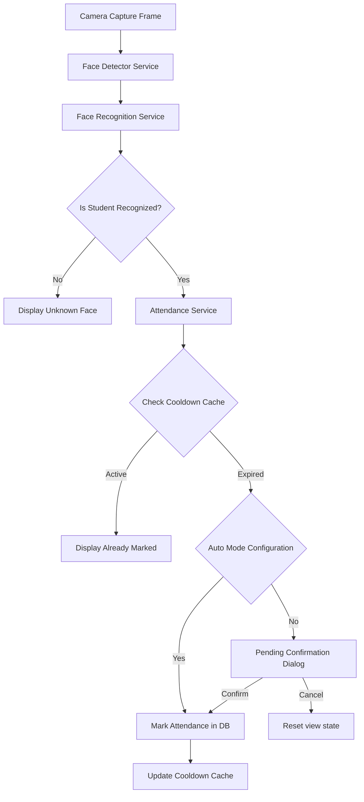

# Attendance Management Overview

This module governs the process of validating biometric classification matches from the Face Recognition Engine and writing transaction-safe attendance records to the database.

## System Workflow

## Features Complete

1. **Biometric Integration**: Seamlessly maps LBPH recognition distance matches to checked identities.
2. **Duplicate Prevention**: Dual-layer protection using in-memory cooldown cache and SQLite database unique constraints.
3. **Session Windows**: Group logs under active course/class date intervals.
4. **Manual Override**: Supports supervised check-in records logging source = MANUAL.
5. **Interactive UI**: Real-time feedback badges (✓ Recorded, ℹ Already Marked, ⚠ Error).
