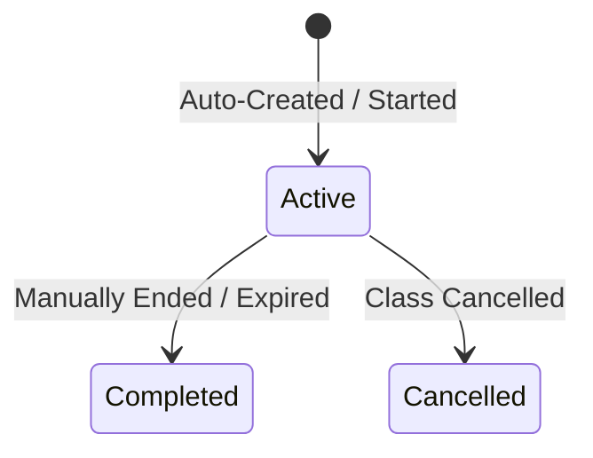

# Attendance Session

This document describes the foundation and lifecycle of attendance tracking sessions.

## Concept
An **Attendance Session** represents a specific time slot or class event for which attendance is recorded. It isolates tracking metrics and allows the system to support multiple classes or daily check-ins independently.

## Data Schema
The `AttendanceSession` database model contains:
- **`id`**: Unique primary key.
- **`name`**: Descriptive label (e.g. `"Daily Session - YYYY-MM-DD"`).
- **`date`**: Specific tracking date in `YYYY-MM-DD` format.
- **`start_time`**: Session start window (e.g. `09:00:00`).
- **`end_time`**: Session expiration window (e.g. `17:00:00`).
- **`status`**: Current state (`Active`, `Completed`, `Cancelled`).
- **`created_by`**: Source identifier (`System` or `User`).

## Session Lifecycle

### Auto-creation Rule
To guarantee the system is always runnable with minimal manual setup:
- When marking attendance, if no `session_id` is supplied, `AttendanceService.get_or_create_daily_session` checks the database for an active session matching the current date.
- If no active session exists, it automatically creates a default daily session (9:00 AM - 5:00 PM) to bootstrap the database.
