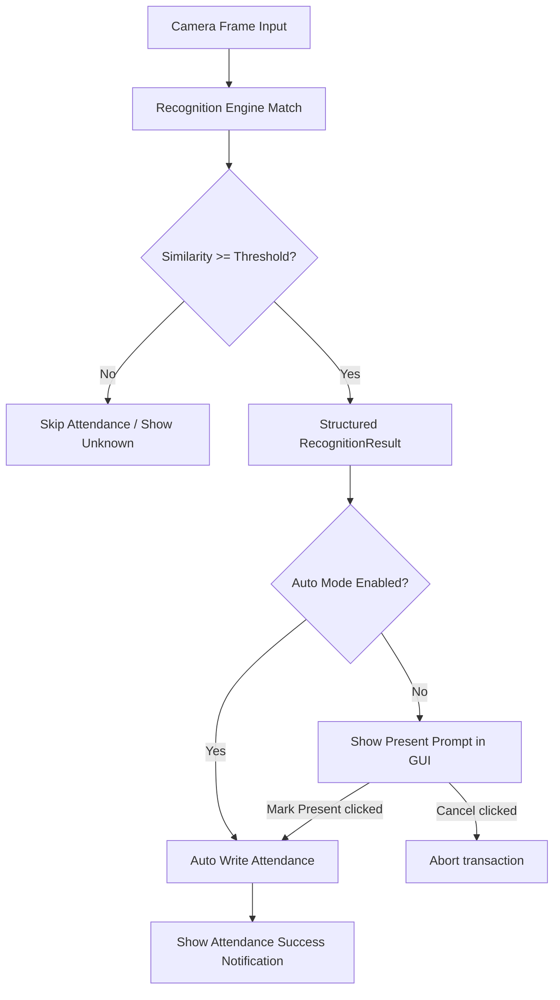

# Recognition to Attendance Flow

This document details the transition from a real-time computer vision frame result to a written database attendance record.

## Architecture Boundary
- **Face Recognition Engine**: Responsible only for finding bounding boxes and matching faces to registered student database IDs with a similarity metric. It knows *nothing* about attendance policies.
- **Attendance Service**: Responsible only for evaluating duplicate filters, checking cooldown windows, applying grace periods, and writing transactions. It knows *nothing* about pixel data or OpenCV.

## Flow of Control

### Modes of Execution
1. **Auto Mode (`ATTENDANCE_AUTO_MODE=True`)**:
   - The GUI intercepts the recognition, performs duplicate cache validation, and instantly registers the attendance entry.
2. **Confirmation Mode (`ATTENDANCE_AUTO_MODE=False`)**:
   - The GUI freezes processing of subsequent frames for that bounding box, prompts the operator with `"Mark John Doe Present?"`, and writes only upon manual consent.
