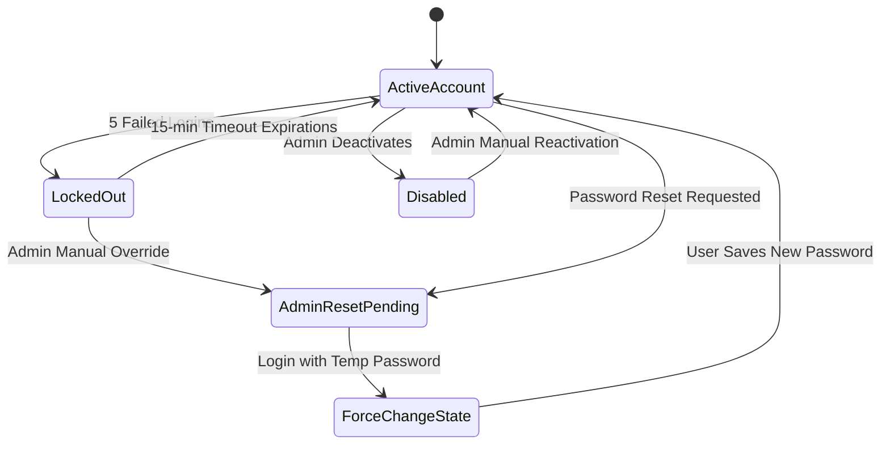

# Account Management & Recovery Specification

This document details the user lifecycle management states and credential recovery workflows for the **Face Recognition Attendance System**.

---

## 1. Account Recovery Lifecycle

Below is the state machine showing the flows for account password resets and force-change redirections.



---

## 2. Account Management Operations

### 2.1 User Creation Lifecycle
1.  Super Admin or Administrator inputs registration metadata (username, email, role, department).
2.  The service layer generates a random cryptographically secure temporary password (e.g. `12` characters containing numeric, uppercase, and special chars).
3.  The user record is saved in the database with parameters:
    *   `password_hash = <hash_of_temp_password>`
    *   `is_active = True`
    *   `force_password_change = True`
4.  The temporary password is shown once to the administrator to convey to the recipient.

### 2.2 Account Disabling & Activation
*   **Deactivation**: Setting `is_active = False` in the database. When updated, the `SessionManager` instantly terminates all active sessions associated with the user's ID, forcing a redirect to the login screen within 30 seconds (sliding polling window).
*   **Reactivation**: Setting `is_active = True` clears all previous failed login attempt counters and allows authentication loops to proceed normally.

### 2.3 Soft Delete Strategy
To protect relational integrity (specifically historical audit trails, manual logs, and attendance markings):
*   **No Hard Deletes**: The system does not execute `DELETE FROM users` queries.
*   **Soft Delete Columns**: Tables utilize `deleted_at (DATETIME, default=NULL)`.
*   **Query Filtering**: The repository layer overrides standard fetch calls to filter records:
    ```sql
    -- Planned filtering behavior under the hood
    SELECT * FROM users WHERE deleted_at IS NULL AND username = :username;
    ```
*   Biometric vector mappings associated with a soft-deleted student are purged to comply with privacy policies, but the academic metadata record remains archived.

---

## 3. Password Recovery Workflows

### 3.1 Local Deployment: Administrative Override
In standard local-first desktop deployments (which operate offline):
1.  The user contacts the institutional system administrator.
2.  The Administrator authenticates, opens the **User Management Panel**, and selects the target account.
3.  The Administrator clicks **"Reset Password"** which generates a new temporary credentials key.
4.  The system flags the account with `force_password_change = True`.
5.  On next login, the user is restricted to the **Password Reset View** and cannot access the main dashboard panels until they set a secure password.

### 3.2 SaaS Deployment: Email Recovery (Planned Future Scope)
*   **Workflow**: The user clicks "Forgot Password" on the login screen.
*   **Token Generation**: The system generates a short-lived token (`exp = 30 minutes`) containing a secure hash signature.
*   **SMTP Trigger**: The backend service dispatches an email containing a link: `https://attendance-system.edu/reset-password?token=<hex_string>`.
*   **Security Questions**: Avoided in this architecture due to high vulnerability to social engineering and predictable answers (e.g., Mother's maiden name).
