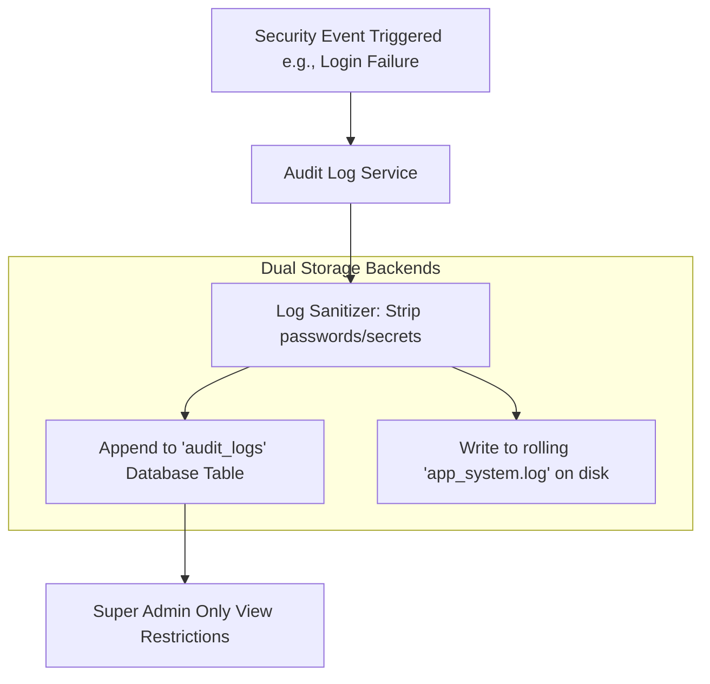

# Security & Authentication Audit Logging Design

This document details the audit logging system, data structures, and logging policies designed for the **Face Recognition Attendance System**.

---

## 1. Audit Logging Flow

Below is the workflow showing how events are captured dynamically, structured, and appended to the audit tables and local files.

---

## 2. Tracked Security Events

The system logs all security-sensitive events to verify audit trails and track administrative operations:

| Event Code | Event Category | Trigger Description | Log Level |
| :--- | :--- | :--- | :--- |
| `AUTH_SUCCESS` | Authentication | User logged in successfully. | INFO |
| `AUTH_FAILURE` | Authentication | Password mismatch or non-existent username. | WARNING |
| `AUTH_LOCKOUT` | Authentication | Account locked due to 5 consecutive failed logins. | CRITICAL |
| `AUTH_UNLOCK` | Authentication | Lockout cleared manually or by timeout expiration. | INFO |
| `AUTH_LOGOUT` | Authentication | Session explicitly closed. | INFO |
| `PWD_CHANGE` | Account Management | User updated their own password. | INFO |
| `PWD_RESET` | Account Management | Admin reset another user's password. | WARNING |
| `USER_PROV` | User Management | Admin created, activated, or soft-deleted a user. | INFO |
| `PERM_MODIFY` | Access Control | Role mapping or permission assignments updated. | CRITICAL |
| `DB_BACKUP` | Administration | Database backup or restore operation executed. | CRITICAL |

---

## 3. Audit Log Schema & Structure

Audit logs are stored in a dedicated database table (`security_audit_logs`) with the following fields:

| Column | Data Type | Constraint | Description |
| :--- | :--- | :--- | :--- |
| `id` | INTEGER | PRIMARY KEY | Unique auto-increment identifier. |
| `timestamp` | DATETIME | DEFAULT CURRENT_TIMESTAMP | UTC timestamp of the event. |
| `event_code` | VARCHAR(20) | NOT NULL | Categorized code (e.g. `AUTH_FAILURE`). |
| `actor_user_id`| INTEGER | FOREIGN KEY, NULLABLE | User ID who executed the action (NULL if anonymous). |
| `target_user_id`| INTEGER | FOREIGN KEY, NULLABLE | User ID affected by the action (e.g. reset target). |
| `status` | VARCHAR(10) | NOT NULL | `SUCCESS`, `FAILURE`, `WARNING`, `ALERT`. |
| `client_ip` | VARCHAR(45) | NOT NULL | IP Address of client (supports IPv4/IPv6). |
| `client_host` | VARCHAR(100) | NOT NULL | System name / hostname of client machine. |
| `description` | TEXT | NOT NULL | Human-readable log narrative. |

---

## 4. Log Security & Integrity Policies

1.  **Sanitization Guarantee**: Plaintext passwords, password hashes, session tokens, and recovery codes are strictly prohibited from log descriptions.
2.  **Immutability**: The audit repository provides insertion controls only (`CREATE`). Update (`UPDATE`) and deletion (`DELETE`) operations are blocked at the repository driver level.
3.  **Access Limits**: The audit log GUI view is restricted exclusively to the **Super Admin** role. Faculty and standard Administrators have zero access.
4.  **Rotation Rules**: Local file-based loggers (`app_system.log`) utilize a rolling file handler that rotates logs when a file size reaches **$10\text{ MB}$**, keeping a maximum backup history of **$5$** files to prevent disk exhaustion.
