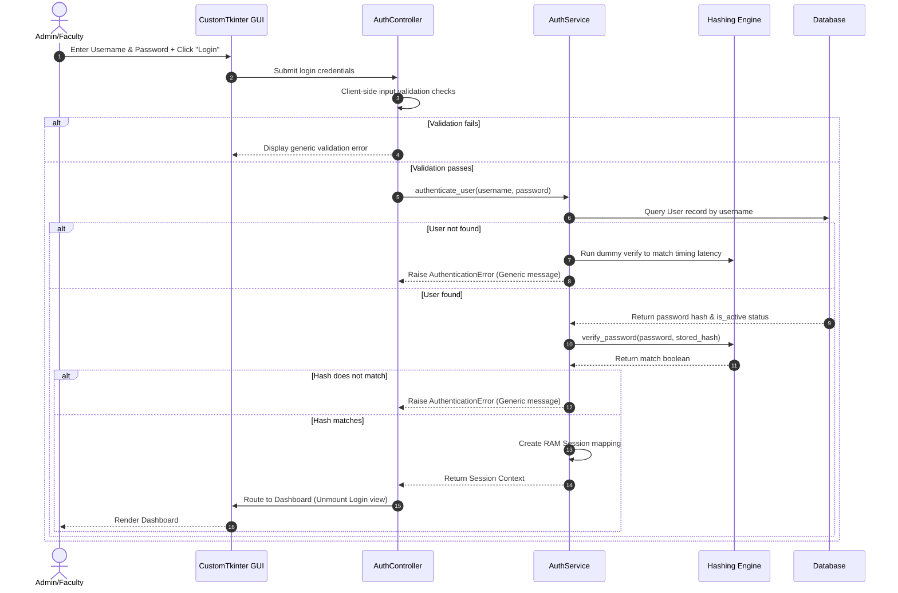
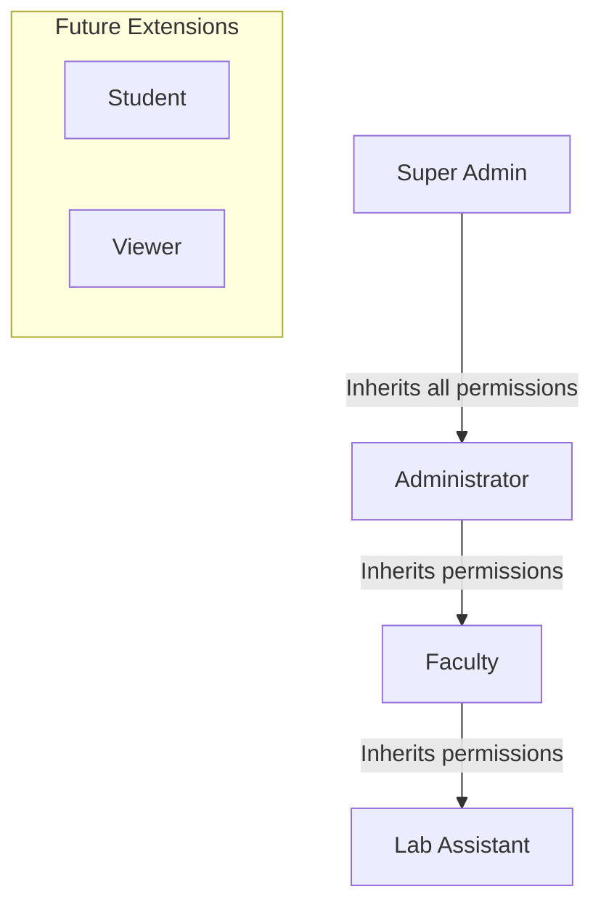
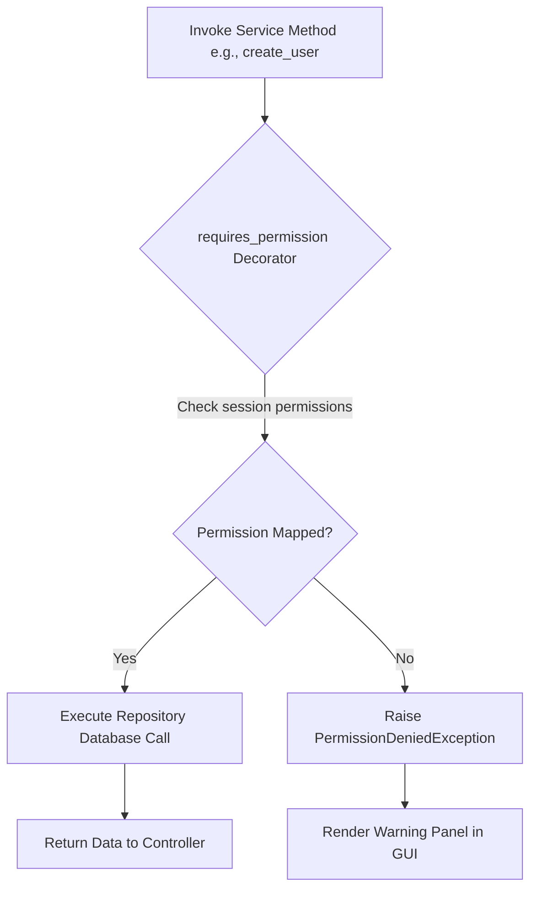
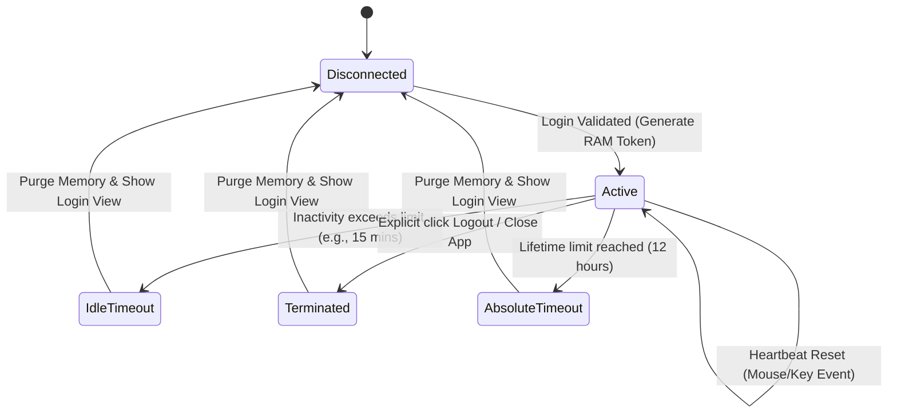
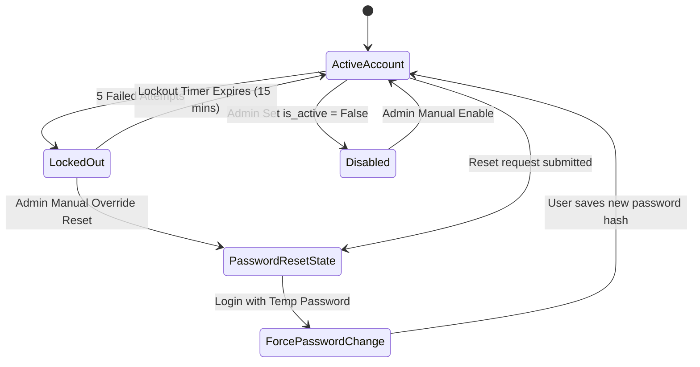
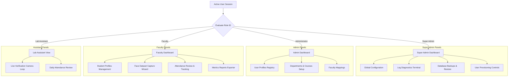
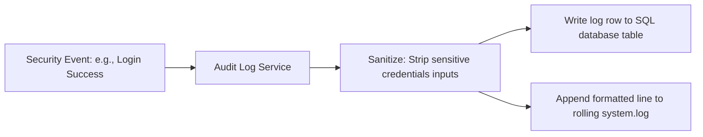

# Authentication & Authorization Architecture Diagrams

This document consolidates all architectural, sequencing, and state transitions diagrams for the **Face Recognition Attendance System** authentication design.

---

## 1. Authentication Flow (Sequencing)

Details the request flow from login view submission to credential hashing and dashboard dispatch.

---

## 2. RBAC Structure (Inheritance Diagram)

Visualizes how permissions inherit from lower roles to higher administration tiers.

---

## 3. Permission Verification Flow

Shows how security intercepts are processed at the boundary of service executions.

---

## 4. Session Lifecycle State Diagram

Tracks session state transitions from initial startup validation to timeouts and explicit logouts.

---

## 5. Account Recovery State Diagram

Maps account states from creation (temporary password force change) to lockout and deactivation overrides.

---

## 6. Dashboard Navigation by Role

Illustrates the navigation views rendered in the CustomTkinter sidebar according to the authenticated user's role:

---

## 7. Audit Logging Process Flow

Traces how security logs are generated, sanitized of passwords/hashes, and saved.

