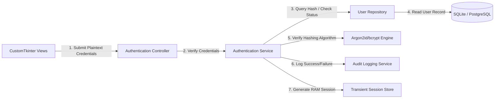

# Authentication Architecture Overview

This document provides a high-level summary of the authentication and credential security architecture for the **Face Recognition Attendance System**. 

The architecture is designed to support a secure, local-first **CustomTkinter desktop client** during development and scale seamlessly into a **multi-user, cloud-connected enterprise network** in production.

---

## 1. Architectural Objectives

1.  **Security-First Foundation**: Safeguard user credentials and sensitive biometric vector mappings against unauthorized access, credential extraction, and tampering.
2.  **Modular Separation of Concerns**: Keep authentication/authorization mechanics isolated within a dedicated service layer, completely independent of the CustomTkinter presentation widgets.
3.  **Scalable Transition Path**: Support clean switching from local-file database validation (SQLite) to secure database connections (PostgreSQL) and eventual REST API token validation (JWT/OAuth2) without code churn in higher-level application layers.
4.  **Audit Integrity**: Guarantee that all security-sensitive events (logins, session timeouts, administrative overrides, password resets) are recorded in a temper-resistant audit log.

---

## 2. Threat Modeling & Design Mitigations

As a desktop application deployed on local institutional machines, the system operates within a high-exposure environment. The following mitigations are built into the design:

| Threat Vector | Description | Architectural Mitigation |
| :--- | :--- | :--- |
| **Database Compromise (Physical/Local)** | An attacker copies the SQLite database file (`app_database.db`) to extract passwords. | Credentials are encrypted using industry-standard, slow hashing functions (**Argon2id** or **bcrypt**) with a high work factor to resist GPU brute-force attacks. |
| **RAM Dumping / Reverse Engineering** | An attacker dumps the application's RAM to capture active sessions or plain passwords. | Plaintext passwords are overwritten in memory as soon as validation completes. Session details are kept in private, transient runtime objects that are cleared immediately on logout. |
| **Credential Sniffing (Network)** | An attacker intercepts database packets during PostgreSQL transactions. | Enforce strictly encrypted transport boundaries (TLS/SSL) for all PostgreSQL configurations. |
| **Privilege Escalation** | A user bypasses UI controls to run administrative functions. | Access checks are performed at the **Service and Repository layers**, not just the GUI layer. Even if a user alters UI widgets, the service calls will reject unauthorized execution. |

---

## 3. Cryptographic Strategy & Hashing Algorithms

### Primary Hashing Choice: Argon2id (OWASP Recommended)
*   **Standard**: Argon2id is the winner of the Password Hashing Competition (PHC) and is recommended by OWASP for all new designs.
*   **Parameters**:
    *   Time Cost ($m$): $3$ iterations (balances security and hardware latency).
    *   Memory Cost ($M$): $64 \text{ MB}$ ($65536 \text{ KB}$).
    *   Parallelism ($p$): $4$ threads.
*   **Justification**: Argon2id provides memory-hard protection that is highly resistant to massive GPU and ASIC-based brute-force cracking systems.

### Fallback/Alternative: bcrypt
*   **Cost Factor**: $12$ rounds.
*   **Justification**: Widely available across older Python setups and standard database packages, making it a reliable alternative if the client machine's memory limits restrict Argon2id tunings.

> [!IMPORTANT]
> The credential verification routine implements **constant-time string comparison** (using python's `hmac.compare_digest` or native library bindings) to prevent timing side-channel attacks during password checks.

---

## 4. Logical Boundary Architecture

*   **Presentation Layer (CustomTkinter Views)**: Contains zero authentication logic. It captures input events, delegates validation to the controller, and displays warnings/success pages based on responses.
*   **Controller Layer**: Handles GUI-thread orchestration, showing loading indicators during hashing calculations and managing transitions between login and dashboard windows.
*   **Service Layer (AuthService)**: Enforces business logic, evaluates password complexity, verifies hashes, maps active sessions, and triggers security lockouts.
*   **Data Access Layer (UserRepository)**: Interacts with database sessions to query matching usernames, handles updates, and tracks changes to passwords.
