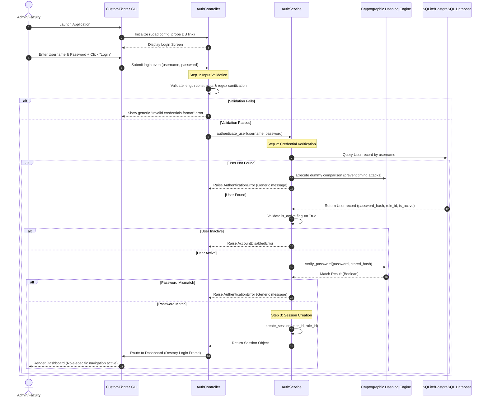

# Authentication Workflow Specification

This document details the step-by-step workflow for user authentication in the **Face Recognition Attendance System**.

---

## 1. Authentication Lifecycle Flow

Below is the sequence diagram illustrating the lifecycle of a single authentication attempt, from the application GUI startup down to database verification and session instantiation.

---

## 2. Step-by-Step Workflow Details

### Step 1: Application Start & Environment Probe
Before showing the credentials panel, the main runtime thread executes setup diagnostics:
*   Imports local configuration values via `ConfigLoader`.
*   Establishes connection pool hooks to the database database (local SQLite file or Postgres connection string).
*   Verifies folder accessibility for temporary files (datasets, local crops, log logs).

### Step 2: Render Login Screen
*   Creates the root CustomTkinter application window.
*   Draws the custom credentials view consisting of `Username` and `Password` inputs.
*   The password input is masked by default (`show='*'`) and includes a toggle button to unmask.
*   The submission button is disabled after clicking to prevent duplicate login calls on the UI thread.

### Step 3: Client-Side Input Validation
To prevent invalid queries from hitting the backend services:
*   **Sanitization Rules**:
    *   `Username` length must be between 3 and 50 characters, and conform to: `^[a-zA-Z0-9_.-]+$`.
    *   `Password` must not be empty.
*   If validation fails, the UI instantly displays a generic error message: *"Invalid username or password format."*

### Step 4: Backend Credential Verification
When inputs pass validation, the controller executes the business logic layer:
1.  **Retrieve User Record**: The service queries the data access repository for the target username.
2.  **Timing Attack Protection**:
    *   If the user is found, the system extracts the `password_hash`.
    *   If the user is **not** found, the system performs a verification check against a static dummy hash (e.g. `bcrypt.hashpw(b"dummy", bcrypt.gensalt())`). This ensures that the verification routine takes roughly the same time whether a username exists or not, preventing enumeration timing attacks.
3.  **Hashed Comparison**: The service executes the selected algorithm validation (Argon2id/bcrypt) which performs a memory-hard comparison.

### Step 5: Role & Account Verification
Before declaring authentication successful, the service evaluates account policies:
*   Checks the `is_active` status flag. If `False`, authentication aborts, raising a localized `AccountDisabledError`.
*   Fetches permissions linked to the user's role ID (used to construct security wrappers).

### Step 6: Session Creation
Upon successful verification:
*   A cryptographically secure, random token is generated for the transient runtime session store.
*   The session mapping stores the `User ID`, `Role ID`, and a `timestamp` in RAM.
*   An audit log entry is written stating: `User: <username> logged in successfully.` (omitting any session token values from log strings).

### Step 7: GUI Routing & Dashboards Launch
*   The GUI controller receives the active session context.
*   The Login view layout is completely destroyed (clearing credentials inputs from memory).
*   The main navigation shell is rendered, loading menus based on the user's designated role.
