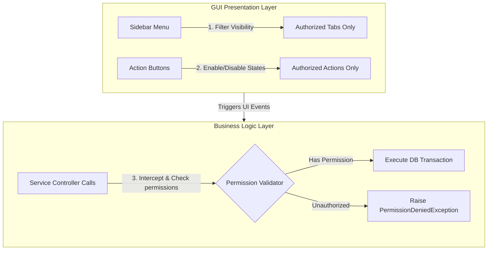

# Authorization Model Specification

This document details the authorization verification patterns used to enforce access controls within the **Face Recognition Attendance System**.

---

## 1. Multi-Layered Authorization Enforcement

To achieve a secure desktop client architecture, authorizations are checked at multiple layers. This prevents security bypasses if UI panels are manipulated or reverse-engineered.



---

## 2. Authorization Verification Strategies

### 2.1 Screen Access Control
Before a GUI View (such as the `Settings` view or the `StudentRegistration` view) is initialized or mounted on the main application frame:
*   The frame loader queries the active session context: `SessionManager.has_permission(permission_key)`.
*   If the permission is missing, the load is blocked, and a generic access error panel is mounted instead.

### 2.2 Feature Access Control
Controls which features a user can perform within an open screen (e.g., viewing students is permitted, but editing student details is restricted).
*   During view initialization, components check specific permission flags:
    ```python
    # Planned implementation pattern
    if not self.session.has_permission("student:write"):
        self.edit_button.configure(state="disabled")
        self.delete_button.configure(state="disabled")
    ```

### 2.3 Menu & Sidebar Visibility
To maintain a clean and non-confusing user experience, sidebar navigation items are dynamically generated:
*   On dashboard load, the sidebar component iterates over available routes.
*   Only routes whose required permissions exist in the active user's session are rendered as menu tabs.

### 2.4 Service-Level Authorization (Crucial Defense in Depth)
UI-based modifications can be bypassed via runtime debugging tools or script execution. Therefore, authorizations are strictly enforced at the **Service Layer** boundary using function wrappers/decorators:
*   Any method within the service layer (e.g., `UserService.create_user()`) must verify permission states before querying repositories.
*   **Planned implementation pattern**:
    ```python
    def requires_permission(permission: str):
        def decorator(func):
            def wrapper(self, *args, **kwargs):
                if not self.session_context.has_permission(permission):
                    raise PermissionDeniedError(f"Access Denied for action: {permission}")
                return func(self, *args, **kwargs)
            return wrapper
        return decorator
    ```

---

## 3. Future REST API Authorization

When scaling the local database system into a distributed SaaS platform:
*   **JSON Web Tokens (JWT)**: Users authenticate via an API endpoint, receiving a signed JWT access token.
*   **Claims Mapping**: The JWT payload will contain user metadata and a list of authorized permissions under a `scopes` claim:
    ```json
    {
      "sub": "usr_90210",
      "username": "prof_smith",
      "role": "Faculty",
      "scopes": ["student:read", "attendance:write", "report:export"],
      "exp": 1719878400
    }
    ```
*   **API Gateways & Middleware**: The backend web services (e.g. built using FastAPI) will intercept incoming HTTP requests, verify the cryptographic signature of the token, and decode the scopes to validate authorization using middleware filters.
