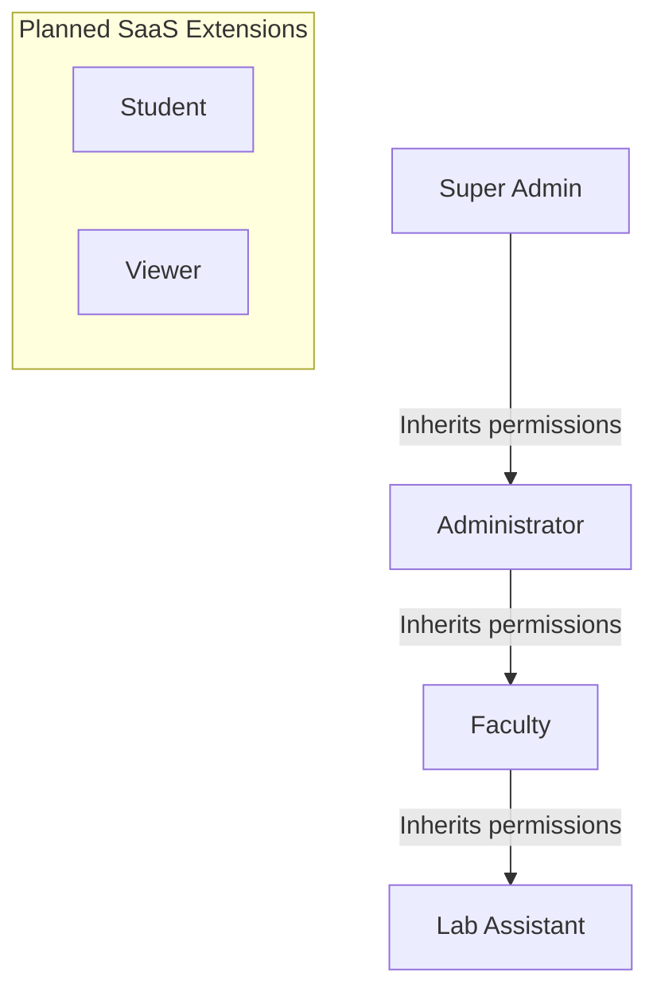

# Role-Based Access Control (RBAC) Specification

This document details the role structure, inheritance hierarchy, and domain responsibilities defined for the **Face Recognition Attendance System**.

---

## 1. Role Hierarchy Diagram

The system employs a strict hierarchical authorization flow where higher-tier roles inherit permissions of child roles.

---

## 2. Role Specifications

### 2.1 Super Admin (System Owner)
*   **Responsibilities**: Absolute control over the local system instance and underlying databases. Maintains database health, system updates, global security, and credentials provisioning.
*   **Access Level**: Full CRUD on all tables, audit logging systems, backup hooks, and encryption parameters.
*   **Restrictions**: None.
*   **Future Scalability**: Serves as the system setup root container in single-instance desktop apps, or SaaS-level tenant managers in cloud settings.

### 2.2 Administrator (Institutional Admin)
*   **Responsibilities**: Manages academic rosters, department configurations, courses directories, and faculty credential records.
*   **Access Level**: CRUD on student profiles, faculty structures, course setups, and permissions maps. Password reset capabilities for faculty accounts.
*   **Restrictions**: Cannot view debug log dumps, change database storage engines (SQLite/PG switcher), or alter system security thresholds.
*   **Future Scalability**: Will maps to organization admins in multi-tenant institution databases.

### 2.3 Faculty (Instructor / Lecturer)
*   **Responsibilities**: Coordinates class attendance tracking, registers face datasets for enrolled students, and generates performance metrics reports.
*   **Access Level**: Read/Write on student rosters, face dataset templates folders, attendance verification loops, and reporting features.
*   **Restrictions**: Cannot modify other departments' rosters, delete user accounts, create new administrators, or modify database paths.

### 2.4 Lab Assistant (Teaching Support)
*   **Responsibilities**: Operates the desktop attendance application in laboratories, runs the camera feeds, and corrects simple marking discrepancies under faculty instruction.
*   **Access Level**: Read-only on student datasets; can activate local verification cameras and edit active attendance entries.
*   **Restrictions**: Cannot export database records, delete face vector templates, register courses, or edit user passwords.

### 2.5 Student (Planned / Future)
*   **Responsibilities**: Submits personal check-in templates, views attendance metrics, and manages personal recovery addresses.
*   **Access Level**: Read-only access to their own attendance metrics.
*   **Restrictions**: Read/Write blocked on other records; zero dashboard screen visibility in the desktop app.

### 2.6 Viewer (Planned / Future)
*   **Responsibilities**: External reviewer role (e.g. parents, institutional inspectors, financial auditors).
*   **Access Level**: Read-only access to metrics, statistics, and reports.
*   **Restrictions**: Zero edit/write/delete capabilities across all entities.

---

## 3. Dynamic Custom Roles Support

To ensure future enterprise scalability:
*   **Entity Mapping**: Instead of hard-coding permission checks to role string values (e.g. `if user.role == "Faculty"`), the authorization checker queries a junction table mapping roles to individual granular keys.
*   **Extensibility**: If an institution needs a custom role (e.g., *"Department Head"*), an administrator can create a new record in the `roles` table and assign specific permissions via `role_permissions` rows without editing the core codebase.
