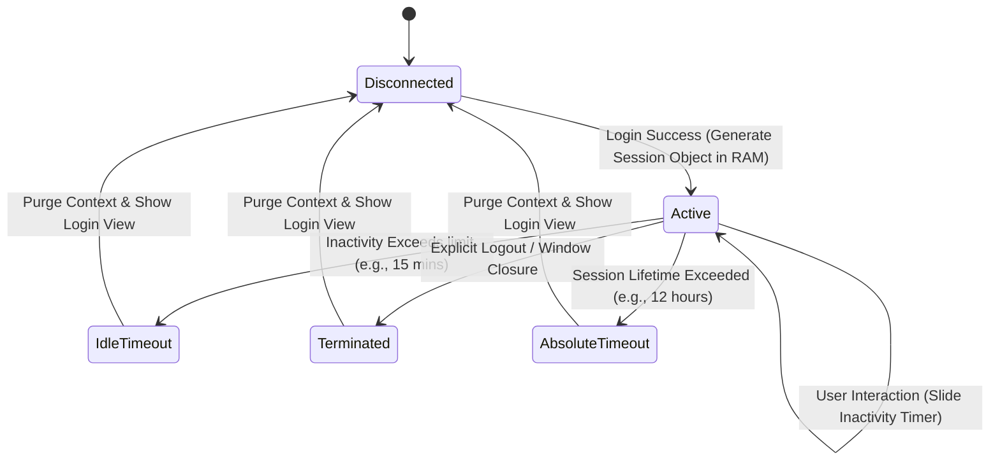

# Session Management Design

This document details the session design, state transitions, security bounds, and desktop-specific integration strategies for the **Face Recognition Attendance System**.

---

## 1. Session Lifecycle Diagram

The session lifecycle monitors user interactions from connection setup to final teardown or expiration.



---

## 2. Session Management Policies

### 2.1 Session Creation
Upon successful authentication, the `SessionManager` instantiates an immutable session context in RAM.
*   **Session ID**: Generated using a cryptographically secure pseudorandom generator (`secrets.token_hex(32)`).
*   **Session Metadata**: Contains:
    *   `session_id` (Hex string)
    *   `user_id` (Integer matching DB ID)
    *   `role` (String representing user role)
    *   `permissions` (Set of strings)
    *   `created_at` (Datetime timestamp)
    *   `last_activity` (Datetime timestamp)

### 2.2 Session Validation
Every transaction invoking a service layer method must validate the active session:
1.  Verify the session exists in the manager's active map.
2.  Compare `last_activity` against the timeout limits.
3.  Confirm the user's status (`is_active`) remains `True` in the database.

### 2.3 Session Expiration & Timeouts
*   **Idle Timeout (Sliding Window)**: Configured via environment settings (e.g. `COOLDOWN_MINUTES`). The default is **15 minutes**. Any keyboard or mouse event resets this window.
*   **Absolute Session Lifetime**: Hard limit of **12 hours**. Once exceeded, the user must re-authenticate, regardless of activity, to prevent stale sessions on overnight terminals.

### 2.4 Explicit Logout
Upon user click or system trigger:
1.  The system calls `SessionManager.destroy_session(session_id)`.
2.  The session entry is deleted from the active RAM dictionary.
3.  The GUI frame removes all dashboard components and forces a clean redirect back to the credentials frame.
4.  Garbage collection is manually triggered (`gc.collect()`) to ensure credentials arrays are fully removed from heap allocations.

---

## 3. Desktop Application UI Considerations

Desktop applications require different session handling compared to stateless web architectures:

1.  **RAM-Only Transient Store**: Session states are stored strictly in Python memory (`dict` / `dataclass` models). No session tokens are written to local cookies, SQLite rows, or configuration files. This eliminates local file leakage vectors.
2.  **Inactivity Monitoring (CustomTkinter event binding)**:
    *   To track user activity in CustomTkinter, the parent app binds global mouse and keypress events to a heartbeat method:
        ```python
        # Planned UI event listener setup
        self.bind("<Any-KeyPress>", self.session_manager.reset_activity_timer)
        self.bind("<Any-ButtonPress>", self.session_manager.reset_activity_timer)
        self.bind("<Motion>", self.session_manager.reset_activity_timer)
        ```
    *   A background daemon thread or Tkinter `after()` callback polls the session time-in check every 30 seconds.
3.  **App Crash Handling**: If the desktop application crashes, the memory space is reclaimed by the operating system, naturally destroying the active session context.
4.  **Concurrent Session Management**: Since the app is a local desktop application, only one active user session can run within the interface window at a time. The system prevents spawning nested/multiple dashboard views within the same process.
