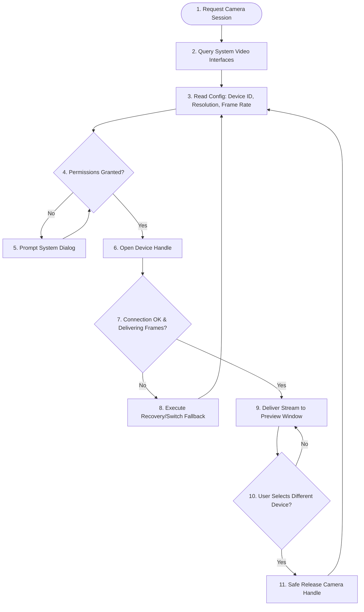

# Face Dataset Collection & Image Processing - Camera Workflow

## 1. Purpose
This document details the camera management architecture and runtime workflow. It defines how the system interfaces with imaging hardware, handles format configurations, manages system permissions, and implements failover recovery to maintain stable frame feeds.

---

## 2. Overview
The Camera subsystem provides a unified hardware abstraction layer. Whether the system accesses a built-in laptop camera, an external USB webcam, or a network IP camera, the rest of the application interacts with a single, uniform interface that delivers frame buffers.

```
+-----------------------------------------------------------------------------------+
|                                 ICameraProvider (Interface)                        |
+-----------------------------------------------------------------------------------+
        ^                               ^                               ^
        |                               |                               |
+---------------+               +---------------+               +---------------+
| OpenCVWebcam  |               |  USBCamera    |               |   IPCamera    |
| (Default/Ext) |               | (DirectShow)  |               | (RTSP Stream) |
+---------------+               +---------------+               +---------------+
```

---

## 3. Workflow
The Camera workflow governs how devices are queried, initialized, monitored, and switched during execution:



---

## 4. Architecture
The camera manager maintains state machines for configuration, health assessment, and recovery:

### 4.1 Device Support
- **Default/Internal Camera**: Standard system webcam accessed via default OS video indexes (e.g., Index `0`).
- **External USB Webcams**: Standard USB video class (UVC) cameras accessed via indexes (e.g., Index `1`, `2`).
- **IP Cameras (Future-Proof)**: RTSP network streams targeting remote URLs (e.g., `rtsp://username:password@ip_address:port/h264`).

### 4.2 Configuration Parameters
- **Resolution Selection**: Support standard aspect ratios:
  - 1080p ($1920 \times 1080$) - Recommended for desktop enrollment.
  - 720p ($1280 \times 720$) - Default minimum for collection.
  - VGA ($640 \times 480$) - Fallback for legacy hardware.
- **Frame Rate (FPS)**: Configurable target rates (default: $30\text{ FPS}$). The system will downsample if processing limits are reached, but frame capture rates are throttled to ensure validation consistency.

### 4.3 Health Check & Diagnostics
The system queries camera health metrics at $1\text{ Hz}$ intervals, monitoring:
- **Frame Delivery Timeout**: Triggers if no frame is delivered within $2.0$ seconds.
- **Frame Drop Rate**: Triggers if more than $50\%$ of target frames are dropped within a $10$-second window.
- **Resolution Mismatch**: Verifies that the hardware is actually outputting the requested resolution.

### 4.4 Failure Recovery
If a device fails:
1. **Soft Reset**: Release the camera channel and attempt re-binding up to 3 times with a 1-second delay.
2. **Fallback Device**: If the primary camera fails, query system interfaces and automatically fallback to the default internal system camera (Index `0`).
3. **Graceful Alert**: If no hardware interfaces respond, raise a `CameraConnectionException` to prompt the user to check physical cable connections.

---

## 5. Business Rules
- **Access Locking**: When a camera device index is opened, a file lock or software lock is generated, preventing duplicate threads from calling the same device.
- **Resolution Threshold**: The registration pipeline will block enrollment if the active camera resolution drops below $1280 \times 720$, as lower resolutions degrade facial landmark precision.
- **Permissions Bypass**: The camera manager must read system configuration values to determine if OS-level permission is missing, displaying an immediate instructional screen if permissions are denied.

---

## 6. Design Decisions
- **Thread Isolation (Frame Reader Thread)**: Frame retrieval must occur in a dedicated, high-priority background thread that pushes frames into a thread-safe Queue (`double-buffered queue`). This decouples frame grabbing from rendering and preprocessing.
- **DirectShow Adapter on Windows**: Use Windows DirectShow backends for faster USB camera initialization times, avoiding the common 3-5 second delay associated with default OpenCV bindings.

---

## 7. Future Improvements
- **Network Bandwidth Optimization**: Add adaptive bitrate adjustments for IP cameras, dropping resolution dynamically if network packet loss is detected on RTSP connections.
- **Hardware Trigger Support**: Support physical industrial hardware triggers (e.g., USB IO buttons) to synchronize snapshot frames directly.

---

## 8. References to Related Modules
- [Dataset Overview](file:///c:/GitHub/Attendence-System-Uning-Face-Recognition/docs/dataset/Dataset_Overview.md)
- [Dataset Architecture](file:///c:/GitHub/Attendence-System-Uning-Face-Recognition/docs/dataset/Dataset_Architecture.md)
- [Dataset Collection](file:///c:/GitHub/Attendence-System-Uning-Face-Recognition/docs/dataset/Dataset_Collection.md)
- [Image Preprocessing](file:///c:/GitHub/Attendence-System-Uning-Face-Recognition/docs/dataset/Image_Preprocessing.md)
- [Image Validation](file:///c:/GitHub/Attendence-System-Uning-Face-Recognition/docs/dataset/Image_Validation.md)
- [Face Alignment](file:///c:/GitHub/Attendence-System-Uning-Face-Recognition/docs/dataset/Face_Alignment.md)
- [Dataset Storage](file:///c:/GitHub/Attendence-System-Uning-Face-Recognition/docs/dataset/Dataset_Storage.md)
- [Embedding Pipeline](file:///c:/GitHub/Attendence-System-Uning-Face-Recognition/docs/dataset/Embedding_Pipeline.md)
- [Dataset Management](file:///c:/GitHub/Attendence-System-Uning-Face-Recognition/docs/dataset/Dataset_Management.md)
- [Quality Control](file:///c:/GitHub/Attendence-System-Uning-Face-Recognition/docs/dataset/Quality_Control.md)
- [Performance Considerations](file:///c:/GitHub/Attendence-System-Uning-Face-Recognition/docs/dataset/Performance_Considerations.md)
- [Future AI Models](file:///c:/GitHub/Attendence-System-Uning-Face-Recognition/docs/dataset/Future_AI_Models.md)
- [Privacy and Security](file:///c:/GitHub/Attendence-System-Uning-Face-Recognition/docs/dataset/Privacy_and_Security.md)
- [Workflow Diagrams](file:///c:/GitHub/Attendence-System-Uning-Face-Recognition/docs/dataset/Workflow_Diagrams.md)
