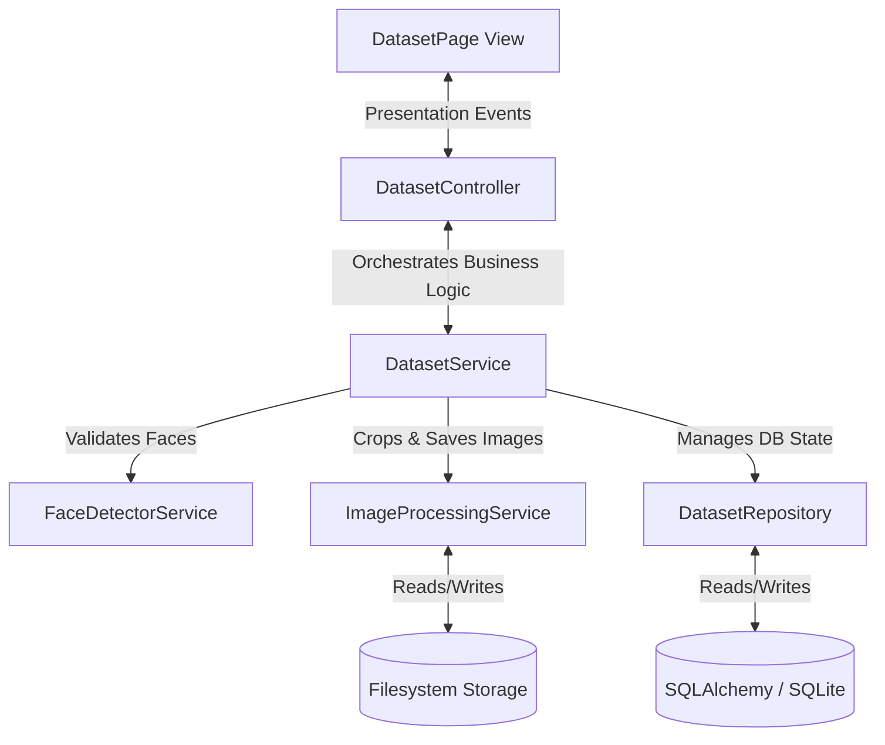

# Face Dataset Architecture

This document describes the design patterns, software layers, and separation of concerns implemented for the Face Dataset module.

---

## Architectural Diagram

The system employs a strict unidirectional separation of concerns:

---

## Layers Description

### 1. Presentation Layer (GUI View)
*   **File**: [dataset.py](file:///c:/GitHub/Attendence-System-Uning-Face-Recognition/src/gui/pages/dataset.py)
*   **Responsibility**: Renders the CustomTkinter widgets, handles background worker scheduling for the video feed, and presents user confirmations (modals).
*   **Constraint**: No database operations or file-saving calls are executed directly in this layer.

### 2. Coordination Layer (Controller)
*   **File**: [dataset_controller.py](file:///c:/GitHub/Attendence-System-Uning-Face-Recognition/src/controllers/dataset_controller.py)
*   **Responsibility**: Formulates requests from the UI layer and handles redirection routing. Passes cleaned parameters to the service tier.

### 3. Business Logic Layer (Services)
*   **File**: [dataset_service.py](file:///c:/GitHub/Attendence-System-Uning-Face-Recognition/src/services/dataset_service.py)
*   **Responsibility**: Manages transaction state, triggers face validations, resizes crops, audits image quality, and synchronizes status strings.
*   **Internal Helpers**:
    *   **FaceDetectorService**: Abstraction over cv2 Haar Cascades.
    *   **ImageProcessingService**: Abstraction over crop math, quality control (brightness, blur), and disk writes.

### 4. Data Access Layer (Repository)
*   **File**: [dataset_repository.py](file:///c:/GitHub/Attendence-System-Uning-Face-Recognition/src/repositories/dataset_repository.py)
*   **Responsibility**: Coordinates SQLAlchemy session contexts, queries, inserts, deletes, and ensures clean instance expunging to prevent detached errors.
