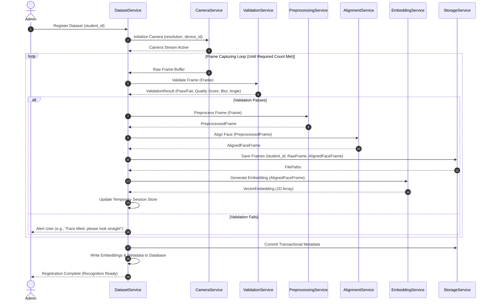

# Face Dataset Collection & Image Processing - Dataset Architecture

## 1. Purpose
This document specifies the software architecture of the Face Dataset Collection and Image Processing pipeline. It details the boundaries, data transfer objects (DTOs), and interfaces of each modular service component, ensuring a highly maintainable, testable, and model-independent architecture.

---

## 2. Overview
The architecture is structured around clean architecture principles. It separates the input hardware adapters (camera wrappers) and deep learning models (embeddings generation) from the core enrollment orchestration logic. The pipeline processes raw camera frames through a series of filtering, normalizing, and verifying services before updating the storage and relational database layers.

```
+---------------------------------------------------------------------------------------------------+
|                                      Orchestrator (DatasetService)                                |
+---------------------------------------------------------------------------------------------------+
       |                    |                    |                    |                   |
       v                    v                    v                    v                   v
+--------------+     +--------------+     +--------------+     +--------------+    +--------------+
| Camera       |     | Image        |     | Image        |     | Face         |    | Embedding    |
| Service      |     | Validation   |     | Preproc.     |     | Alignment    |    | Service      |
|              |     | Service      |     | Service      |     | Service      |    |              |
+--------------+     +--------------+     +--------------+     +--------------+    +--------------+
       |                    |                    |                    |                   |
       v                    v                    v                    v                   v
+------------------+ +------------------+ +------------------+ +------------------+ +------------------+
| Camera Settings  | | Quality Rules    | | Color & Contrast | | Landmarks (5-pt) | | Model Provider  |
| Resolution/fps   | | Blur/Angle/Light | | Resize/Scale     | | Affine Transform | | Vector Encoders  |
+------------------+ +------------------+ +------------------+ +------------------+ +------------------+
```

---

## 3. Workflow
The detailed lifecycle stages of registration, from camera initialization to registration ready, are executed sequentially. Below is the workflow diagram representing the stages:



---

## 4. Architecture
The system consists of the following modular services, each possessing a single, clear responsibility:

### 4.1 Camera Service
- **Responsibility**: Wraps physical video acquisition hardware (webcams, USB cameras, IP streams).
- **Interface**:
  - `initialize_device(device_id: string, width: int, height: int, fps: int) -> bool`
  - `read_frame() -> FrameBuffer`
  - `release_device() -> void`
  - `get_health_status() -> dict`

### 4.2 Capture Service
- **Responsibility**: Controls capture modes (burst, timer-based, manual) and triggers downstream analysis.
- **Interface**:
  - `start_capture_session(mode: CaptureMode, count: int, interval: float)`
  - `process_trigger() -> bool`

### 4.3 Detection Service
- **Responsibility**: Performs fast localization of faces within frames to define bounding boxes.
- **Interface**:
  - `detect_faces(frame: FrameBuffer) -> list[BoundingBox]`

### 4.4 Validation Service
- **Responsibility**: Checks if raw frames satisfy structural conditions (single face, landmarks within boundaries, appropriate face size relative to frame).
- **Interface**:
  - `validate_bounds(frame: FrameBuffer, bbox: BoundingBox) -> ValidationReport`

### 4.5 Preprocessing Service
- **Responsibility**: Formats frame attributes (resolution, color channel alignment, contrast normalizing) to match pipeline standards.
- **Interface**:
  - `standardize(frame: FrameBuffer) -> PreprocessedFrame`

### 4.6 Alignment Service
- **Responsibility**: Executes landmark-based affine rotations so that eyes, nose, and mouth are registered at fixed coordinate fractions.
- **Interface**:
  - `align(frame: PreprocessedFrame, landmarks: FacialLandmarks) -> AlignedFaceFrame`

### 4.7 Quality Service
- **Responsibility**: Checks texture and scene properties (blur level, lighting distribution, occlusion metrics) and computes a composite quality grade.
- **Interface**:
  - `assess_quality(frame: FrameBuffer, bbox: BoundingBox) -> QualityAssessmentReport`

### 4.8 Embedding Service
- **Responsibility**: Feeds aligned face frames into deep neural network backends to extract identity vectors.
- **Interface**:
  - `generate_embedding(face: AlignedFaceFrame) -> list[float]`
  - `set_model_provider(provider: IModelProvider) -> void`

### 4.9 Storage Service
- **Responsibility**: Handles file system directories, writing images to disk, purging temp cache, and structuring image indices.
- **Interface**:
  - `save_raw_image(student_id: string, image: FrameBuffer) -> string`
  - `save_processed_image(student_id: string, image: AlignedFaceFrame) -> string`
  - `delete_dataset(student_id: string) -> bool`

### 4.10 Dataset Service
- **Responsibility**: Coordinates the registration transaction, database interactions, and dataset versioning states.
- **Interface**:
  - `register_new_dataset(student_id: string) -> DatasetSession`
  - `rebuild_student_embeddings(student_id: string) -> bool`

### 4.11 Statistics Service
- **Responsibility**: Aggregates metadata to produce metrics on dataset sizes, frame reject rates, and registration efficiency.
- **Interface**:
  - `generate_system_stats() -> DatasetStats`

---

## 5. Business Rules
- **No Direct Storage Access**: No service other than `StorageService` can perform write or delete operations on the physical disk directory.
- **Transactional Atomicity**: An enrollment session is atomic. If the required count of 10 face frames is not fully captured and successfully processed, the database transaction is rolled back, and temporary files are deleted.
- **Single-Threaded Camera Access**: Only one instance of the `CameraService` can bind to a hardware camera device ID at any given time.
- **Thread Separation**: The `CameraService` must stream frames on a background IO thread to prevent UI freezing.

---

## 6. Design Decisions
- **Loose Coupling via Dependency Injection**: Rather than importing model frameworks directly, services use abstract interfaces. For instance, the `EmbeddingService` accepts any implementation of `IModelProvider`, allowing seamless transitions from PyTorch to ONNX or TensorRT runtimes.
- **Separation of Concerns (Validation vs. Preprocessing)**: Frame validation (light, blur, angle) is performed before preprocessing. If a frame fails validation, preprocessing compute is saved.
- **In-Memory Cache for Session Frames**: Frames are cached in-memory during a session, and committed to storage asynchronously only upon successful session completion to reduce disk IO thrashing.

---

## 7. Future Improvements
- **Microservices Shift**: Separate the `Camera/Capture/Validation/Alignment` services into a client edge application, and the `Embedding/Database/Dataset` services into a centralized containerized service.
- **Distributed Shared Storage**: Support an abstract S3/Cloud storage backend inside the `StorageService` for multi-campus deployments.

---

## 8. References to Related Modules
- [Dataset Overview](file:///c:/GitHub/Attendence-System-Uning-Face-Recognition/docs/dataset/Dataset_Overview.md)
- [Camera Workflow](file:///c:/GitHub/Attendence-System-Uning-Face-Recognition/docs/dataset/Camera_Workflow.md)
- [Dataset Collection](file:///c:/GitHub/Attendence-System-Uning-Face-Recognition/docs/dataset/Dataset_Collection.md)
- [Image Preprocessing](file:///c:/GitHub/Attendence-System-Uning-Face-Recognition/docs/dataset/Image_Preprocessing.md)
- [Image Validation](file:///c:/GitHub/Attendence-System-Uning-Face-Recognition/docs/dataset/Image_Validation.md)
- [Face Alignment](file:///c:/GitHub/Attendence-System-Uning-Face-Recognition/docs/dataset/Face_Alignment.md)
- [Dataset Storage](file:///c:/GitHub/Attendence-System-Uning-Face-Recognition/docs/dataset/Dataset_Storage.md)
- [Embedding Pipeline](file:///c:/GitHub/Attendence-System-Uning-Face-Recognition/docs/dataset/Embedding_Pipeline.md)
- [Dataset Management](file:///c:/GitHub/Attendence-System-Uning-Face-Recognition/docs/dataset/Dataset_Management.md)
- [Quality Control](file:///c:/GitHub/Attendence-System-Uning-Face-Recognition/docs/dataset/Quality_Control.md)
- [Performance Considerations](file:///c:/GitHub/Attendence-System-Uning-Face-Recognition/docs/dataset/Performance_Considerations.md)
- [Future AI Models](file:///c:/GitHub/Attendence-System-Uning-Face-Recognition/docs/dataset/Future_AI_Models.md)
- [Privacy and Security](file:///c:/GitHub/Attendence-System-Uning-Face-Recognition/docs/dataset/Privacy_and_Security.md)
- [Workflow Diagrams](file:///c:/GitHub/Attendence-System-Uning-Face-Recognition/docs/dataset/Workflow_Diagrams.md)
