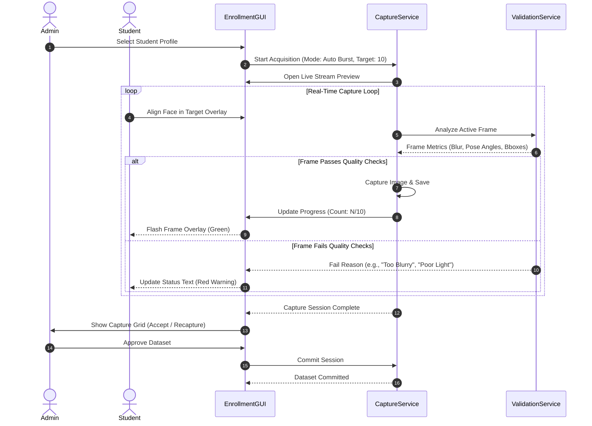

# Face Dataset Collection & Image Processing - Dataset Collection

## 1. Purpose
This document specifies the user experience flow, state transitions, and backend orchestration logic for collecting student facial datasets. It establishes standard methodologies for manual, automatic, and burst image acquisition, ensuring high-quality, diverse facial samples while minimizing onboarding time.

---

## 2. Overview
The dataset collection subsystem is the user-facing gateway for biometric enrollment. Rather than requiring users to manually capture every photo, this design integrates automated face tracking and real-time validation feedback. This feedback helps operators and students adjust poses dynamically to complete enrollment sessions quickly.

```
       +------------------+
       |   Student Info   |
       +------------------+
                |
                v
       +------------------+
       |  Camera Preview  |
       +------------------+
                |
                v
+--------------------------------+
|    Face Detection & Tracking   |
+--------------------------------+
  |              |             |
  v              v             v
Manual         Timer         Burst
Mode           Mode          Mode
  |              |             |
  +--------------+-------------+
                 |
                 v
       +------------------+
       |  Validation & QC |
       +------------------+
         |              |
     [Pass]           [Fail]
         |              |
         v              v
   +-----------+  +-----------+
   | Keep &    |  | Reject &  |
   | Increment |  | Alert     |
   +-----------+  +-----------+
```

---

## 3. Workflow
The registration sequence enforces a series of steps to register student faces:



---

## 4. Architecture
The Collection flow is managed by a state machine containing three core configurations:

### 4.1 Capture Modes
- **Manual Capture**: The administrator clicks a manual trigger button to capture a frame. Recommended when enrolling students with mobility or positioning difficulties.
- **Automatic Capture**: The system monitors the live feed and automatically captures a frame whenever the face validation service reports a perfect score ($>90\%$).
- **Burst Capture (Recommended)**: The system captures frames in a rapid, automated sequence ($2-3\text{ frames/second}$) while prompting the student to perform micro-motions of the head (look forward, tilt up, tilt down, slight angles) to capture lighting and structural variance.

### 4.2 Collection Controls
- **Capture Counter**: Displays the index of the currently accepted frame relative to the total needed (e.g., `5 / 10`).
- **Capture Interval**: A cooldown period ($500\text{ ms}$ minimum) between successive automated captures. This ensures that the burst mode doesn't capture identical consecutive frames, which would lead to poor feature variance.
- **Required Sample Count**: Standardized to exactly $10$ approved frames.
- **Progress Feedback**: A UI progress bar that fills dynamically as frames pass quality control, accompanied by sound cues or color-coded overlays (green border for success, red border for failure).

### 4.3 Failures & Retries
- **Capture Retry Logic**: If a frame is rejected, the capture loop is not interrupted. The frame is discarded, and the system continues to process incoming frames until the target count is satisfied.
- **Duplicate Prevention**: The system compares bounding boxes and feature points between consecutive frames. If the cosine similarity of the generated embedding vectors is extremely high ($>0.99$), the frame is rejected as a duplicate to ensure sample diversity.

---

## 5. Business Rules
- **No In-Frame Multi-Face Allowed**: If a frame contains more than one face, the capture service immediately suspends collection and prompts the user, preventing registration database poisoning.
- **Maximum Time Limit**: A capture session has a $60$-second timeout. If the required count is not met within this time, the session expires, prompting the user to restart the process. This prevents system lockups when users walk away from active registration stations.
- **Dynamic Posing Requirement**: Out of the $10$ required frames:
  - Minimum 6 frames must be frontal center face.
  - Minimum 2 frames must represent slight left/right angles ($15^{\circ}$).
  - Minimum 2 frames must represent slight upward/downward tilts ($15^{\circ}$).

---

## 6. Design Decisions
- **Event-Driven Collection Orchestrator**: The collection service communicates with the UI via event emitters or callback hooks. This decouples the processing thread from the GUI thread, preventing interface lag.
- **Temporary Cache Commits**: Aligned and raw images are stored in a session-specific temporary directory (`tmp/session_student_id/`). They are moved to the production data store only when the administrator approves the final dataset layout.

---

## 7. Future Improvements
- **Guided UI overlays**: Draw dynamic 3D head outlines on the camera preview screen, instructing the student to align their face with a moving target to automate multi-angle pose collections.
- **Audio Prompts**: Add automated synthesized voice prompts to guide visually impaired students during registration.

---

## 8. References to Related Modules
- [Dataset Overview](file:///c:/GitHub/Attendence-System-Uning-Face-Recognition/docs/dataset/Dataset_Overview.md)
- [Dataset Architecture](file:///c:/GitHub/Attendence-System-Uning-Face-Recognition/docs/dataset/Dataset_Architecture.md)
- [Camera Workflow](file:///c:/GitHub/Attendence-System-Uning-Face-Recognition/docs/dataset/Camera_Workflow.md)
- [Image Preprocessing](file:///c:/GitHub/Attendence-System-Uning-Face-Recognition/docs/dataset/Image_Preprocessing.md)
- [Image Validation](file:///c:/GitHub/Attendence-System-Uning-Face-Recognition/docs/dataset/Image_Validation.md)
- [Face Alignment](file:///c:/GitHub/Attendence-System-Uning-Face-Recognition/docs/dataset/Face_Alignment.md)
- [Dataset Storage](file:///c:/GitHub/Attendence-System-Uning-Face-Recognition/docs/dataset/Dataset_Storage.md)
- [Embedding Pipeline](file:///c:/GitHub/Attendence-System-Uning-Face-Recognition/docs/dataset/Embedding_Pipeline.md)
- [Dataset Management](file:///c:/GitHub/Attendence-System-Uning-Face-Recognition/docs/dataset/Dataset_Management.md)
- [Quality Control](file:///c:/GitHub/Attendence-System-Uning-Face-Recognition/docs/dataset/Quality_Control.md)
- [Performance Considerations](file:///c:/GitHub/Attendence-System-Uning-Face-Recognition/docs/dataset/Performance_Considerations.md)
- [Future AI Models](file:///c:/GitHub/Attendence-System-Uning-Face-Recognition/docs/dataset/Future_AI_Models.md)
- [Privacy and Security](file:///c:/GitHub/Attendence-System-Uning-Face-Recognition/docs/dataset/Privacy_and_Security.md)
- [Workflow Diagrams](file:///c:/GitHub/Attendence-System-Uning-Face-Recognition/docs/dataset/Workflow_Diagrams.md)
