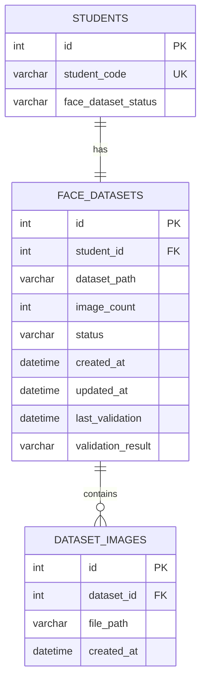

# Database Integration Schema

This document explains the schema design, tables, relationships, and queries used to manage face dataset metadata.

---

## Schema Model relationships

The entity relationship diagram for the face dataset module:

---

## Key SQL Constraints

1.  **Cascading Deletes**: `ondelete="CASCADE"` is set on the foreign keys `student_id` in `face_datasets` and `dataset_id` in `dataset_images`. Deleting a student record automatically deletes their dataset and images metadata rows.
2.  **Unique Constraints**: `student_id` is unique in `face_datasets` (one-to-one relationship), and `file_path` is unique in `dataset_images` to prevent file path duplicates.
3.  **Automatic Seeding**: Tables are generated on start via SQLAlchemy `Base.metadata.create_all(_engine)` in `database.py`.
