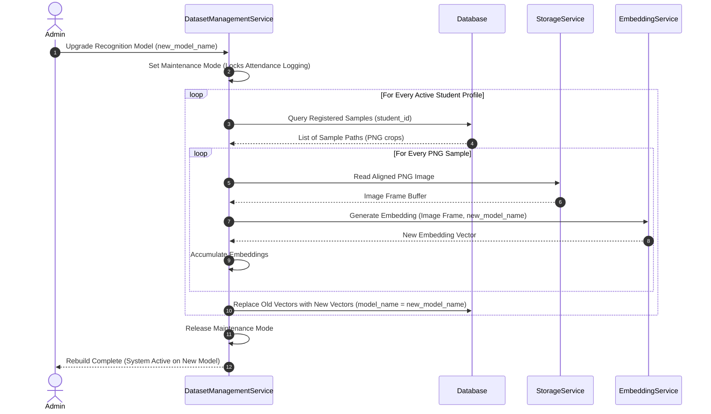

# Face Dataset Collection & Image Processing - Dataset Management

## 1. Purpose
This document specifies the dataset management service. It defines the operations used to maintain, upgrade, archive, and audit student biometric profiles, ensuring the dataset remains healthy and aligned with database states.

---

## 2. Overview
The dataset lifecycle extends beyond initial enrollment. Over time, students graduate, models upgrade, database indices corrupt, and files require migration. The Dataset Management Service provides administrative operations to rebuild embeddings, archive old profiles, verify storage integrity, and compile usage statistics.

```
                  +--------------------------------+
                  |    DatasetManagementService    |
                  +--------------------------------+
                                   |
      +-----------------+----------+----------+-----------------+
      |                 |                     |                 |
      v                 v                     v                 v
+-----------+     +-----------+         +-----------+     +-----------+
| Rebuild   |     | Archive   |         | Database  |     | Statistics|
| Engine    |     | Manager   |         | Sync Tool |     | Engine    |
+-----------+     +-----------+         +-----------+     +-----------+
```

---

## 3. Workflow
The workflow below details how the system upgrades its biometric engine, rebuilding embeddings from stored aligned images without requiring students to re-register:



---

## 4. Architecture
The management system includes eight core operations:

### 4.1 Create & Register Profile
- **Function**: Allocates physical file directories (`raw/<student_id>`, `aligned/<student_id>`) and creates database record templates.

### 4.2 Update Dataset
- **Function**: Appends new samples to an existing profile or replaces low-quality samples.

### 4.3 Delete Dataset
- **Function**: Safely deletes all physical files (raw, aligned, rejected) and database records associated with a student. This operation is designed to comply with privacy laws like GDPR's "Right to be Forgotten".

### 4.4 Rebuild Embeddings
- **Function**: Re-processes saved aligned images through a new model provider to regenerate embedding vectors. This allows the system to upgrade its AI model without forcing students to re-enroll.

### 4.5 Archive Dataset
- **Function**: Compresses a student's raw images into a single zip archive and moves it to long-term storage, while deleting active disk files to save space.

### 4.6 Restore Dataset
- **Function**: Decompresses archived zip profiles, restores folder structures, and updates database records.

### 4.7 Dataset Version Control
- **Function**: Tags database embeddings with version numbers (e.g., `EMB_VER_1_0`). The matching engine uses this version tag to filter profiles and prevent cross-model comparison errors.

### 4.8 Integrity & Health Diagnostics
- **Function**: Runs a scheduled audit that checks for:
  - **Dangling Database Rows**: Database records pointing to files that do not exist on disk.
  - **Orphan Files**: Images on disk that have no corresponding database record.
  - **Corrupted Files**: Unreadable or truncated image files.

---

## 5. Business Rules
- **Biometric Backup Sync**: The system must run a database sync audit daily. Any discrepancy (e.g., missing aligned images for an active database ID) must trigger a system alert.
- **Maintenance Locks**: While embedding rebuild operations are running, the authentication and attendance modules are temporarily locked to prevent read/write conflicts.
- **GDPR Deletion Protocol**: Deleting a dataset must perform a secure erase (overwriting file storage blocks with random bytes) instead of a simple metadata reference deletion, ensuring biometric data cannot be recovered.

---

## 6. Design Decisions
- **Decoupled Rebuild Pipeline**: Rebuilding embeddings is designed to run in background worker threads. This prevents the admin interface from freezing and allows the system to process large databases in the background.
- **Relational Integrity Constraints**: All dataset deletion operations use cascade constraints at the database level to ensure that deleting a student profile automatically removes all related attendance records and face embeddings.

---

## 7. Future Improvements
- **Automated Cloud Sync Backups**: Implement secure, encrypted cloud sync pipelines (e.g., targeting AWS S3 Glacier) to archive inactive student profiles automatically.
- **Appearance Drift Notifications**: Generate alerts if a student's newly captured attendance photos show significant variations (e.g., aging or new glasses) compared to their registration dataset, prompting an administrative review to update the dataset.

---

## 8. References to Related Modules
- [Dataset Overview](file:///c:/GitHub/Attendence-System-Uning-Face-Recognition/docs/dataset/Dataset_Overview.md)
- [Dataset Architecture](file:///c:/GitHub/Attendence-System-Uning-Face-Recognition/docs/dataset/Dataset_Architecture.md)
- [Camera Workflow](file:///c:/GitHub/Attendence-System-Uning-Face-Recognition/docs/dataset/Camera_Workflow.md)
- [Dataset Collection](file:///c:/GitHub/Attendence-System-Uning-Face-Recognition/docs/dataset/Dataset_Collection.md)
- [Image Preprocessing](file:///c:/GitHub/Attendence-System-Uning-Face-Recognition/docs/dataset/Image_Preprocessing.md)
- [Image Validation](file:///c:/GitHub/Attendence-System-Uning-Face-Recognition/docs/dataset/Image_Validation.md)
- [Face Alignment](file:///c:/GitHub/Attendence-System-Uning-Face-Recognition/docs/dataset/Face_Alignment.md)
- [Dataset Storage](file:///c:/GitHub/Attendence-System-Uning-Face-Recognition/docs/dataset/Dataset_Storage.md)
- [Embedding Pipeline](file:///c:/GitHub/Attendence-System-Uning-Face-Recognition/docs/dataset/Embedding_Pipeline.md)
- [Quality Control](file:///c:/GitHub/Attendence-System-Uning-Face-Recognition/docs/dataset/Quality_Control.md)
- [Performance Considerations](file:///c:/GitHub/Attendence-System-Uning-Face-Recognition/docs/dataset/Performance_Considerations.md)
- [Future AI Models](file:///c:/GitHub/Attendence-System-Uning-Face-Recognition/docs/dataset/Future_AI_Models.md)
- [Privacy and Security](file:///c:/GitHub/Attendence-System-Uning-Face-Recognition/docs/dataset/Privacy_and_Security.md)
- [Workflow Diagrams](file:///c:/GitHub/Attendence-System-Uning-Face-Recognition/docs/dataset/Workflow_Diagrams.md)
