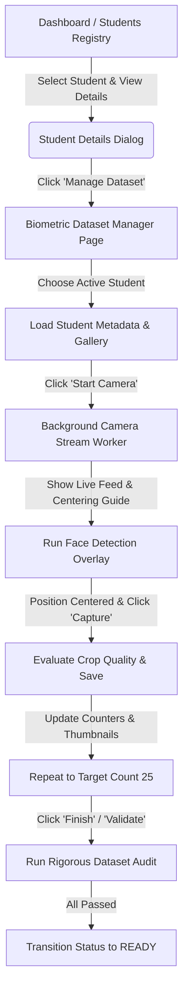

# Face Dataset Management Overview

This document provides a high-level overview of the **Face Dataset Collection & Management Module** (Phase 8) in the Face Recognition Attendance System.

---

## Purpose

The primary objective of the Face Dataset module is to orchestrate the acquisition, validation, and persistence of high-quality facial training samples. These samples are critical for future phases, which involve generating 512-D vector embeddings (InsightFace/ArcFace) and performing facial recognition.

---

## User Flow

The module implements a strict step-by-step user flow:

---

## Core Features

1. **Student Selection Context**: Auto-selects the student redirected from the details page, or allows dropdown selection of active student profiles.
2. **Real-time Camera Stream**: Renders a live preview stream inside the CustomTkinter UI frame using an asynchronous background thread.
3. **Aligned Bounding Box Overlay**: Paints a green rectangle when a single face is perfectly aligned, or red when alignment fails or multiple faces appear.
4. **Interactive Gallery**: Shows a horizontal thumbnail strip of saved image crops with a quick-deletion option.
5. **Rigorous Audit Engine**: Runs file checks, dimension constraints (112x112), readability, and face count audits.
6. **Automatic DB Synchronization**: Saves updates to database metadata and transitions status codes (e.g. `COLLECTING` -> `READY`).
7. **Clear Safeguards**: Double-prompts confirmations before deleting individual files or wiping the directory.
