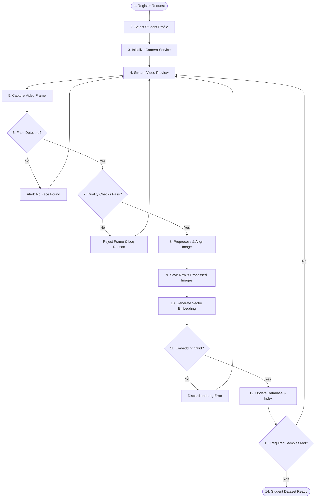

# Face Dataset Collection & Image Processing - Dataset Overview

## 1. Purpose
The **Face Dataset Collection & Image Processing** subsystem forms the ingestion layer of the Face Recognition Attendance System. Its primary objective is to acquire high-quality, normalized, and verified facial biometric datasets from students during onboarding, generating mathematical embeddings optimized for classification. This design minimizes facial recognition error rates (False Acceptance Rate - FAR and False Rejection Rate - FRR) by ensuring only standardized, high-resolution, aligned, and properly illuminated face samples enter the biometric store.

---

## 2. Overview
High-quality, consistent input data is the single most critical factor for reliable face recognition in production. Rather than passing unverified frames directly to neural networks, this architecture defines an automated capture, assessment, correction, and encoding pipeline. The system enforces strict image standards at the hardware and software ingestion points before generating feature vectors.

The subsystem operates as a sequence of decoupled modules:
1. **Camera Layer**: Standardizes multi-camera video feed inputs.
2. **Collection Loop**: Manages frame capture intervals and session thresholds.
3. **Validation & Quality Engine**: Real-time evaluation of lighting, focus, pose angles, and occlusion.
4. **Processing & Alignment Engine**: Geometrically normalizes and crops faces based on facial landmark alignment.
5. **Storage Manager**: Preserves audit trails, structured folder files, and schemas.
6. **Biometric Encoder**: A model-independent wrapper translating aligned frames into 1D embedding vectors.

---

## 3. Workflow
The registration flow spans from initial student selection to database commitment:

---

## 4. Architecture
The architecture is structured into a modular service topology:

- **Camera Service**: Interface for video acquisition, parameters (framerate, resolution), and hardware switching.
- **Capture Service**: Manages capture state-machines (manual button click vs. automated burst sequences).
- **Detection Service**: Lightweight local face localization and bounding box extraction.
- **Validation Service**: Rules engine checking image metrics (blur, brightness, head-tilt angles, multi-face presence).
- **Preprocessing Service**: Standardization routines (grayscale conversions, size resampling, normalization).
- **Alignment Service**: Landmark-based affine transformation centering eyes, nose, and mouth.
- **Storage Service**: Handles physical folder partitioning (Raw/Aligned/Rejected) and file serialization.
- **Quality Service**: Aggregates validator reports into a composite Quality Score.
- **Embedding Service**: Unified interface mapping faces to vector arrays via interchangeable model backends.
- **Dataset Service**: Orchestrates dataset CRUD, indexing, backups, and database sync.

---

## 5. Business Rules
- **Minimum Data Requirement**: A minimum of 10 high-quality, distinct face samples is required to activate a student's face recognition profile.
- **Single-Face Enrolment**: Frames containing more than one face are automatically rejected during the registration phase to prevent cross-contamination of identity models.
- **Quality Acceptance Threshold**: Individual frames must score a minimum composite quality grade of 75% to be processed for alignment and embedding generation.
- **Model Independence**: The pipeline must store aligned faces in a standardized format so that if the underlying model is upgraded (e.g., from FaceNet to ArcFace), the embeddings can be rebuilt from storage without re-capturing student photos.

---

## 6. Design Decisions
- **Client-Side/Local Inference**: Face detection, quality assessment, and preprocessing will run locally at the acquisition node to provide real-time latency feedback (<100ms per frame) to users.
- **Decoupling Raw and Processed Datasets**: Original captured photos are preserved for auditability and compliance, while aligned faces are isolated for model inference to avoid re-preprocessing overheads.
- **Modular Model Wrappers**: To avoid hardcoded deep learning library frameworks, the embedding generator connects through a standardized provider interface, wrapping models inside isolated worker pipelines.

---

## 7. Future Improvements
- **Passive Background Re-Enrollment**: Automatically trigger background dataset updates using high-confidence recognition frames captured during daily check-ins to account for aging and appearance changes.
- **Liveness Detection Integration**: Introduce active and passive anti-spoofing tests (e.g., blink checks, texture analysis) directly into the validation workflow to prevent print or video playback attacks.

---

## 8. References to Related Modules
- [Dataset Architecture](file:///c:/GitHub/Attendence-System-Uning-Face-Recognition/docs/dataset/Dataset_Architecture.md)
- [Camera Workflow](file:///c:/GitHub/Attendence-System-Uning-Face-Recognition/docs/dataset/Camera_Workflow.md)
- [Dataset Collection](file:///c:/GitHub/Attendence-System-Uning-Face-Recognition/docs/dataset/Dataset_Collection.md)
- [Image Preprocessing](file:///c:/GitHub/Attendence-System-Uning-Face-Recognition/docs/dataset/Image_Preprocessing.md)
- [Image Validation](file:///c:/GitHub/Attendence-System-Uning-Face-Recognition/docs/dataset/Image_Validation.md)
- [Face Alignment](file:///c:/GitHub/Attendence-System-Uning-Face-Recognition/docs/dataset/Face_Alignment.md)
- [Dataset Storage](file:///c:/GitHub/Attendence-System-Uning-Face-Recognition/docs/dataset/Dataset_Storage.md)
- [Embedding Pipeline](file:///c:/GitHub/Attendence-System-Uning-Face-Recognition/docs/dataset/Embedding_Pipeline.md)
- [Dataset Management](file:///c:/GitHub/Attendence-System-Uning-Face-Recognition/docs/dataset/Dataset_Management.md)
- [Quality Control](file:///c:/GitHub/Attendence-System-Uning-Face-Recognition/docs/dataset/Quality_Control.md)
- [Performance Considerations](file:///c:/GitHub/Attendence-System-Uning-Face-Recognition/docs/dataset/Performance_Considerations.md)
- [Future AI Models](file:///c:/GitHub/Attendence-System-Uning-Face-Recognition/docs/dataset/Future_AI_Models.md)
- [Privacy and Security](file:///c:/GitHub/Attendence-System-Uning-Face-Recognition/docs/dataset/Privacy_and_Security.md)
- [Workflow Diagrams](file:///c:/GitHub/Attendence-System-Uning-Face-Recognition/docs/dataset/Workflow_Diagrams.md)
