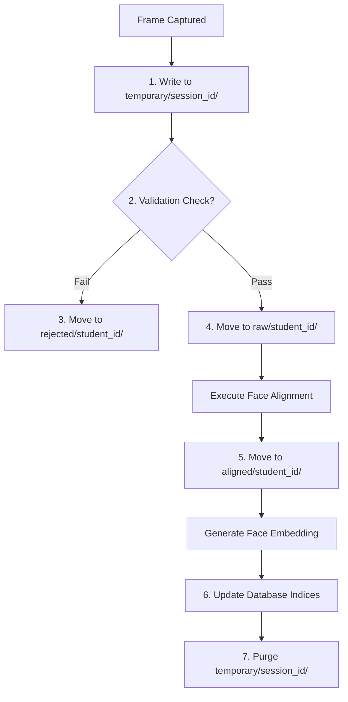

# Face Dataset Collection & Image Processing - Dataset Storage

## 1. Purpose
This document specifies the storage layout, directory tree structures, and metadata serialization formats for the facial dataset. It defines rules for structuring, tracking, and backing up data to ensure compliance with privacy laws and system audit requirements.

---

## 2. Overview
The storage system manages raw images, aligned face crops, feature vectors, and validation metadata. Rather than using unstructured folders, this architecture uses a dual storage system: an indexed directory structure for physical images and a relational database for metadata, schemas, and query indexes.

```
data/
├── raw/
│   └── student_id/
│       ├── raw_001.jpg
│       └── ...
├── aligned/
│   └── student_id/
│       ├── aligned_001.jpg
│       └── ...
├── rejected/
│   └── student_id/
│       ├── rej_001_blur.jpg
│       └── ...
├── temporary/
│   └── session_id/
└── archive/
    └── student_id/
```

---

## 3. Workflow
The workflow below describes the file operations performed during registration:



---

## 4. Architecture
The physical workspace directory structure is partitioned into logical areas under a base directory:

### 4.1 Directory Hierarchy
- **Raw Images Directory (`data/raw/<student_id>/`)**:
  - Contains the original captured frames.
  - Saved in high-quality compression formats (`JPEG`, quality rating $>95\%$).
  - Naming standard: `raw_<sequence_index>.jpg` (e.g., `raw_001.jpg`).
- **Aligned Face Crops (`data/aligned/<student_id>/`)**:
  - Standardized aligned faces (e.g., $112 \times 112$ pixels).
  - Saved in lossless formats (`PNG`) to preserve exact pixel values for embedding models.
  - Naming standard: `aligned_<sequence_index>.png` (e.g., `aligned_001.png`).
- **Rejected Images (`data/rejected/<student_id>/`)**:
  - Retained for audit trails and to debug system issues.
  - Naming standard: `rej_<sequence_index>_<error_code>.jpg` (e.g., `rej_002_blur.jpg`).
- **Temporary Sessions (`data/temporary/<session_id>/`)**:
  - Active capture buffers during registration sessions.
- **Archive Stores (`data/archive/<student_id>/`)**:
  - Zip-compressed folders containing inactive student datasets.

### 4.2 Metadata Serialization
Each student dataset contains an index file (`metadata.json`) containing system configurations and image attributes:
```json
{
  "student_id": "STU10294",
  "registration_timestamp": "2026-08-02T21:35:06Z",
  "active_embedding_version": "v1.2",
  "samples": [
    {
      "index": 1,
      "raw_path": "data/raw/STU10294/raw_001.jpg",
      "aligned_path": "data/aligned/STU10294/aligned_001.png",
      "resolution": "1280x720",
      "blur_score": 114.5,
      "brightness_score": 72.1,
      "yaw": 2.1,
      "pitch": -1.4,
      "roll": 0.5
    }
  ]
}
```

---

## 5. Business Rules
- **Biometric Path Decoupling**: Database paths must be stored using relative paths (e.g., `data/aligned/...`) rather than absolute paths (`C:/GitHub/...`). This ensures the system remains portable and can be deployed across different environments without breaking paths.
- **Automatic Session Purging**: The temporary directory is automatically purged if a capture session is aborted, or if it remains inactive for more than $10$ minutes.
- **Read-Only Data Folders**: Except during onboarding or profile deletions, the `raw/` and `aligned/` data directories are write-protected at the OS level to prevent accidental modifications.

---

## 6. Design Decisions
- **PNG for Aligned Outputs**: While RAW captures use `JPEG` to save disk space, aligned crops are saved as `PNG`. This prevents lossy JPEG compression artifacts from changing pixel gradients, which can alter embedding vectors.
- **Relational Sync**: All files written to disk must have a corresponding database record in the `student_face_samples` table. If the database transaction fails, the physical files are removed to maintain system integrity.

---

## 7. Future Improvements
- **Object Storage Adaptors**: Support remote object storage systems (such as AWS S3 or MinIO) by implementing an abstract storage driver.
- **Dynamic Encryption at Rest**: Encrypt raw and aligned images at rest using AES-256 keys tied to student consent tokens.

---

## 8. References to Related Modules
- [Dataset Overview](file:///c:/GitHub/Attendence-System-Uning-Face-Recognition/docs/dataset/Dataset_Overview.md)
- [Dataset Architecture](file:///c:/GitHub/Attendence-System-Uning-Face-Recognition/docs/dataset/Dataset_Architecture.md)
- [Camera Workflow](file:///c:/GitHub/Attendence-System-Uning-Face-Recognition/docs/dataset/Camera_Workflow.md)
- [Dataset Collection](file:///c:/GitHub/Attendence-System-Uning-Face-Recognition/docs/dataset/Dataset_Collection.md)
- [Image Preprocessing](file:///c:/GitHub/Attendence-System-Uning-Face-Recognition/docs/dataset/Image_Preprocessing.md)
- [Image Validation](file:///c:/GitHub/Attendence-System-Uning-Face-Recognition/docs/dataset/Image_Validation.md)
- [Face Alignment](file:///c:/GitHub/Attendence-System-Uning-Face-Recognition/docs/dataset/Face_Alignment.md)
- [Embedding Pipeline](file:///c:/GitHub/Attendence-System-Uning-Face-Recognition/docs/dataset/Embedding_Pipeline.md)
- [Dataset Management](file:///c:/GitHub/Attendence-System-Uning-Face-Recognition/docs/dataset/Dataset_Management.md)
- [Quality Control](file:///c:/GitHub/Attendence-System-Uning-Face-Recognition/docs/dataset/Quality_Control.md)
- [Performance Considerations](file:///c:/GitHub/Attendence-System-Uning-Face-Recognition/docs/dataset/Performance_Considerations.md)
- [Future AI Models](file:///c:/GitHub/Attendence-System-Uning-Face-Recognition/docs/dataset/Future_AI_Models.md)
- [Privacy and Security](file:///c:/GitHub/Attendence-System-Uning-Face-Recognition/docs/dataset/Privacy_and_Security.md)
- [Workflow Diagrams](file:///c:/GitHub/Attendence-System-Uning-Face-Recognition/docs/dataset/Workflow_Diagrams.md)
