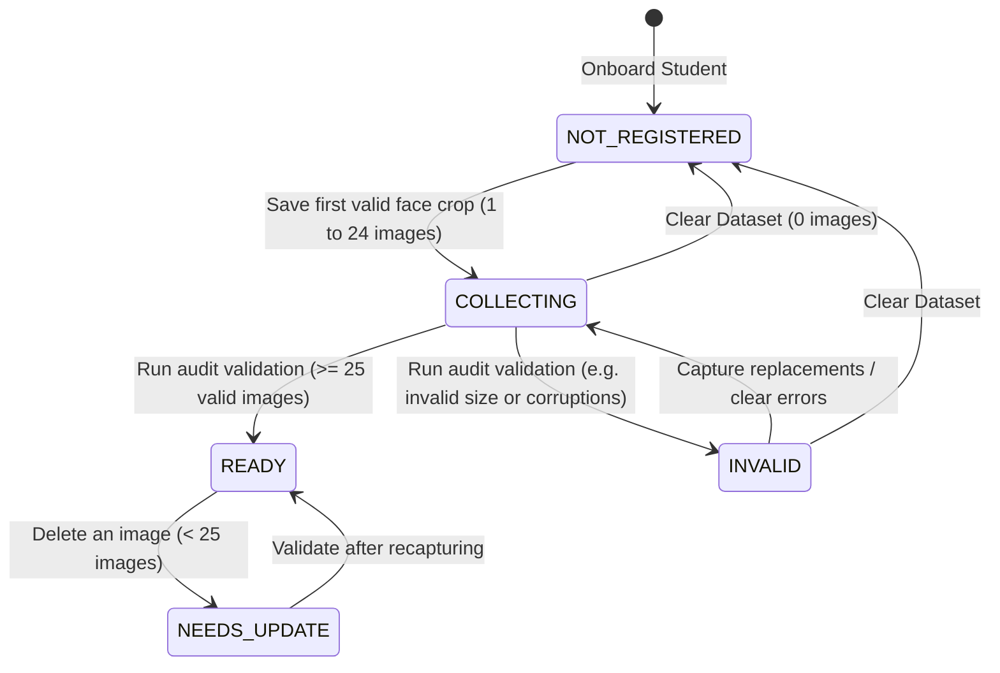

# Face Dataset Workflow

This document explains the workflows for capture loops, deletion audits, and validation checks.

---

## State Transition Workflow

The face dataset status moves through these states based on the size and audit checks of the image files:

---

## Operations Flowchart

### Capture Image Loop
1. User presses the **Capture** button in the UI.
2. The UI queries the latest frame array from the thread-safe `CameraReader`.
3. The frame array is sent to `DatasetController.capture_image()`.
4. `DatasetService` validates that exactly 1 face exists, meets size limits, and is centered.
5. The face region is cropped, padded, and scaled to $112 \times 112$ pixels.
6. The crop's mean brightness and Laplacian blur variance are evaluated.
7. If all checks pass, the crop is saved on disk as `image_xxx.jpg` and registered in the `dataset_images` table.
8. The UI increments the progress bar and adds a new card in the thumbnail gallery.
