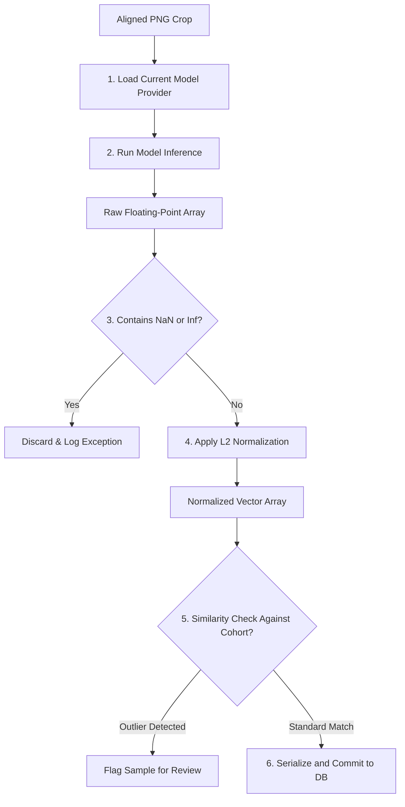

# Face Dataset Collection & Image Processing - Embedding Pipeline

## 1. Purpose
This document details the embedding generation pipeline. It defines how aligned facial images are converted into normalized 1D vector arrays, how validation checks are performed on vectors, and how the database is updated to remain independent of the underlying recognition model.

---

## 2. Overview
The embedding pipeline is the core translation layer between computer vision and database logic. A face embedding is a 1D vector (typically 128, 256, or 512 floating-point values) that represents a face in a multi-dimensional space. The pipeline uses an abstract wrapper layer to ensure that changing the AI model does not require modifying database tables or collection workflows.

```
+---------------------+     +---------------------+     +---------------------+
| Aligned Face Image  | --> |  IModelProvider API | --> |  Raw Vector Output  |
|   (PNG from disk)   |     | (ONNX/Torch Runner) |     | (e.g., 512 Floats)  |
+---------------------+     +---------------------+     +---------------------+
                                                                   |
                                                                   v
+---------------------+     +---------------------+     +---------------------+
| Database Sync Index | <-- |  L2 Norm & Validation| <-- | Vector Check (NaN)  |
|  (Biometric Store)  |     |   (Similarity OK)   |     |  (L2 Vector Check)  |
+---------------------+     +---------------------+     +---------------------+
```

---

## 3. Workflow
The workflow below details the steps from aligned face crop to database indexing:



---

## 4. Architecture
The embedding generation workflow relies on a provider-based architecture:

### 4.1 Model Independence via Provider Interface
To decouple the application from machine learning frameworks, the system communicates with models through an abstract interface:
```python
class IModelProvider(ABC):
    @abstractmethod
    def load_model(self) -> None:
        pass
    
    @abstractmethod
    def extract_embedding(self, face_image: ndarray) -> list[float]:
        pass
    
    @property
    @abstractmethod
    def embedding_dimension(self) -> int:
        pass
```

### 4.2 Supported Model Backends
The provider interface supports various state-of-the-art architectures:
- **InsightFace / ArcFace**: Generates $512$-dimensional vectors. This model provides high accuracy across pose and illumination variations and is recommended for enterprise deployments.
- **FaceNet (Google)**: Generates $128$-dimensional or $512$-dimensional vectors.
- **OpenFace**: Generates $128$-dimensional vectors. Recommended for edge devices with limited computing power.
- **DeepFace**: Multi-model framework wrapping VGG-Face, Facenet, and OpenFace.

### 4.3 Embedding Validation & Verification
Before saving a vector, the validation engine performs three checks:
- **Null Value Check**: Ensures the vector does not contain `NaN` or `Infinity` values.
- **Dimensionality Verification**: Confirms that the vector length matches the configured model dimensions (e.g., exactly $512$ floats for ArcFace).
- **L2 Unit Normalization**: Ensures that the Euclidean length of the vector equals exactly $1.0$:
  $$\|v\|_2 = \sqrt{\sum_{i=1}^n v_i^2} = 1.0$$
  This allows the system to compare embeddings using fast Cosine Similarity or Dot Product calculations.

### 4.4 Database Schema Mapping
Embeddings are saved in the `student_embeddings` table:
- `id` (UUID): Primary key.
- `student_id` (String, ForeignKey): Links to the student profile.
- `embedding_vector` (Vector/JSON): The float array.
- `model_name` (String): Indicates which model generated the vector (e.g., `arcface_insightface_v2`). This helps when updating models.
- `created_at` (Timestamp).

---

## 5. Business Rules
- **L2 Norm Requirement**: The system rejects vectors that are not normalized to unit length, as unnormalized vectors can cause matching errors.
- **Model Isolation**: The database must not mix embeddings generated by different models. If a new model version is deployed, the system must rebuild all database records before enabling recognition.
- **Cohort Similarity Checks**: Newly generated embeddings must have a minimum cosine similarity of $0.65$ with other samples in the student's dataset. This prevents misenrollment if an administrator registers the wrong student by mistake.

---

## 6. Design Decisions
- **In-Memory Cache (Redis or local RAM indexes)**: During attendance matching, the system loads embeddings into memory (e.g., using `numpy` arrays or FAISS vector indexes) instead of querying the database for every check, which reduces matching latency to under $10\text{ ms}$.
- **ONNX Runtime Engine**: Deep learning models are exported to ONNX format. This allows the system to run inference on multiple hardware platforms without requiring full PyTorch or TensorFlow dependencies.

---

## 7. Future Improvements
- **Vector Search Index Integration**: Incorporate vector indexing engines like FAISS or Milvus to support fast matches against large student databases ($>10,000$ profiles).
- **Multi-Model Consensus Fusion**: Extract embeddings using two distinct models (e.g., ArcFace + FaceNet) and concatenate their weights to increase verification accuracy.

---

## 8. References to Related Modules
- [Dataset Overview](file:///c:/GitHub/Attendence-System-Uning-Face-Recognition/docs/dataset/Dataset_Overview.md)
- [Dataset Architecture](file:///c:/GitHub/Attendence-System-Uning-Face-Recognition/docs/dataset/Dataset_Architecture.md)
- [Camera Workflow](file:///c:/GitHub/Attendence-System-Uning-Face-Recognition/docs/dataset/Camera_Workflow.md)
- [Dataset Collection](file:///c:/GitHub/Attendence-System-Uning-Face-Recognition/docs/dataset/Dataset_Collection.md)
- [Image Preprocessing](file:///c:/GitHub/Attendence-System-Uning-Face-Recognition/docs/dataset/Image_Preprocessing.md)
- [Image Validation](file:///c:/GitHub/Attendence-System-Uning-Face-Recognition/docs/dataset/Image_Validation.md)
- [Face Alignment](file:///c:/GitHub/Attendence-System-Uning-Face-Recognition/docs/dataset/Face_Alignment.md)
- [Dataset Storage](file:///c:/GitHub/Attendence-System-Uning-Face-Recognition/docs/dataset/Dataset_Storage.md)
- [Dataset Management](file:///c:/GitHub/Attendence-System-Uning-Face-Recognition/docs/dataset/Dataset_Management.md)
- [Quality Control](file:///c:/GitHub/Attendence-System-Uning-Face-Recognition/docs/dataset/Quality_Control.md)
- [Performance Considerations](file:///c:/GitHub/Attendence-System-Uning-Face-Recognition/docs/dataset/Performance_Considerations.md)
- [Future AI Models](file:///c:/GitHub/Attendence-System-Uning-Face-Recognition/docs/dataset/Future_AI_Models.md)
- [Privacy and Security](file:///c:/GitHub/Attendence-System-Uning-Face-Recognition/docs/dataset/Privacy_and_Security.md)
- [Workflow Diagrams](file:///c:/GitHub/Attendence-System-Uning-Face-Recognition/docs/dataset/Workflow_Diagrams.md)
