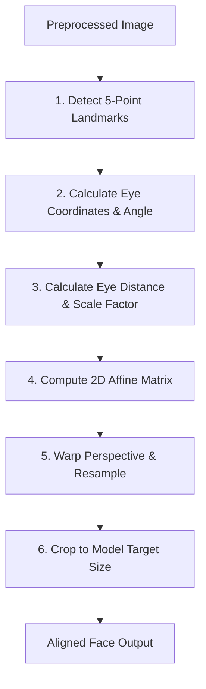

# Face Dataset Collection & Image Processing - Face Alignment

## 1. Purpose
This document details the face alignment subsystem. It specifies the geometric transformation pipeline used to normalize head rotation, scaling, and position across all images, guaranteeing consistent spatial orientation for deep learning models.

---

## 2. Overview
Facial recognition models are sensitive to spatial translations, head tilt, and scale variations. If two photos of the same student have different rotation angles, the embedding vectors will vary, increasing the False Rejection Rate (FRR). Face alignment corrects this by mapping localized face bounding boxes onto a standard geometric template.

```
       +------------------------------------+
       |  Preprocessed Bounding Box Frame  |
       +------------------------------------+
                         |
                         v
       +------------------------------------+
       |    Detect 5 Facial Landmarks       |
       | (Eyes, Nose Tip, Mouth Corners)    |
       +------------------------------------+
                         |
                         v
       +------------------------------------+
       |      Compute Eye Center Angle      |
       +------------------------------------+
                         |
                         v
       +------------------------------------+
       |   Calculate Affine Matrix (2x3)    |
       +------------------------------------+
                         |
                         v
       +------------------------------------+
       |   Warp Image & Crop Face Region    |
       +------------------------------------+
                         |
                         v
       +------------------------------------+
       |   Standardized Aligned Face Output |
       +------------------------------------+
```

---

## 3. Workflow
The alignment subsystem processes localized face bounding boxes in a sequential pipeline:



---

## 4. Architecture
The face alignment subsystem consists of landmark extraction, geometric coordinate transformations, and matrix warping:

### 4.1 Facial Landmark Detection
The alignment service queries a landmark extractor to retrieve 5 key coordinate points:
1. Left Pupil Center: $P_1 = (x_1, y_1)$
2. Right Pupil Center: $P_2 = (x_2, y_2)$
3. Nose Tip: $P_3 = (x_3, y_3)$
4. Left Mouth Corner: $P_4 = (x_4, y_4)$
5. Right Mouth Corner: $P_5 = (x_5, y_5)$

### 4.2 Rotation Angle Calculation
The rotation angle ($\theta$) is calculated relative to the horizontal axis passing through the eyes:
$$\Delta x = x_2 - x_1$$
$$\Delta y = y_2 - y_1$$
$$\theta = \arctan2(\Delta y, \Delta x) \times \frac{180}{\pi}$$

### 4.3 Scale & Center Normalization
The system calculates a scale factor ($s$) based on the distance between the eyes:
$$\text{dist}_{\text{eye}} = \sqrt{(\Delta x)^2 + (\Delta y)^2}$$
$$s = \frac{\text{target\_eye\_distance}}{\text{dist}_{\text{eye}}}$$
The target center point ($C$) is computed as the midpoint between the eyes:
$$C = \left( \frac{x_1 + x_2}{2}, \frac{y_1 + y_2}{2} \right)$$

### 4.4 Affine Transformation Matrix
Using the rotation angle ($\theta$), scale factor ($s$), and center point ($C$), the system constructs a $2 \times 3$ affine transformation matrix ($M$). The raw image is warped using bilinear interpolation:
$$M = \begin{bmatrix} \alpha & \beta & (1-\alpha) \cdot C_x - \beta \cdot C_y \\ -\beta & \alpha & \beta \cdot C_x + (1-\alpha) \cdot C_y \end{bmatrix}$$
where:
$$\alpha = s \cdot \cos(\theta)$$
$$\beta = s \cdot \sin(\theta)$$

### 4.5 Standardized Cropping Boundaries
The output image size is normalized to $112 \times 112$ pixels (or $160 \times 160$ depending on configuration). The eyes are centered at fixed coordinates:
- Left eye target: $30\%$ of width, $35\%$ of height.
- Right eye target: $70\%$ of width, $35\%$ of height.

---

## 5. Business Rules
- **Landmark Extraction Failure**: If the landmark detector cannot isolate the eyes with a confidence level $>85\%$, the alignment process fails, the frame is rejected, and the pipeline registers a `LandmarkDetectionException`.
- **Maximum Angle Limits**: If the calculated rotation angle exceeds $\pm 30^{\circ}$, the system rejects the frame. Extreme tilt angles distort face shapes even after warping, making embedding generation unreliable.

---

## 6. Design Decisions
- **5-Point vs. 68-Point Alignment**: The system uses 5-point alignment instead of a 68-point mesh model. The 5-point method requires significantly less CPU computation ($<2\text{ ms}$ vs. $15\text{ ms}$) and provides sufficient orientation accuracy for face recognition.
- **Bilinear Resampling**: Warp operations use bilinear pixel resampling, which strikes a balance between spatial accuracy and performance, avoiding the performance overhead of bicubic interpolation.

---

## 7. Future Improvements
- **3D Landmark-Based Mesh Warping**: Implement a 3D Morphable Model (3DMM) to dynamically warp faces profiles up to $45^{\circ}$, allowing side-view registration.
- **Deep Alignment Networks**: Investigate end-to-end deep spatial transformer networks (STN) that integrate alignment directly into the embedding network layers.

---

## 8. References to Related Modules
- [Dataset Overview](file:///c:/GitHub/Attendence-System-Uning-Face-Recognition/docs/dataset/Dataset_Overview.md)
- [Dataset Architecture](file:///c:/GitHub/Attendence-System-Uning-Face-Recognition/docs/dataset/Dataset_Architecture.md)
- [Camera Workflow](file:///c:/GitHub/Attendence-System-Uning-Face-Recognition/docs/dataset/Camera_Workflow.md)
- [Dataset Collection](file:///c:/GitHub/Attendence-System-Uning-Face-Recognition/docs/dataset/Dataset_Collection.md)
- [Image Preprocessing](file:///c:/GitHub/Attendence-System-Uning-Face-Recognition/docs/dataset/Image_Preprocessing.md)
- [Image Validation](file:///c:/GitHub/Attendence-System-Uning-Face-Recognition/docs/dataset/Image_Validation.md)
- [Dataset Storage](file:///c:/GitHub/Attendence-System-Uning-Face-Recognition/docs/dataset/Dataset_Storage.md)
- [Embedding Pipeline](file:///c:/GitHub/Attendence-System-Uning-Face-Recognition/docs/dataset/Embedding_Pipeline.md)
- [Dataset Management](file:///c:/GitHub/Attendence-System-Uning-Face-Recognition/docs/dataset/Dataset_Management.md)
- [Quality Control](file:///c:/GitHub/Attendence-System-Uning-Face-Recognition/docs/dataset/Quality_Control.md)
- [Performance Considerations](file:///c:/GitHub/Attendence-System-Uning-Face-Recognition/docs/dataset/Performance_Considerations.md)
- [Future AI Models](file:///c:/GitHub/Attendence-System-Uning-Face-Recognition/docs/dataset/Future_AI_Models.md)
- [Privacy and Security](file:///c:/GitHub/Attendence-System-Uning-Face-Recognition/docs/dataset/Privacy_and_Security.md)
- [Workflow Diagrams](file:///c:/GitHub/Attendence-System-Uning-Face-Recognition/docs/dataset/Workflow_Diagrams.md)
