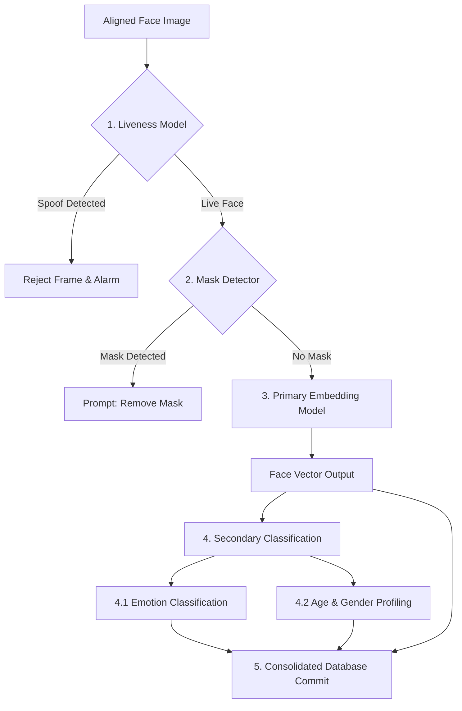

# Face Dataset Collection & Image Processing - Future AI Models

## 1. Purpose
This document specifies the extensibility architecture for future AI enhancements. It defines integration interfaces for liveness verification, mask detection, demographic estimation, and multi-model deployment, ensuring the pipeline remains flexible as AI technology evolves.

---

## 2. Overview
An enterprise-grade facial recognition system must adapt to changing operational requirements, such as verifying that a user is a live person rather than a photo (liveness detection), checking for safety masks, or analyzing emotions. This architecture defines a modular plug-in system that allows developers to add new computer vision modules without changing the core registration workflows.

```
                  +-----------------------------------+
                  |      Unified Processing Pipeline  |
                  +-----------------------------------+
                                    |
            +-----------------------+-----------------------+
            |                       |                       |
            v                       v                       v
+-----------------------+ +-----------------------+ +-----------------------+
|  Liveness Detection   | |    Mask Detection     | | Demographic/Emotion   |
| (Anti-Spoofing Hook)  | |  (Safety Check Hook)  | |  (Analytics Engine)   |
+-----------------------+ +-----------------------+ +-----------------------+
```

---

## 3. Workflow
The workflow below details how new AI models are integrated into the real-time processing sequence:



---

## 4. Architecture
The extensibility system uses standard hook methods and configuration registries to integrate new models:

### 4.1 Liveness Detection (Anti-Spoofing)
- **Objective**: Identifies biometric presentation attacks (such as holding up a printed photo, playing a video on a phone, or wearing a 3D mask).
- **Integration Hook**: Runs immediately after face detection, before generating embeddings.
- **Methods**:
  - *Active Liveness*: Prompts the user to perform random actions (e.g., blink, turn head left, smile) and validates the movements using landmark tracking.
  - *Passive Liveness*: Analyzes texture details, reflections, and depth cues in a single frame using a deep classification network to distinguish real skin from screens or paper.

### 4.2 Mask & Occlusion Detection
- **Objective**: Identifies face masks, helmets, or large sunglasses that obscure key facial features.
- **Integration Hook**: Part of the image validation service.
- **Method**: A classification model returns a probability score for the presence of occlusions. If a mask is detected, the system displays a UI prompt: `Please remove your mask to check in`.

### 4.3 Demographic & Emotion Analytics
- **Objective**: Estimates age, gender, and emotion for campus analytics.
- **Integration Hook**: Runs in parallel with embedding generation.
- **Method**: The system feeds the aligned face crop into secondary classification layers, saving demographic attributes to the database for statistical reporting.

### 4.4 Multi-Model Recognition Configurations
- To support deploying multiple face recognition models simultaneously, the embedding database supports versioned model tags:
```json
{
  "student_id": "STU10294",
  "embeddings": {
    "arcface_v2": [0.012, -0.045, "...", 0.114],
    "facenet_v1": [0.092, 0.112, "...", -0.023]
  }
}
```
This allows the matching engine to query different vector indexes depending on which model is configured for a specific entry gate.

---

## 5. Business Rules
- **Liveness Security Override**: If the liveness validation confidence falls below $95\%$, embedding generation is aborted, and a security warning is logged.
- **Order of Execution**: Security checks (liveness, mask detection) must run before recognition models. This prevents the system from spending GPU resources generating embeddings for invalid inputs or spoof attacks.

---

## 6. Design Decisions
- **Unified Pipeline Model Registries**: The system uses a registry pattern to manage models. New models register by providing a name, version, output size, and execution priority. The system automatically inserts them into the processing loop based on their priority.
- **Multi-Output Execution Blocks**: For models that share a backbone (e.g., estimating age, gender, and emotion using a single feature extractor), the system runs the backbone once and branches the output to separate classification heads, saving compute resources.

---

## 7. Future Improvements
- **Continuous Zero-Shot Upgrades**: Integrate zero-shot vision models (such as CLIP-based encoders) to support open-vocabulary classification of facial attributes without retraining local classifiers.
- **Distributed Edge Orchestration**: Offload processing to edge devices, running lightweight detection and liveness checks on smart cameras, while centralizing embedding generation and database synchronization.

---

## 8. References to Related Modules
- [Dataset Overview](file:///c:/GitHub/Attendence-System-Uning-Face-Recognition/docs/dataset/Dataset_Overview.md)
- [Dataset Architecture](file:///c:/GitHub/Attendence-System-Uning-Face-Recognition/docs/dataset/Dataset_Architecture.md)
- [Camera Workflow](file:///c:/GitHub/Attendence-System-Uning-Face-Recognition/docs/dataset/Camera_Workflow.md)
- [Dataset Collection](file:///c:/GitHub/Attendence-System-Uning-Face-Recognition/docs/dataset/Dataset_Collection.md)
- [Image Preprocessing](file:///c:/GitHub/Attendence-System-Uning-Face-Recognition/docs/dataset/Image_Preprocessing.md)
- [Image Validation](file:///c:/GitHub/Attendence-System-Uning-Face-Recognition/docs/dataset/Image_Validation.md)
- [Face Alignment](file:///c:/GitHub/Attendence-System-Uning-Face-Recognition/docs/dataset/Face_Alignment.md)
- [Dataset Storage](file:///c:/GitHub/Attendence-System-Uning-Face-Recognition/docs/dataset/Dataset_Storage.md)
- [Embedding Pipeline](file:///c:/GitHub/Attendence-System-Uning-Face-Recognition/docs/dataset/Embedding_Pipeline.md)
- [Dataset Management](file:///c:/GitHub/Attendence-System-Uning-Face-Recognition/docs/dataset/Dataset_Management.md)
- [Quality Control](file:///c:/GitHub/Attendence-System-Uning-Face-Recognition/docs/dataset/Quality_Control.md)
- [Performance Considerations](file:///c:/GitHub/Attendence-System-Uning-Face-Recognition/docs/dataset/Performance_Considerations.md)
- [Privacy and Security](file:///c:/GitHub/Attendence-System-Uning-Face-Recognition/docs/dataset/Privacy_and_Security.md)
- [Workflow Diagrams](file:///c:/GitHub/Attendence-System-Uning-Face-Recognition/docs/dataset/Workflow_Diagrams.md)
