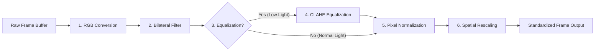

# Face Dataset Collection & Image Processing - Image Preprocessing

## 1. Purpose
This document details the image preprocessing pipeline. It defines the mathematical and visual transformations applied to raw camera frames, converting raw pixel data into standardized inputs optimized for face alignment and deep learning feature extraction.

---

## 2. Overview
Raw camera sensors produce images with variable contrast, color profiles, noise, and dimensions depending on ambient illumination and hardware drivers. The preprocessing pipeline normalizes these variables. It ensures that every face image evaluated by the AI models possesses standard properties, minimizing recognition discrepancies.

```
+------------------+     +------------------+     +------------------+
|    Raw Frame     | --> | Color Space Conv | --> |  Noise Filtering  |
+------------------+     +------------------+     +------------------+
                                                           |
                                                           v
+------------------+     +------------------+     +------------------+
|  Standardization | <-- |   Normalizing    | <-- | Contrast & Light |
+------------------+     +------------------+     +------------------+
```

---

## 3. Workflow
Preprocessing executes as a serial pipeline:



---

## 4. Architecture
The preprocessing architecture separates mandatory transformations from optional, context-dependent enhancement routines:

### 4.1 Mandatory Preprocessing Steps
- **Color Conversion**: Raw camera streams (often loaded in `BGR` layout) are converted to standard `RGB` format. For specific legacy detection models, a parallel `Grayscale` matrix is generated.
- **Resizing (Bilinear/Lanczos Interpolation)**: Downsamples/upsamples target face regions to fixed dimensions. The pipeline supports configurable target resolutions based on model backends (typically $112 \times 112$ pixels for ArcFace or $160 \times 160$ pixels for FaceNet).
- **Pixel Normalization**: Converts unsigned integer pixel matrices ($[0, 255]$) into floating-point tensors ($[0.0, 1.0]$ or $[-1.0, 1.0]$) using channel-wise mean subtraction and division by standard deviation:
  $$x_{\text{norm}} = \frac{x - \mu}{\sigma}$$

### 4.2 Optional Preprocessing Steps
- **Contrast Enhancement (CLAHE)**: *Contrast Limited Adaptive Histogram Equalization* divides the image into contextual tiles ($8 \times 8$ pixels), equalizing local histograms to enhance facial details in poor or back-lit environments. It limits contrast amplification to prevent noise injection.
- **Gamma Correction**: Adjusts mid-tone luminance dynamically when the frame brightness departs from optimal ranges:
  $$V_{\text{out}} = A \cdot V_{\text{in}}^{\gamma}$$
  Values of $\gamma < 1.0$ brighten dark images; $\gamma > 1.0$ darken overexposed images.
- **Noise Reduction (Bilateral Filter)**: Smoothes uniform skin surfaces while preserving sharp facial edges (such as eye contours and jawlines).

---

## 5. Business Rules
- **Color Space Integrity**: All color conversions must occur before any cropping or landmark adjustments to prevent boundary artifacts.
- **Aspect Ratio Locking**: Spatial scaling must use uniform aspect ratios. If the target bounding box is not square, the cropping helper must pad the borders with zeros (black padding) rather than stretching the facial structure.
- **Bypass for High-Quality Inputs**: If a frame registers an initial brightness score between $60-80$ and contrast score $>50$, CLAHE and Gamma correction are bypassed to conserve computing resources.

---

## 6. Design Decisions
- **Vectorized Array Operations**: All preprocessing steps will be planned using vectorized NumPy/matrix operations to maintain pipeline execution times under $5\text{ ms}$ per frame on standard CPU architectures.
- **Stateless Transform Operations**: The preprocessing service must remain stateless, taking an input frame and configuration tuple and returning a new frame copy. This design enables concurrent multiprocessing during batch imports.

---

## 7. Future Improvements
- **Super-Resolution GAN Integration**: Incorporate a lightweight Super-Resolution network (e.g., ESPCN) to reconstruct high-frequency details for small or distant faces.
- **Adaptive White Balancing**: Implement an automated gray-world algorithm to correct color cast variations caused by fluorescent or warm office lighting.

---

## 8. References to Related Modules
- [Dataset Overview](file:///c:/GitHub/Attendence-System-Uning-Face-Recognition/docs/dataset/Dataset_Overview.md)
- [Dataset Architecture](file:///c:/GitHub/Attendence-System-Uning-Face-Recognition/docs/dataset/Dataset_Architecture.md)
- [Camera Workflow](file:///c:/GitHub/Attendence-System-Uning-Face-Recognition/docs/dataset/Camera_Workflow.md)
- [Dataset Collection](file:///c:/GitHub/Attendence-System-Uning-Face-Recognition/docs/dataset/Dataset_Collection.md)
- [Image Validation](file:///c:/GitHub/Attendence-System-Uning-Face-Recognition/docs/dataset/Image_Validation.md)
- [Face Alignment](file:///c:/GitHub/Attendence-System-Uning-Face-Recognition/docs/dataset/Face_Alignment.md)
- [Dataset Storage](file:///c:/GitHub/Attendence-System-Uning-Face-Recognition/docs/dataset/Dataset_Storage.md)
- [Embedding Pipeline](file:///c:/GitHub/Attendence-System-Uning-Face-Recognition/docs/dataset/Embedding_Pipeline.md)
- [Dataset Management](file:///c:/GitHub/Attendence-System-Uning-Face-Recognition/docs/dataset/Dataset_Management.md)
- [Quality Control](file:///c:/GitHub/Attendence-System-Uning-Face-Recognition/docs/dataset/Quality_Control.md)
- [Performance Considerations](file:///c:/GitHub/Attendence-System-Uning-Face-Recognition/docs/dataset/Performance_Considerations.md)
- [Future AI Models](file:///c:/GitHub/Attendence-System-Uning-Face-Recognition/docs/dataset/Future_AI_Models.md)
- [Privacy and Security](file:///c:/GitHub/Attendence-System-Uning-Face-Recognition/docs/dataset/Privacy_and_Security.md)
- [Workflow Diagrams](file:///c:/GitHub/Attendence-System-Uning-Face-Recognition/docs/dataset/Workflow_Diagrams.md)
