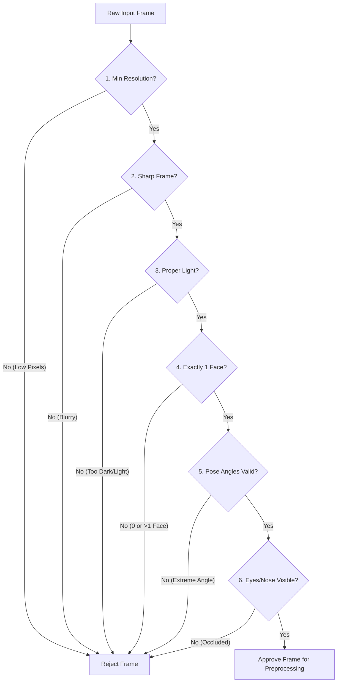

# Face Dataset Collection & Image Processing - Image Validation

## 1. Purpose
This document specifies the image validation subsystem. It defines the algorithms and criteria used to assess candidate frame quality in real-time, preventing blurred, occluded, or poorly aligned faces from entering the biometric dataset.

---

## 2. Overview
To ensure accurate facial recognition under varying real-world conditions, input samples must meet strict quality standards. The Validation Service acts as a filter on raw frames. It evaluates spatial characteristics, illumination distributions, and pose structures, and rejects any sample that could degrade recognition performance.

```
                  +--------------------------+
                  |  Candidate Frame Buffer  |
                  +--------------------------+
                               |
                               v
                  +--------------------------+
                  |    Resolution Check      |
                  +--------------------------+
                               |
                               v
                  +--------------------------+
                  |  Sharpness & Blur Check  |
                  +--------------------------+
                               |
                               v
                  +--------------------------+
                  |     Lighting Analysis    |
                  +--------------------------+
                               |
                               v
                  +--------------------------+
                  |    Pose & Occlusion      |
                  +--------------------------+
                               |
                               v
                  +--------------------------+
                  |  Single Face Enforcer    |
                  +--------------------------+
                               |
              +----------------+----------------+
              |                                 |
              v                                 v
        [All Passes]                     [Any Fail]
              |                                 |
              v                                 v
      [Proceed to Align]                [Reject Frame]
```

---

## 3. Workflow
The validation service executes checks in a hierarchical order of computational cost:



---

## 4. Architecture
The validation service implements seven core checks:

### 4.1 Minimum Resolution
- **Rule**: Frame resolution must be at least $1280 \times 720$ pixels.
- **Biometric Boundary**: The localized face bounding box must be at least $160 \times 160$ pixels to ensure sufficient high-frequency facial feature details.

### 4.2 Sharpness & Blur Assessment
- **Algorithm**: Variance of the Laplacian (VoL). The frame is convolved with a single Laplacian kernel:
  $$K = \begin{bmatrix} 0 & 1 & 0 \\ 1 & -4 & 1 \\ 0 & 1 & 0 \end{bmatrix}$$
- **Threshold**: The variance ($\sigma^2$) of the response matrix must exceed $100.0$. Scores below this indicate motion blur or out-of-focus optics.

### 4.3 Brightness & Contrast Distribution
- **Algorithm**: Mean and standard deviation of luminance values ($Y$ channel in $YCrCb$).
- **Threshold**:
  - Mean brightness must lie between $50$ and $200$ (out of $255$).
  - Standard deviation must be at least $15.0$ to ensure sufficient local contrast.

### 4.4 Pose & Angle Evaluation
- **Algorithm**: 3D Head Pose estimation (yaw, pitch, roll) computed using landmarks matched against a standard 3D face model.
- **Threshold**:
  - Yaw (rotation left/right): $\le \pm 15^{\circ}$
  - Pitch (tilt up/down): $\le \pm 15^{\circ}$
  - Roll (tilt side-to-side): $\le \pm 10^{\circ}$

### 4.5 Occlusion Detection
- **Algorithm**: Landmark confidence analysis.
- **Threshold**: Detection confidence scores for crucial facial keypoints (pupils, outer eye corners, nose tip, mouth edges) must exceed $90\%$. If sunglasses, hands, or hats cover these points, the frame is rejected.

### 4.6 Single Face Enforcement
- **Algorithm**: Frame-wide face counting.
- **Threshold**: The localized face count must equal exactly $1.0$. Zero faces or multiple faces trigger instant rejection.

### 4.7 Background Quality
- **Algorithm**: Background segmentation and variance tracking.
- **Threshold**: Background areas should not contain significant movement (high optical flow) or high-contrast structural clutter that could interfere with face detection algorithms.

---

## 5. Business Rules
- **Fast-Failure Execution**: To maximize performance, validation steps are sorted by processing cost. Low-cost checks (resolution, brightness) run first, saving CPU time if the frame is unusable.
- **Reason-Specific Rejection Logs**: Every frame rejection must append a specific failure code (e.g., `ERR_BLUR`, `ERR_LOW_LIGHT`, `ERR_POOR_ANGLE`) to the session metadata to provide clear feedback in the user interface.

---

## 6. Design Decisions
- **Fast Laplacian Kernels**: Sharpness validation uses a single-channel Laplacian kernel calculation instead of deep learning blur estimators, completing in under $0.5\text{ ms}$.
- **Strict Bounding Box Buffer**: Faces detected too close to the frame boundary (within $10\%$ of image borders) are rejected, preventing crop failures during alignment.

---

## 7. Future Improvements
- **Automated Mask Detection**: Integrate a lightweight classification layer to identify face masks, prompting the student to remove them during registration.
- **Specular Reflection Analysis**: Implement glint detection on glasses to alert students to adjust their head angle relative to light sources.

---

## 8. References to Related Modules
- [Dataset Overview](file:///c:/GitHub/Attendence-System-Uning-Face-Recognition/docs/dataset/Dataset_Overview.md)
- [Dataset Architecture](file:///c:/GitHub/Attendence-System-Uning-Face-Recognition/docs/dataset/Dataset_Architecture.md)
- [Camera Workflow](file:///c:/GitHub/Attendence-System-Uning-Face-Recognition/docs/dataset/Camera_Workflow.md)
- [Dataset Collection](file:///c:/GitHub/Attendence-System-Uning-Face-Recognition/docs/dataset/Dataset_Collection.md)
- [Image Preprocessing](file:///c:/GitHub/Attendence-System-Uning-Face-Recognition/docs/dataset/Image_Preprocessing.md)
- [Face Alignment](file:///c:/GitHub/Attendence-System-Uning-Face-Recognition/docs/dataset/Face_Alignment.md)
- [Dataset Storage](file:///c:/GitHub/Attendence-System-Uning-Face-Recognition/docs/dataset/Dataset_Storage.md)
- [Embedding Pipeline](file:///c:/GitHub/Attendence-System-Uning-Face-Recognition/docs/dataset/Embedding_Pipeline.md)
- [Dataset Management](file:///c:/GitHub/Attendence-System-Uning-Face-Recognition/docs/dataset/Dataset_Management.md)
- [Quality Control](file:///c:/GitHub/Attendence-System-Uning-Face-Recognition/docs/dataset/Quality_Control.md)
- [Performance Considerations](file:///c:/GitHub/Attendence-System-Uning-Face-Recognition/docs/dataset/Performance_Considerations.md)
- [Future AI Models](file:///c:/GitHub/Attendence-System-Uning-Face-Recognition/docs/dataset/Future_AI_Models.md)
- [Privacy and Security](file:///c:/GitHub/Attendence-System-Uning-Face-Recognition/docs/dataset/Privacy_and_Security.md)
- [Workflow Diagrams](file:///c:/GitHub/Attendence-System-Uning-Face-Recognition/docs/dataset/Workflow_Diagrams.md)
