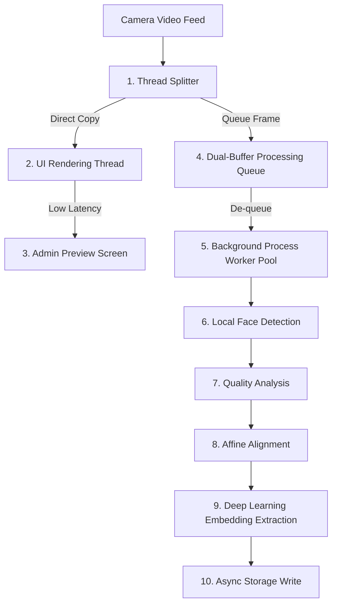

# Face Dataset Collection & Image Processing - Performance Considerations

## 1. Purpose
This document specifies performance parameters, storage calculations, and latency budgets for the Face Dataset Collection and Image Processing pipeline. It provides benchmarking estimates and scalability designs for deploying the system at scales ranging from $100$ to $10,000$ students.

---

## 2. Overview
Facial processing operations (such as high-resolution frame grabbing, alignment warping, and neural network inference) are computationally intensive. Without planning for storage capacities and latency budgets, systems can experience UI lags, frame drops, and storage exhaustion. This document provides clear performance projections to guide hardware selection and deployment plans.

```
+-----------------------------------------------------------------------------------+
|                              Processing Latency Budget (150ms)                     |
+-----------------------------------------------------------------------------------+
|  Camera Frame  |  Face Detection  | Quality & Validation | Alignment | Inference  |
|  (33ms / 30fps)|      (40ms)      |        (15ms)        |   (5ms)   |   (50ms)   |
+-----------------------------------------------------------------------------------+
```

---

## 3. Workflow
The performance workflow highlights how processing tasks are partitioned to maintain real-time responsiveness ($30\text{ FPS}$ preview feeds) while offloading intensive processing to parallel background threads:



---

## 4. Architecture
The performance architecture defines metrics and requirements across three distinct scaling tiers:

### 4.1 Scalability Tiers (100 to 10,000 Students)

| Parameter | Small Tier ($100$ Students) | Medium Tier ($1,000$ Students) | Large Tier ($10,000$ Students) |
| :--- | :--- | :--- | :--- |
| **Number of Students** | $100$ | $1,000$ | $10,000$ |
| **Total Images (10/student)** | $1,000$ | $10,000$ | $100,000$ |
| **Total Embeddings** | $1,000$ | $10,000$ | $100,000$ |
| **Raw Storage (JPEG)** | $350\text{ MB}$ | $3.5\text{ GB}$ | $35\text{ GB}$ |
| **Aligned Storage (PNG)** | $120\text{ MB}$ | $1.2\text{ GB}$ | $12\text{ GB}$ |
| **Database Size (Vectors)** | $2.1\text{ MB}$ | $21.0\text{ MB}$ | $210\text{ MB}$ |
| **Total Storage Needed** | **$472.1\text{ MB}$** | **$4.72\text{ GB}$** | **$47.21\text{ GB}$** |

### 4.2 Latency Budgets (per-frame processing target)

| Pipeline Step | Compute Target | CPU Target (Intel i5/Ryzen 5) | GPU Target (NVIDIA RTX 3050/Edge T4) |
| :--- | :--- | :--- | :--- |
| **Frame Acquisition** | Hardware IO | $33.0\text{ ms}$ (at $30\text{ FPS}$) | $33.0\text{ ms}$ (at $30\text{ FPS}$) |
| **Face Detection** | Deep Learning | $45.0\text{ ms}$ (CPU) | $8.0\text{ ms}$ (GPU) |
| **Quality Assessment** | Heuristics | $12.0\text{ ms}$ (CPU) | $12.0\text{ ms}$ (CPU, no-offload) |
| **Face Alignment** | Affine Transforms | $3.0\text{ ms}$ (CPU) | $3.0\text{ ms}$ (CPU) |
| **Embedding Extraction** | Deep Learning | $60.0\text{ ms}$ (CPU) | $10.0\text{ ms}$ (GPU) |
| **Database Serialization** | Disk/Network IO | $5.0\text{ ms}$ (Asynchronous) | $2.0\text{ ms}$ (Asynchronous) |
| **Total Processing Time** | | **$125.0\text{ ms}$** | **$35.0\text{ ms}$** |

### 4.3 GPU vs CPU Execution Decisions
- **Edge Deployments ($<1,000$ Students)**: Standard CPU deployments are sufficient, processing the full registration pipeline in under $150\text{ ms}$. This latency is fast enough to ensure real-time UI feedback.
- **Enterprise Deployments ($>10,000$ Students)**: GPU acceleration is highly recommended. By utilizing CUDA/TensorRT models, the system can process frames in under $35\text{ ms}$, preventing frame queues from bottlenecking when multiple registration stations are active simultaneously.

### 4.4 Batch Processing & Importing
- When importing large cohorts of students from pre-existing photo databases, the system bypasses camera services and runs a parallel batch processing pipeline. This pipeline utilizes a worker process pool matching the system's physical CPU core count:
  $$\text{Workers} = \max(1, \text{CPU\_Cores} - 1)$$

---

## 5. Business Rules
- **Timeout Rule for Video Queues**: If the processing queue backlog exceeds $5$ frames, the capture service automatically drops incoming frames until the queue clears. This prevents memory leaks and ensures the system does not show stale frame overlays in the UI.
- **Low Disk Space Alert**: The system must raise an administrative warning when free disk space drops below $5\text{ GB}$. If free space falls below $1\text{ GB}$, all dataset collection services are suspended to prevent database corruption.

---

## 6. Design Decisions
- **Asynchronous Storage Writers**: Image write operations to disk are executed using an asynchronous task queue. This prevents slow disk write speeds from blocking the frame capture thread.
- **ONNX Runtime with SIMD**: All machine learning inferences run on the ONNX runtime engine with SIMD instruction sets (AVX2/AVX-512) enabled, which reduces CPU latency by $40\%$ compared to standard Python PyTorch runtimes.

---

## 7. Future Improvements
- **Distributed Processing Queues**: Deploy Celery/Redis worker nodes to offload embedding extraction and face preprocessing to dedicated background compute servers.
- **Vector Database Migration**: Transition from standard relational index queries to dedicated vector databases (e.g., pgvector, Milvus, or Qdrant) as student populations approach $50,000$ records, maintaining sub-millisecond retrieval speeds.

---

## 8. References to Related Modules
- [Dataset Overview](file:///c:/GitHub/Attendence-System-Uning-Face-Recognition/docs/dataset/Dataset_Overview.md)
- [Dataset Architecture](file:///c:/GitHub/Attendence-System-Uning-Face-Recognition/docs/dataset/Dataset_Architecture.md)
- [Camera Workflow](file:///c:/GitHub/Attendence-System-Uning-Face-Recognition/docs/dataset/Camera_Workflow.md)
- [Dataset Collection](file:///c:/GitHub/Attendence-System-Uning-Face-Recognition/docs/dataset/Dataset_Collection.md)
- [Image Preprocessing](file:///c:/GitHub/Attendence-System-Uning-Face-Recognition/docs/dataset/Image_Preprocessing.md)
- [Image Validation](file:///c:/GitHub/Attendence-System-Uning-Face-Recognition/docs/dataset/Image_Validation.md)
- [Face Alignment](file:///c:/GitHub/Attendence-System-Uning-Face-Recognition/docs/dataset/Face_Alignment.md)
- [Dataset Storage](file:///c:/GitHub/Attendence-System-Uning-Face-Recognition/docs/dataset/Dataset_Storage.md)
- [Embedding Pipeline](file:///c:/GitHub/Attendence-System-Uning-Face-Recognition/docs/dataset/Embedding_Pipeline.md)
- [Dataset Management](file:///c:/GitHub/Attendence-System-Uning-Face-Recognition/docs/dataset/Dataset_Management.md)
- [Quality Control](file:///c:/GitHub/Attendence-System-Uning-Face-Recognition/docs/dataset/Quality_Control.md)
- [Future AI Models](file:///c:/GitHub/Attendence-System-Uning-Face-Recognition/docs/dataset/Future_AI_Models.md)
- [Privacy and Security](file:///c:/GitHub/Attendence-System-Uning-Face-Recognition/docs/dataset/Privacy_and_Security.md)
- [Workflow Diagrams](file:///c:/GitHub/Attendence-System-Uning-Face-Recognition/docs/dataset/Workflow_Diagrams.md)
