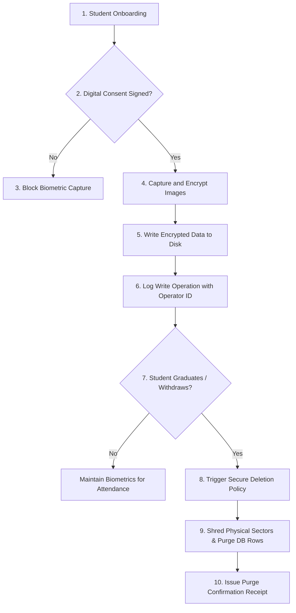

# Face Dataset Collection & Image Processing - Privacy & Security

## 1. Purpose
This document specifies the privacy and security architecture for the Face Dataset Collection and Image Processing pipeline. It defines data protection frameworks, encryption standards, consent workflows, and access controls required to comply with global biometric privacy regulations (such as GDPR, CCPA, and regional guidelines).

---

## 2. Overview
Facial images and their mathematical embeddings are classified as sensitive biometric data. Under modern privacy regulations, storing and processing this data requires strict security measures. This architecture implements security-by-design, ensuring that all data is encrypted at rest and in transit, audited at every access point, and tied directly to student consent.

```
       +------------------------------------+
       |   Student Consent Agreement (Opt)  |
       +------------------------------------+
                         |
                         v
       +------------------------------------+
       |  Encryption at Rest (AES-256-GCM)  |
       |  (Raw / Aligned biometrics store)  |
       +------------------------------------+
                         |
                         v
       +------------------------------------+
       |    Access Control & Audit Logs     |
       |      (RBAC / Operations Logs)      |
       +------------------------------------+
                         |
                         v
       +------------------------------------+
       |    Retention & Purge Scheduler     |
       |     (Auto Shredding on Expire)     |
       +------------------------------------+
```

---

## 3. Workflow
The privacy and consent lifecycle manages biometric data from collection consent to secure deletion:



---

## 4. Architecture
The security architecture enforces five core layers of biometric data protection:

### 4.1 Encryption at Rest & in Transit
- **Biometric Images**: Raw and aligned images on disk are encrypted using `AES-256-GCM`. The system retrieves decryption keys from the OS-level keystore (e.g., Windows Credential Manager or Linux Keyring) at runtime. Decrypted frames exist only in volatile RAM buffers and are never written to disk in plain text.
- **Biometric Templates**: Embedding vectors in the database are encrypted using column-level encryption.
- **In Transit**: All video streams and API calls are encrypted using `TLS 1.3`.

### 4.2 Biometric Access Control Matrix
Access to the dataset is restricted using Role-Based Access Control (RBAC):

| Role | Raw Image Access | Aligned Crop Access | Vector Embedding Access | Management Actions |
| :--- | :---: | :---: | :---: | :---: |
| **System Admin** | Read / Write | Read / Write | Read / Write | Full CRUD / Rebuild / Export |
| **Faculty** | No Access | No Access | Read Only (Inference) | Trigger Attendance Logs |
| **Student** | Read Only (Own) | No Access | No Access | Update Own Consent Status |
| **Audit Logger** | No Access | No Access | No Access | Read Logs Only |

### 4.3 Audit Logging & Monitoring
The system logs all operations involving facial data to an append-only audit trail. Each log entry includes:
- `timestamp`: UTC execution time.
- `operator_id`: ID of the user performing the action.
- `action_type`: e.g., `BIOMETRIC_REGISTRATION`, `EMBEDDING_REBUILD`, `CONSENT_REVOCATION`, `ACCESS_READ`.
- `target_student_id`: The ID of the affected student.
- `client_ip`: Source address of the request.
- `checksum`: SHA-256 hash linking to the previous log entry to prevent tampering.

### 4.4 Consent Management
- The database stores a digital consent flag (`has_consented`, `consent_date`, `consent_version`) for every student.
- If a student revokes consent, the system automatically triggers the deletion pipeline, removing their biometric profile within $24$ hours.

### 4.5 Retention & Secure Deletion Policies
- **Retention Limit**: Biometric records are kept only for the duration of the student's enrollment. The system runs an automated task monthly that moves graduated or inactive students to the archive directory, or deletes their profiles if required.
- **Secure File Shredding**: When a profile is deleted, the system overwrites the file's disk sectors with random patterns before releasing the storage blocks (complying with DoD 5220.22-M guidelines), ensuring the images cannot be recovered.

---

## 5. Business Rules
- **No Consent, No Biometrics**: The capture service will not initialize if the student's database profile lacks an active consent flag.
- **Audit trail Integrity**: Audit log files are write-protected and cannot be modified or deleted by any user role, including the System Administrator.
- **Mandatory Re-Consent on Update**: If the institution updates its privacy policy, the system marks all profiles as `PENDING_RECONSENT` and suspends attendance logging for affected students until they accept the updated policy terms.

---

## 6. Design Decisions
- **Decoupled Key Management**: Encryption keys are managed separately from the database and image storage. If the database is compromised, the biometric templates remain secure without the keys stored in the OS-level vault.
- **No Cloud Image Storage**: All physical images are stored on-premises to reduce compliance risks under strict regional data laws.

---

## 7. Future Improvements
- **Homomorphic Encryption**: Evaluate homomorphic encryption frameworks that allow the matching engine to compare encrypted templates without decrypting them in system memory, reducing security risks during matching.
- **Decentralized Biometrics**: Research models that store templates locally on students' smart devices, allowing them to verify their identity on their own device and send only validation tokens to system gates.

---

## 8. References to Related Modules
- [Dataset Overview](file:///c:/GitHub/Attendence-System-Uning-Face-Recognition/docs/dataset/Dataset_Overview.md)
- [Dataset Architecture](file:///c:/GitHub/Attendence-System-Uning-Face-Recognition/docs/dataset/Dataset_Architecture.md)
- [Camera Workflow](file:///c:/GitHub/Attendence-System-Uning-Face-Recognition/docs/dataset/Camera_Workflow.md)
- [Dataset Collection](file:///c:/GitHub/Attendence-System-Uning-Face-Recognition/docs/dataset/Dataset_Collection.md)
- [Image Preprocessing](file:///c:/GitHub/Attendence-System-Uning-Face-Recognition/docs/dataset/Image_Preprocessing.md)
- [Image Validation](file:///c:/GitHub/Attendence-System-Uning-Face-Recognition/docs/dataset/Image_Validation.md)
- [Face Alignment](file:///c:/GitHub/Attendence-System-Uning-Face-Recognition/docs/dataset/Face_Alignment.md)
- [Dataset Storage](file:///c:/GitHub/Attendence-System-Uning-Face-Recognition/docs/dataset/Dataset_Storage.md)
- [Embedding Pipeline](file:///c:/GitHub/Attendence-System-Uning-Face-Recognition/docs/dataset/Embedding_Pipeline.md)
- [Dataset Management](file:///c:/GitHub/Attendence-System-Uning-Face-Recognition/docs/dataset/Dataset_Management.md)
- [Quality Control](file:///c:/GitHub/Attendence-System-Uning-Face-Recognition/docs/dataset/Quality_Control.md)
- [Performance Considerations](file:///c:/GitHub/Attendence-System-Uning-Face-Recognition/docs/dataset/Performance_Considerations.md)
- [Future AI Models](file:///c:/GitHub/Attendence-System-Uning-Face-Recognition/docs/dataset/Future_AI_Models.md)
- [Workflow Diagrams](file:///c:/GitHub/Attendence-System-Uning-Face-Recognition/docs/dataset/Workflow_Diagrams.md)
