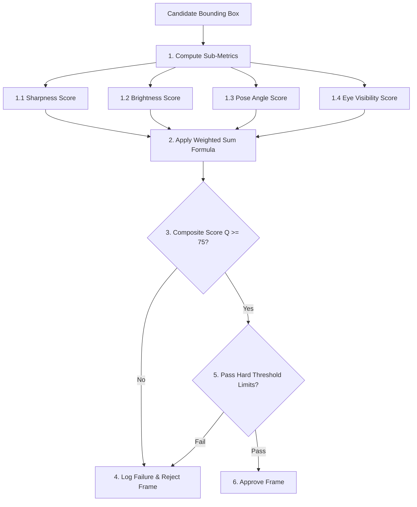

# Face Dataset Collection & Image Processing - Quality Control

## 1. Purpose
This document specifies the automatic image quality scoring system. It defines the mathematical models, weight distributions, and thresholds used to evaluate candidate frames, ensuring that only high-quality biometric data is accepted.

---

## 2. Overview
Image quality directly impacts face recognition accuracy. Lower quality input data increases matching errors (FAR/FRR). The Quality Control Service analyzes multiple image properties (such as sharpness, brightness, and pose angles) and combines them into a single, standardized Quality Score ($Q$).

```
+------------------+     +------------------+     +------------------+
| Sharpness (25%)  |     | Brightness (15%) |     |  Contrast (10%)  |
+------------------+     +------------------+     +------------------+
         |                        |                        |
         +------------------------+------------------------+
                                  |
                                  v
+------------------+     +------------------+     +------------------+
| Position (15%)   | --> | Composite Quality| <-- |  Eyes Vis. (15%) |
|                  |     |    Score (Q)     |     |                  |
+------------------+     +------------------+     +------------------+
         ^                        ^                        ^
         |                        |                        |
         +------------------------+------------------------+
                                  |
+------------------+     +--------+---------+     +------------------+
| Pose Angle (10%) |     |                  |     | Neutrality (10%) |
+------------------+     +------------------+     +------------------+
```

---

## 3. Workflow
The quality control workflow evaluates each frame in a multi-stage process:



---

## 4. Architecture
The quality control engine evaluates frames against a weighted scoring matrix and strict hardware boundaries:

### 4.1 Scoring Formula
The system calculates a composite Quality Score ($Q$) out of $100$ using a weighted sum of seven sub-metrics:
$$Q = w_{\text{sharp}} S_{\text{sharp}} + w_{\text{bright}} S_{\text{bright}} + w_{\text{contrast}} S_{\text{contrast}} + w_{\text{pos}} S_{\text{pos}} + w_{\text{eyes}} S_{\text{eyes}} + w_{\text{pose}} S_{\text{pose}} + w_{\text{expr}} S_{\text{expr}}$$

### 4.2 Weight Configurations & Sub-metrics
The default weight distributions and scoring algorithms are configured as follows:

| Sub-Metric | Weight ($w_i$) | Target Target | Description |
| :--- | :--- | :--- | :--- |
| **Sharpness** ($S_{\text{sharp}}$) | $0.25$ | Variance of Laplacian $\ge 120$ | Assesses motion blur. Standardized to a linear scale: $S_{\text{sharp}} = \min(100, \frac{\sigma^2}{1.2})$. |
| **Brightness** ($S_{\text{bright}}$) | $0.15$ | Mean pixel value $100 - 160$ | Assesses illumination. Standardized to $S_{\text{bright}} = 100 - |128 - \mu| \times \frac{100}{128}$. |
| **Contrast** ($S_{\text{contrast}}$) | $0.10$ | Standard deviation $\ge 30$ | Assesses lighting dynamics. Standardized to $S_{\text{contrast}} = \min(100, \sigma_{\text{contrast}} \times 2)$. |
| **Position** ($S_{\text{pos}}$) | $0.15$ | Face centered in frame | Bounding box center distance from target coordinate center. |
| **Eye Visibility** ($S_{\text{eyes}}$) | $0.15$ | Eyes detected & unoccluded | Assesses pupil landmark detection confidence levels. |
| **Pose Angle** ($S_{\text{pose}}$) | $0.10$ | Face yaw/pitch/roll $\le 10^{\circ}$ | Assesses facial rotation. Higher scores correspond to a straight-ahead frontal pose. |
| **Neutrality** ($S_{\text{expr}}$) | $0.10$ | Neutral expression | Assesses facial expressions to verify neutral features (e.g., closed mouth, open eyes). |

### 4.3 Acceptance Thresholds
To be accepted, a frame must satisfy both:
1. **Composite Score**: $Q \ge 75.0$
2. **Hard Quality Limits**:
   - $S_{\text{sharp}} \ge 50.0$ (rejects highly blurry frames even if they are well-lit).
   - $S_{\text{bright}} \ge 40.0$ (rejects severely under-exposed or over-exposed frames).
   - $S_{\text{eyes}} \ge 80.0$ (ensures eyes are always visible and open).
   - $S_{\text{pose}} \ge 70.0$ (ensures the face is looking mostly forward).

---

## 5. Business Rules
- **Fail-Fast Checks**: If any hard quality limit fails during evaluation, the scoring calculation is aborted immediately to minimize processing latency.
- **Dynamic Session Averages**: The completed student dataset must maintain an average composite Quality Score of at least $82.0$ across all 10 accepted frames. This ensures that the overall dataset is of high quality, even if a few individual frames scored close to the minimum $75.0$ threshold.

---

## 6. Design Decisions
- **Standardized Score Mapping**: All sub-metrics are mapped to a standard $0.0 - 100.0$ float scale before applying the weighted sum. This ensures that the weights are easy to interpret and adjust.
- **Configurable Weights**: Quality weights are stored in the database configuration table, allowing administrators to adjust them for different deployment environments (e.g., increasing lighting weight weights for outdoor installations) without modifying application code.

---

## 7. Future Improvements
- **Environmental Context Tuning**: Implement an adaptive scoring algorithm that adjusts brightness thresholds dynamically based on time-of-day and ambient light sensors.
- **Deep Quality Assessment Models**: Evaluate deep-learning-based face image quality assessment frameworks (like FaceQnet or SER-FIQ) to replace handcrafted heuristics with machine learning quality predictions.

---

## 8. References to Related Modules
- [Dataset Overview](file:///c:/GitHub/Attendence-System-Uning-Face-Recognition/docs/dataset/Dataset_Overview.md)
- [Dataset Architecture](file:///c:/GitHub/Attendence-System-Uning-Face-Recognition/docs/dataset/Dataset_Architecture.md)
- [Camera Workflow](file:///c:/GitHub/Attendence-System-Uning-Face-Recognition/docs/dataset/Camera_Workflow.md)
- [Dataset Collection](file:///c:/GitHub/Attendence-System-Uning-Face-Recognition/docs/dataset/Dataset_Collection.md)
- [Image Preprocessing](file:///c:/GitHub/Attendence-System-Uning-Face-Recognition/docs/dataset/Image_Preprocessing.md)
- [Image Validation](file:///c:/GitHub/Attendence-System-Uning-Face-Recognition/docs/dataset/Image_Validation.md)
- [Face Alignment](file:///c:/GitHub/Attendence-System-Uning-Face-Recognition/docs/dataset/Face_Alignment.md)
- [Dataset Storage](file:///c:/GitHub/Attendence-System-Uning-Face-Recognition/docs/dataset/Dataset_Storage.md)
- [Embedding Pipeline](file:///c:/GitHub/Attendence-System-Uning-Face-Recognition/docs/dataset/Embedding_Pipeline.md)
- [Dataset Management](file:///c:/GitHub/Attendence-System-Uning-Face-Recognition/docs/dataset/Dataset_Management.md)
- [Performance Considerations](file:///c:/GitHub/Attendence-System-Uning-Face-Recognition/docs/dataset/Performance_Considerations.md)
- [Future AI Models](file:///c:/GitHub/Attendence-System-Uning-Face-Recognition/docs/dataset/Future_AI_Models.md)
- [Privacy and Security](file:///c:/GitHub/Attendence-System-Uning-Face-Recognition/docs/dataset/Privacy_and_Security.md)
- [Workflow Diagrams](file:///c:/GitHub/Attendence-System-Uning-Face-Recognition/docs/dataset/Workflow_Diagrams.md)
