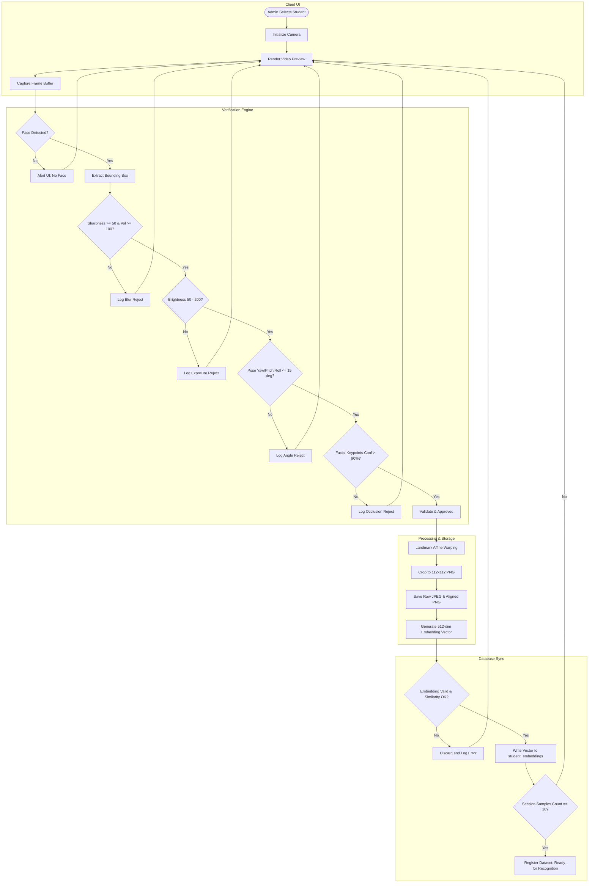
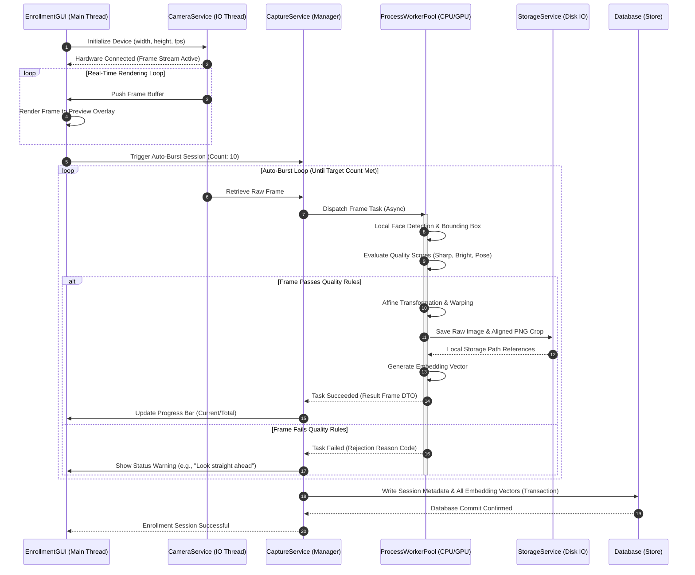

# Face Dataset Collection & Image Processing - Workflow Diagrams

## 1. Purpose
This document consolidates the architectural diagrams, interaction flows, sequence charts, and process structures for the Face Dataset Collection and Image Processing pipeline. It serves as a visual reference for developers implementing these services.

---

## 2. Overview
To ensure a consistent design across the system, this document compiles the workflows described throughout the Phase 5 documentation. These diagrams cover the registration lifecycle, camera failovers, batch imports, and data security models.

---

## 3. Workflow Diagrams

### 3.1 End-to-End Registration Pipeline Flow
This diagram details the sequence of operations from student onboarding to embedding generation and database synchronization:



---

### 3.2 Real-Time Processing Sequence Diagram
This sequence diagram shows the real-time interactions between client threads, background workers, and hardware adapters during capture sessions:



---

### 3.3 Camera Connection Diagnostics & Failover Recovery
This diagram outlines the system diagnostics and failover procedures when a camera connection fails or frames are dropped:

```mermaid
flowchart TD
    Init[Initialize Camera Channel] --> StartStream[Read Stream Stream Buffer]
    StartStream --> ReadFrame{Frame Received within 2.0s?}
    
    ReadFrame -- Yes --> TrackDrops{Frame Drop Rate > 50% over 10s?}
    TrackDrops -- No --> ProcessFrame[Process Standard Frame] --> StartStream
    
    ReadFrame -- No --> RetryHandle[1. Safe Release Device Handle]
    TrackDrops -- Yes --> RetryHandle
    
    RetryHandle --> RebindAttempt{2. Re-bind to Target Index (Attempt <= 3)?}
    RebindAttempt -- Yes --> WaitRebind[Wait 1s] --> Init
    RebindAttempt -- No --> QuerySys[3. Query System Video Interfaces]
    
    QuerySys --> FoundFallback{4. Fallback Index Found (Index 0)?}
    FoundFallback -- Yes --> SwitchFallback[5. Switch Target to Fallback Device] --> Init
    FoundFallback -- No --> ThrowException[6. Raise CameraConnectionException]
    
    ThrowException --> ShowErrorUI[Display Hardware Connection Error Screen]
```

---

### 3.4 Encryption & Biometric Data Flow
This diagram details the encryption and decryption pathways used to protect raw images and biometric templates:

```mermaid
flowchart TD
    subgraph Plaintext Memory (RAM)
        Frame[Plaintext Frame Buffer]
        Vector[Plaintext Vector Array]
    end

    subgraph OS Key Store (Vault)
        Key[Master AES-256 Key]
    end

    subgraph Physical Disk
        RawJPEG[(raw_001.jpg - Encrypted AES-GCM)]
        AlignedPNG[(aligned_001.png - Encrypted AES-GCM)]
    end

    subgraph Relational DB
        EmbRow[(student_embeddings - Encrypted Columns)]
    end

    Frame & Key --> EncryptDisk[AES-GCM Disk Encryptor]
    EncryptDisk --> RawJPEG & AlignedPNG

    Vector & Key --> EncryptDb[Column-Level DB Encryptor]
    EncryptDb --> EmbRow

    RawJPEG & Key --> DecryptDisk[AES-GCM Disk Decryptor]
    DecryptDisk --> Frame

    EmbRow & Key --> DecryptDb[DB Decryptor]
    DecryptDb --> Vector
```

---

## 4. Architecture
The Workflow Diagrams document coordinates components by acting as the system blueprint. It links mathematical functions (like affine warping transforms) with the sequence steps where they are executed.

---

## 5. Business Rules
- **Mermaid Compliance**: All system diagrams must be maintained in plaintext Mermaid syntax inside documentation markdown files. This ensures they can be rendered dynamically in code repositories and are easy to update.
- **Version Alignment**: When updating database structures or preprocessing steps, the corresponding workflow diagrams must be updated in the same commit to maintain documentation accuracy.

---

## 6. Design Decisions
- **Unified Modeling Notation**: The system standardizes on flowcharts for operations, sequence charts for runtime execution threads, and block diagrams for data security layers. This structure provides a clear, comprehensive overview for development teams.

---

## 7. Future Improvements
- **Automated SVG Generation**: Configure a continuous integration (CI) pipeline script that uses the Mermaid CLI tool to compile these markdown diagrams into SVG files, generating high-resolution assets for user guides automatically.

---

## 8. References to Related Modules
- [Dataset Overview](file:///c:/GitHub/Attendence-System-Uning-Face-Recognition/docs/dataset/Dataset_Overview.md)
- [Dataset Architecture](file:///c:/GitHub/Attendence-System-Uning-Face-Recognition/docs/dataset/Dataset_Architecture.md)
- [Camera Workflow](file:///c:/GitHub/Attendence-System-Uning-Face-Recognition/docs/dataset/Camera_Workflow.md)
- [Dataset Collection](file:///c:/GitHub/Attendence-System-Uning-Face-Recognition/docs/dataset/Dataset_Collection.md)
- [Image Preprocessing](file:///c:/GitHub/Attendence-System-Uning-Face-Recognition/docs/dataset/Image_Preprocessing.md)
- [Image Validation](file:///c:/GitHub/Attendence-System-Uning-Face-Recognition/docs/dataset/Image_Validation.md)
- [Face Alignment](file:///c:/GitHub/Attendence-System-Uning-Face-Recognition/docs/dataset/Face_Alignment.md)
- [Dataset Storage](file:///c:/GitHub/Attendence-System-Uning-Face-Recognition/docs/dataset/Dataset_Storage.md)
- [Embedding Pipeline](file:///c:/GitHub/Attendence-System-Uning-Face-Recognition/docs/dataset/Embedding_Pipeline.md)
- [Dataset Management](file:///c:/GitHub/Attendence-System-Uning-Face-Recognition/docs/dataset/Dataset_Management.md)
- [Quality Control](file:///c:/GitHub/Attendence-System-Uning-Face-Recognition/docs/dataset/Quality_Control.md)
- [Performance Considerations](file:///c:/GitHub/Attendence-System-Uning-Face-Recognition/docs/dataset/Performance_Considerations.md)
- [Future AI Models](file:///c:/GitHub/Attendence-System-Uning-Face-Recognition/docs/dataset/Future_AI_Models.md)
- [Privacy and Security](file:///c:/GitHub/Attendence-System-Uning-Face-Recognition/docs/dataset/Privacy_and_Security.md)
