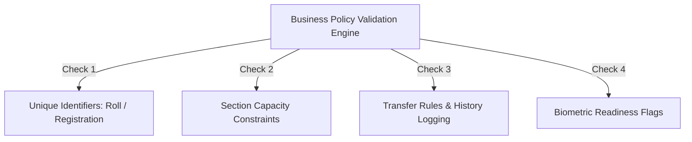
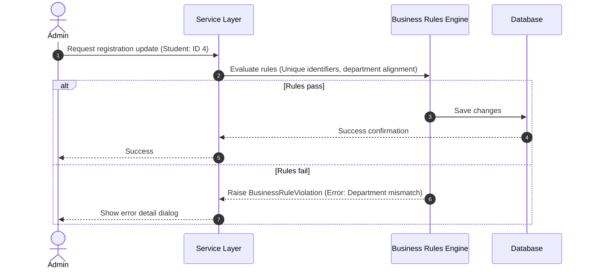

# Business Rules

## 1. Purpose
The **Business Rules** document outlines the core administrative policies, constraints, and validation rules for the Face Recognition Attendance System. These rules preserve database consistency and ensure compliance with academic guidelines.

---

## 2. Overview
Academic institutions require strict guidelines to maintain accurate records. Business rules govern student registration, section sizes, transfer requests, faculty schedules, and student status transitions.

### Policy Rules Mapping

---

## 3. Core Business Rules Specifications

### 3.1 Unique Identifiers Policy
- **Rule Description**: Every student must possess a unique `student_code` (institution-wide registration code) and a unique `roll_number` (within their semester/section cohort).
- **Rationale**: Prevents student records from merging or colliding during search queries, bulk updates, and report generation.
- **Enforcement**: Enforced via unique database constraints and checked during form submission.

### 3.2 Department Alignment Policy
- **Rule Description**: A student can only be assigned to a course that is owned by the student's designated parent department.
- **Rationale**: Prevents students from being enrolled in courses outside their department's scope, ensuring accurate course tracking.
- **Enforcement**: Checked in the `ValidationService` during registration and transfer requests.

### 3.3 Section Capacity Policy
- **Rule Description**: A section cohort's enrollment list cannot exceed its `max_capacity` limit (default: 60).
- **Rationale**: Enforces physical classroom limits and maintains optimal cohort sizes.
- **Enforcement**: Checked in the `SectionService` during student enrollment and transfer.

### 3.4 Faculty Assignment Policy
- **Rule Description**: A faculty member can only be assigned to teach subjects that belong to the instructor's parent department, unless an HOD override is approved.
- **Rationale**: Encourages departmental ownership of subjects while supporting interdisciplinary courses.
- **Enforcement**: Evaluated in the `FacultyService` during subject assignment.

### 3.5 Student Transfer Policy
- **Rule Description**: Transferring a student between departments or courses requires updating their `department_id`, `course_id`, and `section_id` in a single database transaction. This update must also write a record to the student's transfer history log.
- **Rationale**: Ensures historical logs are preserved and prevents database anomalies during transfers.
- **Enforcement**: Handled via transaction blocks in the `EnrollmentService`.

### 3.6 Inactive Status Policy
- **Rule Description**: If a student is flagged as `Inactive` or `Suspended` in `is_active` or `enrollment_status`, they are immediately excluded from all active attendance camera scans and schedule lists.
- **Rationale**: Prevents inactive students from being flagged as absent, maintaining accurate attendance statistics.
- **Enforcement**: Evaluated dynamically by the query engine during schedule checks.

### 3.7 Graduation Status Policy
- **Rule Description**: Transitioning a student profile to `Graduated` removes their active `section_id` assignment and marks their `enrollment_status` as `Graduated`. The system preserves their biometric embeddings and historical attendance records in a read-only state.
- **Rationale**: Preserves historic attendance logs for verification queries while releasing active classroom capacity.
- **Enforcement**: Managed via the student promotion interface.

---

## 4. Workflow
The workflow below details how the validation engine processes these business rules during student registration:

---

## 5. Design Decisions
- **Transactional State Management**: State updates are processed within database transactions. If any business rule is violated, the transaction rolls back, keeping database records consistent.
- **Soft Deactivations**: The system uses soft deactivations (e.g., flags like `is_active` and `employment_status`) rather than deleting records. This approach preserves historic logs for auditing while keeping active lists clean.

---

## 6. Future Improvements
- **Automatic Attendance Alerts**: Send email or dashboard notifications to HODs if a student's attendance drops below the university's minimum requirement (e.g., 75%).
- **Interactive Timetable Checkers**: Add dynamic checking to the timetable grid to highlight scheduling conflicts (e.g., overlapping classroom reservations) in real-time.

---

## 7. References to Related Modules
- [Management Overview](file:///c:/GitHub/Attendence-System-Uning-Face-Recognition/docs/management/Management_Overview.md)
- [Student Module](file:///c:/GitHub/Attendence-System-Uning-Face-Recognition/docs/management/Student_Module.md)
- [Faculty Module](file:///c:/GitHub/Attendence-System-Uning-Face-Recognition/docs/management/Faculty_Module.md)
- [Data Validation](file:///c:/GitHub/Attendence-System-Uning-Face-Recognition/docs/management/Data_Validation.md)
