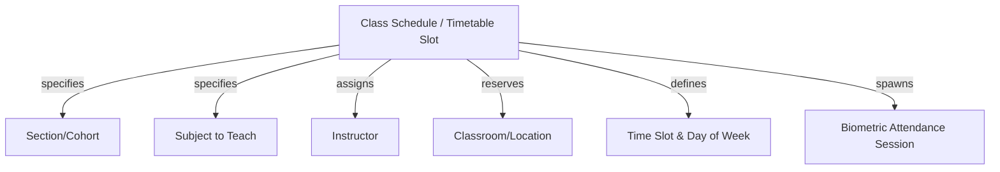
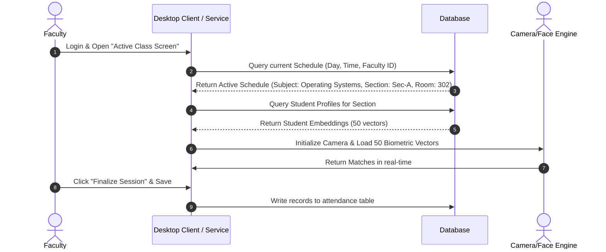

# Class Module Design

## 1. Purpose
The **Class Module** manages class schedules and schedules face recognition attendance sessions. It maps subjects, sections, classrooms, time slots, and instructors into an organized timetable.

---

## 2. Overview
This module acts as the coordinator for attendance tracking. By defining weekly schedules, the system knows which student cohort (Section) should be in which classroom (Room) with which instructor (Faculty) at any given hour. This enables the camera system to load the correct face recognition models automatically.

### Timetable Connection Diagram

### Table Schema Expansion Plans
To support timetable scheduling, the database schema will include the following entities:

#### Table: `class_schedules`
| Column Name | Type | Constraints | Description & Justification |
| :--- | :--- | :--- | :--- |
| `id` | INTEGER | PK, Auto-increment | Primary key. |
| `section_id` | INTEGER | FK -> `sections(id)` | Target student cohort. |
| `subject_id` | INTEGER | FK -> `subjects(id)` | Subject being taught. |
| `faculty_id` | INTEGER | FK -> `faculty(id)` | Instructor conducting the class. |
| `day_of_week` | INTEGER | 1 to 7 (Mon to Sun) | Target day for weekly schedules. |
| `start_time` | TIME | NOT NULL | Class start time (e.g., 09:00:00). |
| `end_time` | TIME | NOT NULL | Class end time (e.g., 09:50:00). |
| `classroom_code` | VARCHAR(50) | NOT NULL | Location code (e.g., "Room 401"). |
| `is_active` | BOOLEAN | DEFAULT TRUE | Allows soft deactivation of schedule slots. |

---

## 3. Responsibilities
- **Timetable Scheduling**: Model weekly timetables by mapping sections, subjects, classrooms, time slots, and instructors.
- **Biometric Model Loading**: Provide query interfaces that return active student enrollment IDs for the current date, time, and classroom. This enables the face recognition module to load only the required embedding vector files instead of the entire student database.
- **Attendance Session Management**: Track attendance sessions and link captured logs back to the corresponding class schedule.

---

## 4. Workflow
The lifecycle of scheduling a class and running its attendance tracking session is shown below:

---

## 5. Business Rules
- **Faculty Double-Booking Prevention**: A faculty member cannot be assigned to more than one active `class_schedules` record during overlapping time slots.
- **Classroom Clash Prevention**: A classroom (`classroom_code`) cannot be reserved by two different sections during overlapping times.
- **Time Slot Limit**: The duration of a class schedule record must be between 30 minutes and 240 minutes.

---

## 6. Design Decisions
- **Time-only Slots**: Storing time fields as `TIME` columns without date variables enables the system to reuse schedule configurations weekly throughout the semester.
- **Scoped Biometric Loading (Optimization)**: Loading only the facial embeddings of students enrolled in the scheduled section reduces processing overhead. This optimization keeps recognition latency low and maintains high match accuracy, even when scaling to databases with thousands of students.

---

## 7. Future Improvements
- **Timetable Import Engine**: Add parsing utilities to import university-wide schedules directly from standard formats (e.g., ASC Timetable CSV, Excel exports).
- **Ad-Hoc Session Support**: Allow faculty to start unscheduled attendance sessions (e.g., make-up classes) by manually selecting a subject and section from the dashboard.

---

## 8. References to Related Modules
- [Management Overview](file:///c:/GitHub/Attendence-System-Uning-Face-Recognition/docs/management/Management_Overview.md)
- [Faculty Module](file:///c:/GitHub/Attendence-System-Uning-Face-Recognition/docs/management/Faculty_Module.md)
- [Section Module](file:///c:/GitHub/Attendence-System-Uning-Face-Recognition/docs/management/Section_Module.md)
- [Enrollment Module](file:///c:/GitHub/Attendence-System-Uning-Face-Recognition/docs/management/Enrollment.md)
