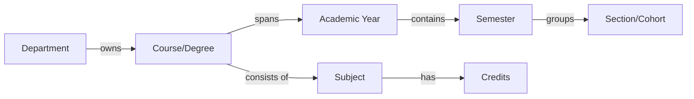
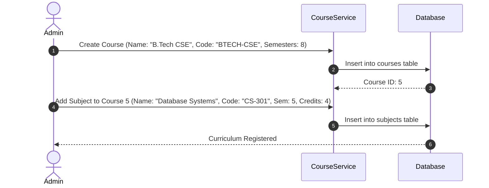

# Course Module Design

## 1. Purpose
The **Course Module** structures the academic offerings of the organization. It models degrees, curricula, subject lists, credit weighting, and academic terms (semesters and years). This structure is essential for verifying student registration rules and determining their attendance requirements.

---

## 2. Overview
A Course is a comprehensive degree plan (e.g., Bachelor of Technology, Master of Business Administration) spanning multiple semesters. Each course contains a set of subjects (modules of study) taught across semesters.

### Curriculum Structure Diagram

### Table Schema Expansion Plans
The Course and Subject entities are designed with the following relational attributes:

#### Table: `courses`
| Column Name | Type | Constraints | Description & Justification |
| :--- | :--- | :--- | :--- |
| `id` | INTEGER | PK, Auto-increment | Primary key. |
| `name` | VARCHAR(100) | NOT NULL | Course Name (e.g., "Bachelor of Science in Physics"). |
| `code` | VARCHAR(20) | UNIQUE, NOT NULL | Unique course code (e.g., "BSC-PHYS"). |
| `department_id` | INTEGER | FK -> `departments(id)` | Parent department reference. |
| `duration_semesters`| INTEGER | NOT NULL, DEFAULT 8 | Total academic semesters required for graduation. |
| `total_credits` | INTEGER | NOT NULL | Combined credit hours required for program completion. |
| `academic_year` | VARCHAR(9) | NOT NULL | Target calendar scope (e.g., "2026-2027"). |

#### Table: `subjects`
| Column Name | Type | Constraints | Description & Justification |
| :--- | :--- | :--- | :--- |
| `id` | INTEGER | PK, Auto-increment | Primary key. |
| `name` | VARCHAR(100) | NOT NULL | Subject Title (e.g., "Algorithms & Complexity"). |
| `code` | VARCHAR(20) | UNIQUE, NOT NULL | Unique identifier (e.g., "CS-302"). |
| `course_id` | INTEGER | FK -> `courses(id)` | Course mapping reference. |
| `semester_num` | INTEGER | NOT NULL | Semester number this subject is taught (e.g., 3). |
| `credits` | INTEGER | NOT NULL, DEFAULT 4 | Subject weighting (used for attendance calculations). |
| `faculty_id` | INTEGER | FK -> `faculty(id)`, NULLABLE | Assigned instructor reference. |

---

## 3. Responsibilities
- **Academic Framework Maintenance**: Maintain course details, durations, credits, and subject catalogs.
- **Relational Integrity Mapping**: Keep course offerings connected to their parent departments and associated semesters.
- **Academic Calendar Boundaries**: Track details like current semester numbers and active academic years to ensure valid enrollments.

---

## 4. Workflow
The workflow for defining a new course program and structuring its curriculum is shown below:

---

## 5. Business Rules
- **Unique Code System**: Subject and course codes must be unique across the system to prevent overlapping catalog items.
- **Credit Limit**: A single subject cannot exceed 12 credits, and a single semester's subjects cannot sum to more than 30 credits.
- **Cascade Deletion Policy**: If a course is deleted, all its associated subjects are deleted (`ON DELETE CASCADE`), while assigned student profiles must be updated or remapped to prevent orphaned records.

---

## 6. Design Decisions
- **Semester Representation**: Rather than creating a complex tree of dynamic classes, semesters are modeled using simple integer indices (e.g., `semester_num` = 1 to 8) within subjects, while dates are managed through the Semester Module.
- **Explicit Faculty Association**: A subject contains a foreign key to a faculty member. This handles primary scheduling lookups, ensuring that when an instructor starts a face recognition loop for a subject, the system knows they are the authorized teacher.

---

## 7. Future Improvements
- **Elective Selection Logic**: Add support for elective subjects where students from different sections enroll in the same subject, bypassing default section allocations.
- **Syllabus PDF Storage**: Plan database updates to store reference links to PDF course outlines.

---

## 8. References to Related Modules
- [Management Overview](file:///c:/GitHub/Attendence-System-Uning-Face-Recognition/docs/management/Management_Overview.md)
- [Department Module](file:///c:/GitHub/Attendence-System-Uning-Face-Recognition/docs/management/Department_Module.md)
- [Semester Module](file:///c:/GitHub/Attendence-System-Uning-Face-Recognition/docs/management/Semester_Module.md)
- [Section Module](file:///c:/GitHub/Attendence-System-Uning-Face-Recognition/docs/management/Section_Module.md)
