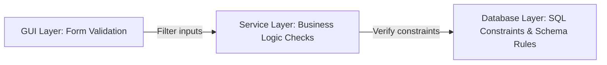
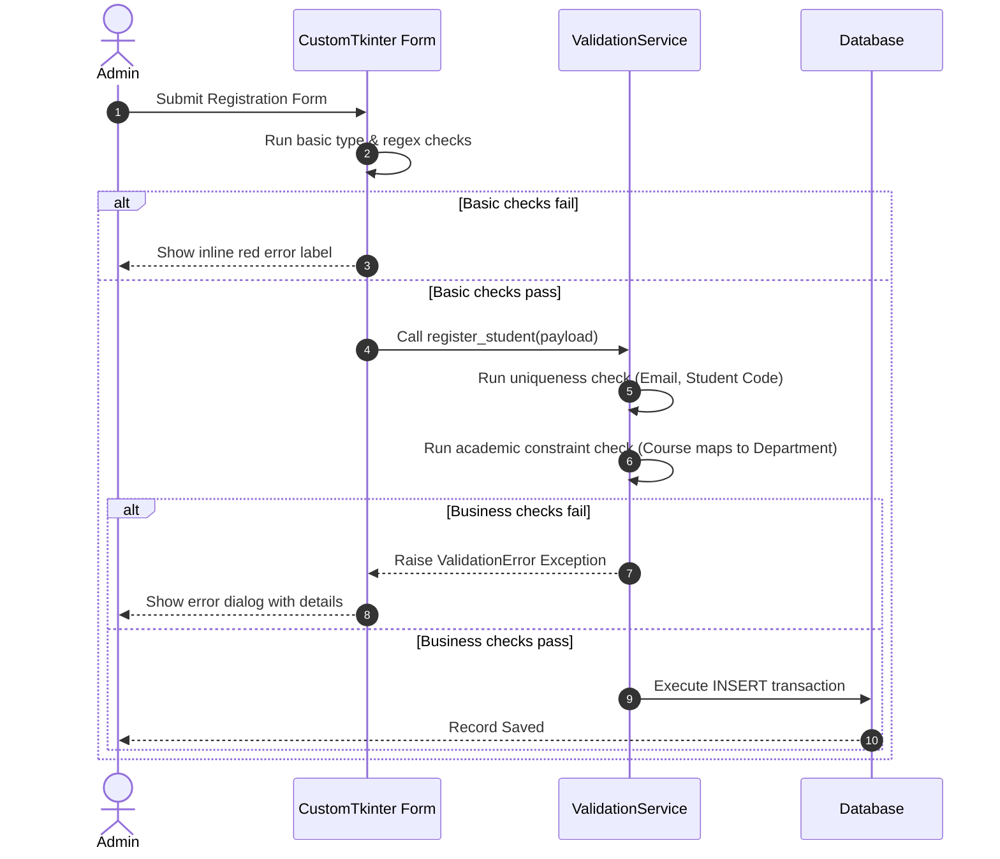

# Data Validation Strategy

## 1. Purpose
The **Data Validation Strategy** defines the input verification guidelines and constraint checks for student and faculty profile data. It ensures data consistency and integrity at the API, Service, and Database boundaries before any write operations are executed.

---

## 2. Overview
Input validation is performed at multiple layers of the application stack. This approach prevents corrupted data, malformed identifiers, and invalid relationships from reaching the database, keeping reports and biometric matching reliable.

### Layered Validation Architecture

### Profile Validation Matrix

| Target Field | Validation Phase | Rule Type | Expression / Logic Check |
| :--- | :--- | :--- | :--- |
| `student_code` | Input Entry | Regex, Unique | `^STD[0-9]{4}[0-9]{4}$` (Format: STD + Year + 4-digit Seq). |
| `employee_code`| Input Entry | Regex, Unique | `^EMP[0-9]{4}[0-9]{4}$` (Format: EMP + Year + 4-digit Seq). |
| `email` | Input Entry | Regex, Unique | `^[a-zA-Z0-9._%+-]+@[a-zA-Z0-9.-]+\.[a-zA-Z]{2,}$` (OWASP Email Regex). |
| `phone` | Input Entry | Regex | `^\+?[1-9]\d{1,14}$` (E.164 international standard format). |
| `date_of_birth` | Input Entry | Range | Age bounds: Student must be between 14 and 100 years of age. |
| `course_id` | Allocation | FK Constraint| Must resolve to a valid row in the `courses` database table. |
| `section_id` | Allocation | Relationship | Section must belong to the selected course and have open capacity. |
| `joining_date` | Input Entry | Comparison | Must not be a future date. |

---

## 3. Responsibilities
- **Form-Level Validation**: Filter user inputs and provide immediate feedback for invalid entries (e.g., malformed email addresses) in the GUI.
- **Relational Constraint Auditing**: Verify that associated entities (e.g., matching student courses to departments) are logically consistent in the service layer.
- **Database Schema Enforcement**: Enforce database-level safety nets (e.g., unique constraints, non-null requirements, foreign key rules).

---

## 4. Workflow
The workflow below details how the system validates and saves a new student record:

---

## 5. Business Rules
- **Unique Identifier Guard**: Registration identifiers (`student_code`, `employee_code`) must be checked for duplicates in the database before completing write operations.
- **Required Fields**: Fields like first name, last name, email, phone, and emergency contact details must not be empty or consist only of whitespace.
- **Biometric Limit**: A student cannot have more than 10 registered face embedding records. This limit prevents database bloat and minimizes search delays during recognition.

---

## 6. Design Decisions
- **E.164 Phone Format**: Enforcing the E.164 format for telephone numbers ensures compatibility with SMS notification gateways (e.g., Twilio) in future updates.
- **Decoupled Validation Engine**: Implementing validation checks inside a standalone `ValidationService` instead of embedding them within the DB models makes it easier to write unit tests for input formats without requiring active database connections.

---

## 7. Future Improvements
- **Automated Domain Check**: Update email validation checks to allow only institutional domains (e.g., `@university.edu`).
- **Interactive Face Frame Checks**: Build checks into the face capture interface that analyze lighting, head tilt, and image resolution before extracting embeddings.

---

## 8. References to Related Modules
- [Management Overview](file:///c:/GitHub/Attendence-System-Uning-Face-Recognition/docs/management/Management_Overview.md)
- [Student Module](file:///c:/GitHub/Attendence-System-Uning-Face-Recognition/docs/management/Student_Module.md)
- [Faculty Module](file:///c:/GitHub/Attendence-System-Uning-Face-Recognition/docs/management/Faculty_Module.md)
- [Business Rules](file:///c:/GitHub/Attendence-System-Uning-Face-Recognition/docs/management/Business_Rules.md)
