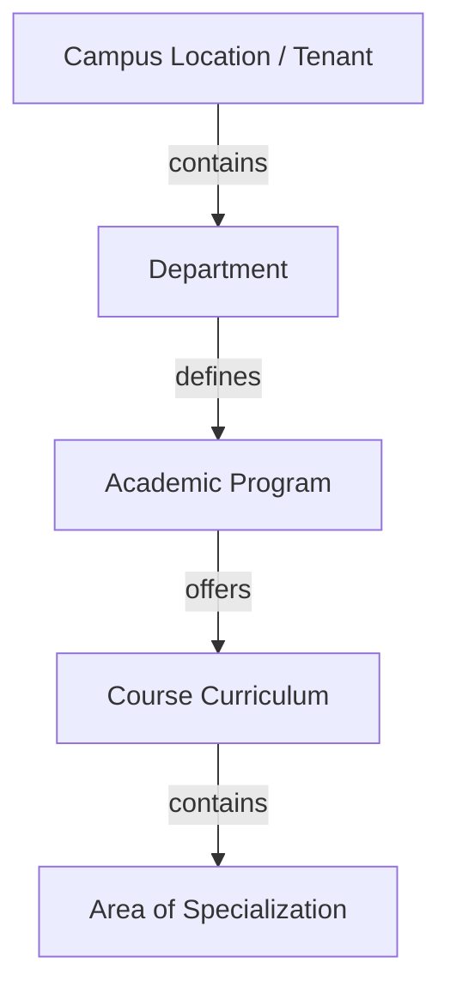
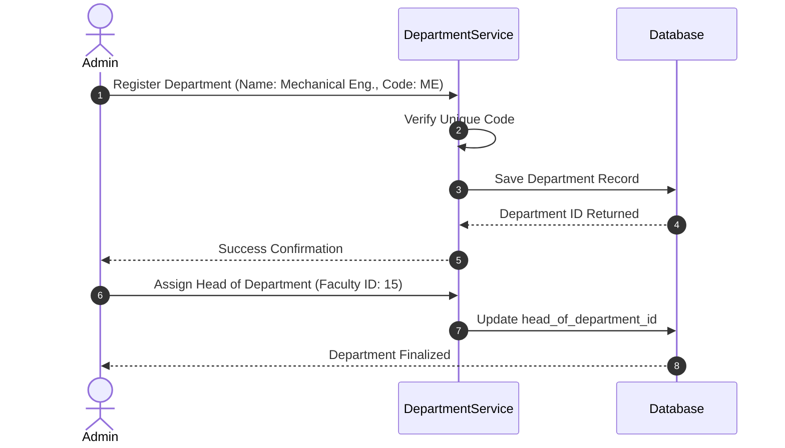

# Department Module Design

## 1. Purpose
The **Department Module** establishes the highest level of administrative partitioning in the database schema. It models institutional academic divisions (e.g., Computer Science, Electrical Engineering), structures academic programs, defines naming conventions, and prepares the core database tables to scale from a single institution to multi-campus environments.

---

## 2. Overview
Every student, faculty member, and course is assigned to a department. This division isolates records, controls reporting, and structures security rules.

### Hierarchical Model

### Table Schema Expansion Plans
To support advanced institutional modeling, the `departments` table will include:

| Column Name | Type | Constraints | Description & Justification |
| :--- | :--- | :--- | :--- |
| `id` | INTEGER | PK, Auto-increment | Primary key. |
| `name` | VARCHAR(100) | NOT NULL, UNIQUE | Full name of the division (e.g., "Department of Computer Science & Engineering"). |
| `code` | VARCHAR(10) | NOT NULL, UNIQUE | Standard abbreviation code (e.g., "CSE"). Used in Roll Numbers. |
| `head_of_department_id` | INTEGER | FK -> `faculty(id)`, NULLABLE | Self-referencing link to designate leadership. |
| `office_location` | VARCHAR(150) | NULLABLE | Main office location for administrative operations. |
| `campus_id` | INTEGER | DEFAULT 1 | Future tenant identifier to support multiple campuses. |
| `is_active` | BOOLEAN | DEFAULT TRUE | Allows soft deactivation of departments during reorganization. |

---

## 3. Responsibilities
- **Organizational Hierarchical Partitioning**: Enforce clean boundaries so courses, students, and faculty map to logical organizational divisions.
- **Ownership of Academic Curriculum**: Act as the parent repository for courses, modules, and specializations.
- **Reporting Boundaries**: Define the scope for generating attendance and academic performance metrics (e.g., Department-level reports).

---

## 4. Workflow
Creating a department and structuring its curriculum follows this lifecycle:

---

## 5. Business Rules
- **Code Constraint**: Department codes must contain uppercase letters only, ranging between 2 and 6 characters (e.g., `CSE`, `ECE`, `ME`).
- **HOD Association**: The faculty member assigned as the Head of Department must have an active status, and their profile must belong to the department they are assigned to lead.
- **Safe Deactivation**: A department cannot be marked as `Inactive` if there are active courses, enrolled students, or active schedules mapped to it.

---

## 6. Design Decisions
- **Naming Conventions**: 
  - Table name: `departments`.
  - Codes: Upper-case, alphanumeric, non-spaced acronym (e.g., `MATH`, `PHYS`).
  - Course mapping prefix: Course codes will be prefixed with the department code (e.g., `CSE-101`, `ECE-202`).
- **Head of Department Self-Reference**: Kept the head of department reference as a foreign key on the `departments` table. This allows fast lookups for dashboard authorization checks (e.g., "Is User HOD?").
- **Campus Multi-Tenancy**: Added `campus_id` directly to the `departments` table. For local deployments, this defaults to `1`. In a cloud-connected, multi-campus setup, this key provides immediate partition boundaries.

---

## 7. Future Improvements
- **Cross-Department Credit Sharing**: Add support for interdisciplinary courses where a course is owned by department A but is available as an elective in department B.
- **Administrative Budgets and Resource Tracking**: Expand the department details to map labs, hardware camera resources, and classrooms to departments.

---

## 8. References to Related Modules
- [Management Overview](file:///c:/GitHub/Attendence-System-Uning-Face-Recognition/docs/management/Management_Overview.md)
- [Course Module](file:///c:/GitHub/Attendence-System-Uning-Face-Recognition/docs/management/Course_Module.md)
- [Faculty Module](file:///c:/GitHub/Attendence-System-Uning-Face-Recognition/docs/management/Faculty_Module.md)
- [Business Rules](file:///c:/GitHub/Attendence-System-Uning-Face-Recognition/docs/management/Business_Rules.md)
