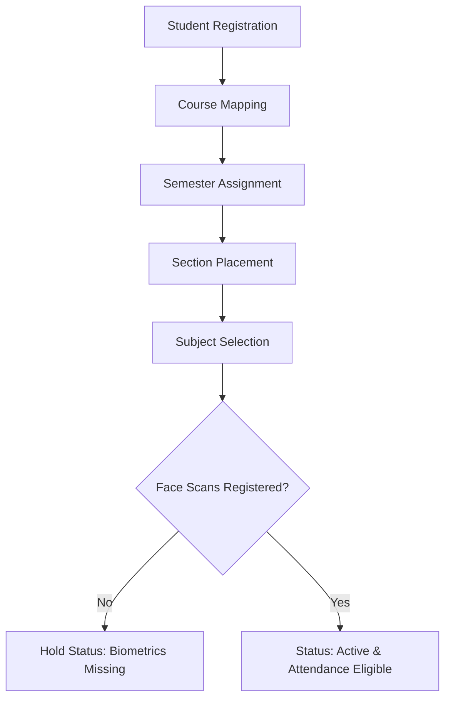
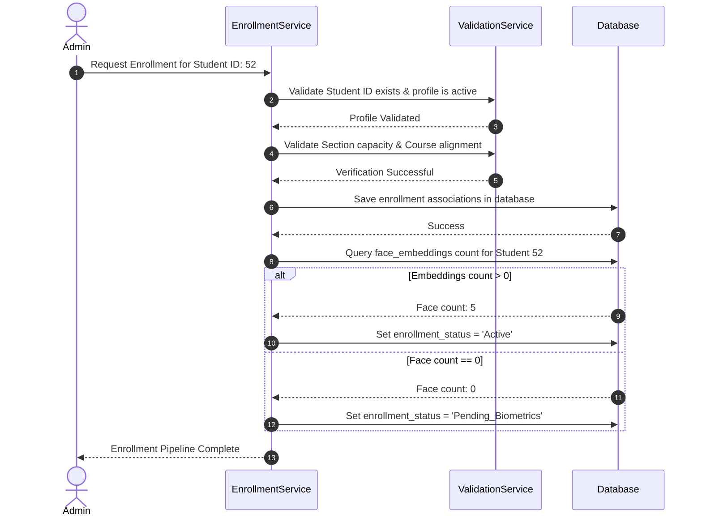

# Enrollment Module Design

## 1. Purpose
The **Enrollment Module** manages student enrollment and class registrations. It models how a student is matched with courses, semesters, sections, and subjects, establishing their attendance eligibility.

---

## 2. Overview
Enrollment acts as the gateway to the system. A registered student profile is not included in the attendance tracking loop until they complete the enrollment pipeline and register a valid facial biometric dataset.

### Enrollment Pipeline Diagram

### Table Schema Expansion Plans
Enrollment mappings are tracked using the following schema layouts:

#### Table: `student_subject_enrollments` (Junction Table)
| Column Name | Type | Constraints | Description & Justification |
| :--- | :--- | :--- | :--- |
| `student_id` | INTEGER | PK, FK -> `students(id)` | Enrolled student reference. |
| `subject_id` | INTEGER | PK, FK -> `subjects(id)` | Targeted subject reference. |
| `enrollment_date`| DATE | NOT NULL | Date when enrollment was processed. |
| `status` | VARCHAR(20) | DEFAULT 'Enrolled' | Status: 'Enrolled', 'Withdrawn', 'Completed'. |

---

## 3. Responsibilities
- **Enrollment Pipeline Verification**: Verify that students complete the registration and academic allocation steps before marking them active.
- **Biometric Eligibility Auditing**: Provide boolean checks (`is_eligible_for_attendance`) that verify if a student has active status and registered facial embeddings.
- **Academic Promotion Tracking**: Coordinate bulk promotions and section transfers while preserving historical records.

---

## 4. Workflow
The workflow below details how the system checks and grants attendance eligibility to a student:

---

## 5. Business Rules
- **Eligibility Rule**: A student is only included in face recognition loops if their `enrollment_status` is `Active`, `is_active` is `True`, and their `face_dataset_status` is `Registered`.
- **Subject-Course Alignment**: A student can only enroll in subjects that are mapped to their selected course.
- **Prerequisite Validation**: Students cannot enroll in advanced terms (e.g., Semester 2) unless they have an active enrollment record for the preceding term or have been granted an administrative override.

---

## 6. Design Decisions
- **Biometric Sanity Check**: The enrollment service automatically queries face embedding counts before activating a student record. This safeguard prevents students without biometric datasets from being added to recognition queues, which would otherwise flag them as absent.
- **Junction-based Subject Enrollment**: Linking students to subjects via a junction table (`student_subject_enrollments`) supports elective enrollments and course-specific schedules, providing greater flexibility than simple course-level assignments.

---

## 7. Future Improvements
- **Online Admission Integration**: Design interfaces to pull enrollment records directly from external registration systems.
- **Automatic Audit Reports**: Build automated reports that list students flagged as `Pending_Biometrics` to simplify onboarding at the start of new terms.

---

## 8. References to Related Modules
- [Management Overview](file:///c:/GitHub/Attendence-System-Uning-Face-Recognition/docs/management/Management_Overview.md)
- [Student Module](file:///c:/GitHub/Attendence-System-Uning-Face-Recognition/docs/management/Student_Module.md)
- [Course Module](file:///c:/GitHub/Attendence-System-Uning-Face-Recognition/docs/management/Course_Module.md)
- [Data Validation](file:///c:/GitHub/Attendence-System-Uning-Face-Recognition/docs/management/Data_Validation.md)
