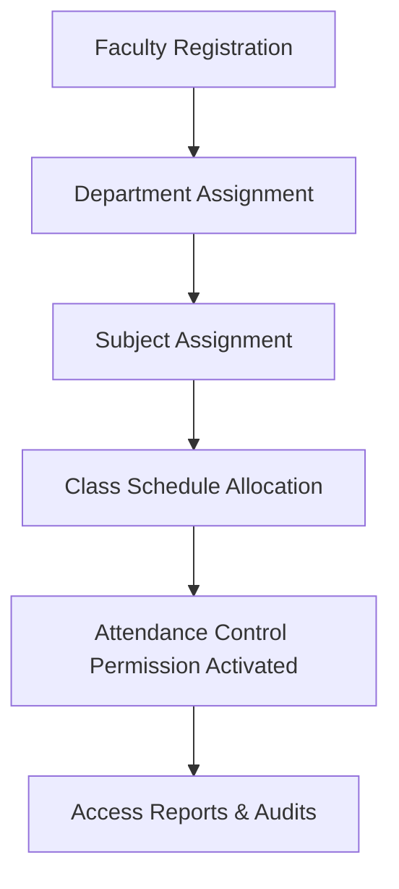

# Faculty Module Design

## 1. Purpose
The **Faculty Module** designs the data structure, responsibilities, and system access rights for teaching, research, and administrative staff. It governs how faculty profiles connect to academic departments, how instructors are assigned to subjects, and how their system authorization permits them to trigger, manage, and verify attendance records.

---

## 2. Overview
Faculty members act as system managers within the classroom context. They require specific profile data to map their professional responsibilities, office boundaries, and security clearance roles.

### Faculty Profile Field Design
The table below specifies the fields mapping to the faculty profile representation:

| Field Name | Type | Constraints | Description & Justification |
| :--- | :--- | :--- | :--- |
| `id` | INTEGER | PK, Auto-increment | Internal unique primary key. |
| `user_id` | INTEGER | FK -> `users(id)`, UNIQUE | Links the faculty profile to a system login account, enabling RBAC. |
| `employee_code` | VARCHAR(50) | UNIQUE, NOT NULL | Unique organizational identification number (e.g., EMP2026098). |
| `first_name` | VARCHAR(50) | NOT NULL | First name. |
| `last_name` | VARCHAR(50) | NOT NULL | Last/Family name. |
| `designation` | VARCHAR(100) | NOT NULL | Academic/Professional title (e.g., Professor, Assistant Professor, Lecturer). |
| `department_id` | INTEGER | FK -> `departments(id)` | Parent department responsible for employment and reporting. |
| `email` | VARCHAR(100) | UNIQUE, NOT NULL | Organizational email address used for institutional communications. |
| `phone` | VARCHAR(20) | NOT NULL | Direct contact telephone number. |
| `office_location` | VARCHAR(100) | NULLABLE | Physical building and room number (e.g., "Block B, Lab 203"). |
| `employment_status`| VARCHAR(20) | DEFAULT 'Full-time' | Status: 'Full-time', 'Part-time', 'On-Leave', 'Resigned'. |
| `role` | VARCHAR(30) | NOT NULL | Operational administrative role (e.g., 'Instructor', 'HOD', 'Dean'). |
| `joining_date` | DATE | NOT NULL | Date of organizational onboarding, used for HR records. |
| `profile_photo` | VARCHAR(255) | NULLABLE | File path link to a primary profile image. |
| `permissions` | TEXT | NULLABLE | JSON serialized list of granular permission overrides. |

---

## 3. Responsibilities
- **Classroom Attendance Orchestration**: Faculty members are responsible for starting, pausing, and closing the biometric camera tracking loops for their scheduled classes.
- **Manual Adjustments & Verification**: Review automated attendance logs, override system mismatches (e.g., marking a late student present), and verify submissions.
- **Reporting & Exporting**: Extract student attendance reports for assigned courses and flag academic warnings to the HOD (Head of Department).

---

## 4. Workflow
The faculty onboarding, course mapping, and operational activities follow this logical sequence:

### Process Steps:
1. **Faculty Registration**: Admin registers the employee record and links it to a `user_id` system account.
2. **Department Assignment**: Map the faculty member to an academic department.
3. **Subject Assignment**: Map one or more subjects to the instructor.
4. **Class Schedule Allocation**: Connect the instructor, subject, and student section inside a timetable schedule slot.
5. **Attendance Control**: When a class begins, the instructor logs in to trigger the camera loop.
6. **Access Reports**: Faculty monitors student attendance trends and runs manual reviews.

---

## 5. Business Rules
- **Cross-Department Restriction**: Faculty can only be assigned to teach subjects belonging to their parent department, unless a cross-department assignment has been authorized.
- **Class Schedule Collision**: A faculty member cannot be scheduled to teach two different classes in overlapping time slots.
- **Deactivation Cascade**: If a faculty member is marked as `Inactive` or `Resigned` in `employment_status`, all their future schedule slots are suspended, and their linked `user_id` account is flagged as inactive.

---

## 6. Design Decisions
- **Decoupled User Accounts**: Separating `users` (credentials and global role permissions) from `faculty` (demographics and academic metadata) allows staff to have administrative roles without cluttering the personnel profile.
- **Permissions JSON Serialization**: A serialized `permissions` string in the profile database allows dynamic, granular overrides (e.g., giving a specific professor temporary rights to mark attendance for another's class) without mutating the primary RBAC tables.
- **Subject Junction Table**: Rather than hardcoding a single `subject_id` reference in the faculty table, a separate relationship mapping resolves the many-to-many link, letting faculty teach multiple subjects.

---

## 7. Future Improvements
- **Automatic Substitute Allocation**: Introduce temporary scheduling rules that auto-delegate attendance tracking to a peer instructor if the primary faculty is flagged as "On-Leave".
- **Dynamic Office Hours Booking**: Plan integration with calendar sync interfaces to show office locations and availability status to students.

---

## 8. References to Related Modules
- [Management Overview](file:///c:/GitHub/Attendence-System-Uning-Face-Recognition/docs/management/Management_Overview.md)
- [Department Module](file:///c:/GitHub/Attendence-System-Uning-Face-Recognition/docs/management/Department_Module.md)
- [Course Module](file:///c:/GitHub/Attendence-System-Uning-Face-Recognition/docs/management/Course_Module.md)
- [Class Module](file:///c:/GitHub/Attendence-System-Uning-Face-Recognition/docs/management/Class_Module.md)
- [Business Rules](file:///c:/GitHub/Attendence-System-Uning-Face-Recognition/docs/management/Business_Rules.md)
