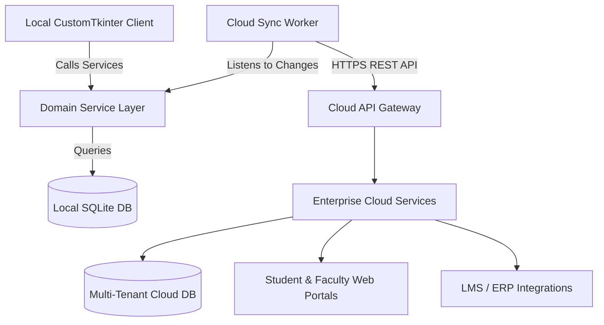
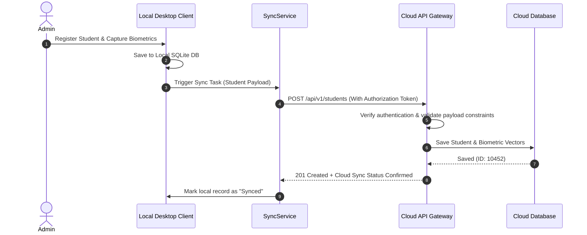

# Future Expansion Plan

## 1. Purpose
The **Future Expansion Plan** outlines how the Student & Faculty Management module will scale to support next-generation features, including multiple campuses, web portals, cloud synchronization, and integrations with Learning Management Systems (LMS) and Enterprise Resource Planning (ERP) platforms.

---

## 2. Overview
The architecture is designed with modular separation in mind. By separating service layers from UI widgets (CustomTkinter) and using standard database foreign keys, the application can scale from a local desktop client to a cloud-connected multi-campus platform.

### Future Architecture Scaling Diagram

---

## 3. Responsibilities
- **Multi-Tenant Isolation**: Partition data by campus or institution to ensure records remain secure across campuses.
- **REST API Readiness**: Standardize service layers so they can be exposed via web services (e.g., FastAPI, Flask) without changing core business logic.
- **Data Synchronization**: Manage data synchronization between offline local clients and cloud databases.

---

## 4. Workflow
The workflow below details how the local database syncs with cloud systems when moving from a local-only to a hybrid cloud setup:

---

## 5. Business Rules
- **Multi-Campus Isolation**: If a `campus_id` is specified, users can only access student, faculty, and schedule records associated with their designated campus.
- **Offline Writes**: Local writes must be saved to the local SQLite database. The sync service queues these records and pushes them when internet access is restored.
- **Biometric Encryption on Transit**: Facial embeddings must be encrypted (e.g., using TLS/SSL and AES-256 payload encryption) during transport to prevent intercepted biometric data from being exposed.

---

## 6. Design Decisions
- **REST API Pathing**: We recommend adopting a clean, versioned REST API pathing standard (e.g., `/api/v1/students`, `/api/v1/faculty`) using Pydantic schemas for data validation. This makes future transitions to web frameworks straightforward.
- **Idempotency Keys**: To prevent duplicate records during sync retries, the sync service generates unique UUID v4 identifiers (`sync_id`) for local writes. The cloud database uses these identifiers to reject duplicate submissions.

---

## 7. Future Improvements
- **ERP Integration Engine**: Design integration patterns to sync records with popular ERP systems (e.g., SAP, Banner) using standard webhook events.
- **LMS Attendance Sync**: Export verified attendance logs directly to Learning Management Systems (e.g., Moodle, Canvas) to automate participation grading.

---

## 8. References to Related Modules
- [Management Overview](file:///c:/GitHub/Attendence-System-Uning-Face-Recognition/docs/management/Management_Overview.md)
- [Department Module](file:///c:/GitHub/Attendence-System-Uning-Face-Recognition/docs/management/Department_Module.md)
- [Service Architecture](file:///c:/GitHub/Attendence-System-Uning-Face-Recognition/docs/management/Service_Architecture.md)
- [Business Rules](file:///c:/GitHub/Attendence-System-Uning-Face-Recognition/docs/management/Business_Rules.md)
