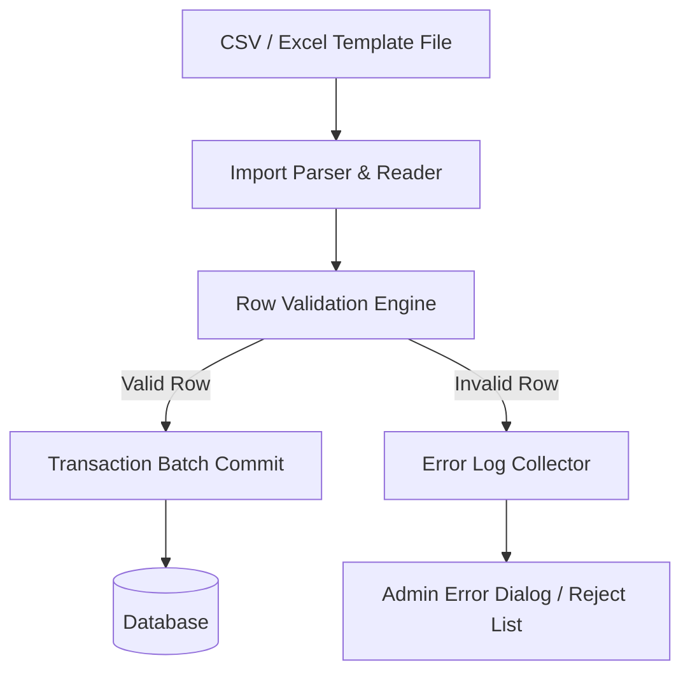
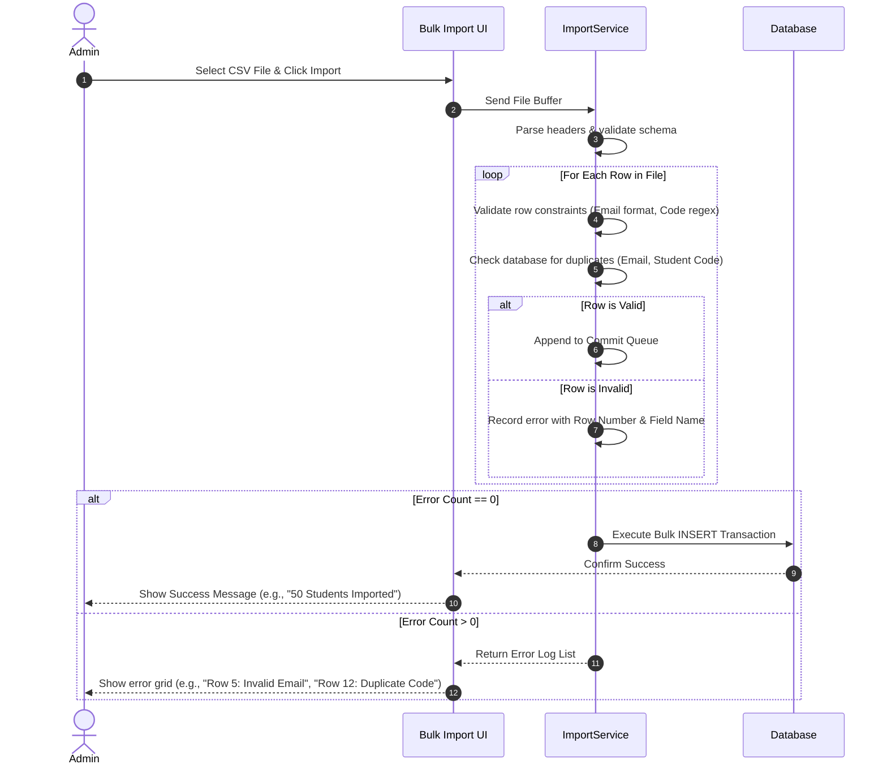

# Import & Export Design

## 1. Purpose
The **Import & Export Module** manages bulk data operations for students and faculty. It supports batch CSV and Excel operations, manages duplicate records, and provides detailed error reporting for administrative data transfers.

---

## 2. Overview
Manual registration of hundreds of students is impractical. Administrators require a bulk import facility. The import module reads, parses, validates, and commits rows of records in transactional batches, while the export engine builds lists for external analysis.

### Data Ingestion Architecture

### Supported Format Layouts

#### Student Import Fields (CSV/Excel Columns)
- `student_code` (Required, String, Unique)
- `first_name` (Required, String)
- `last_name` (Required, String)
- `email` (Required, String, Unique)
- `phone` (Required, String)
- `department_code` (Required, String - mapped to ID)
- `course_code` (Required, String - mapped to ID)
- `batch` (Required, String)
- `gender` (Required, String)
- `date_of_birth` (Required, Date string `YYYY-MM-DD`)
- `guardian_name` (Required, String)
- `guardian_phone` (Required, String)

---

## 3. Responsibilities
- **File Parsing & Decoding**: Safely decode CSV and Excel files, validating character encodings (e.g., UTF-8) and formatting headers.
- **Bulk Registration Validation**: Run validation rules for each row before writing to the database.
- **Transactional Rollback Guard**: Execute bulk imports in isolated database transactions, rolling back changes if a critical structural error occurs.
- **Report Generation**: Export filtered student lists, faculty details, and attendance sheets into CSV, PDF, and Excel formats.

---

## 4. Workflow
The workflow below details how the system processes a bulk student import and handles validation errors:

---

## 5. Business Rules
- **Header Check**: The imported file must contain all required column headers exactly as specified in the template. Missing headers will reject the entire file.
- **Duplicate Detection Rule**: If a row contains a `student_code` or `email` that already exists in the database, the import service flags it as a validation error and halts the import to prevent data corruption.
- **Academic Mapping Rule**: If the `department_code` or `course_code` in a row does not match an existing department or course in the database, the row is rejected.

---

## 6. Design Decisions
- **All-or-Nothing Transaction Policy**: By default, bulk imports use an "All-or-Nothing" transaction policy. If any row contains a critical database conflict or structural error, the entire transaction rolls back. This keeps the database consistent and prevents partial imports.
- **Excel/CSV Template Download**: The system provides downloadable templates for administrators. This reduces header formatting errors and simplifies the import process.

---

## 7. Future Improvements
- **Partial Import Mode**: Allow administrators to choose a "Partial Import" mode where valid rows are saved and invalid rows are exported to a separate rejection CSV file for correction.
- **Asynchronous Background Processing**: Implement background processing for files with more than 500 rows, showing a progress bar to prevent UI freezes.

---

## 8. References to Related Modules
- [Management Overview](file:///c:/GitHub/Attendence-System-Uning-Face-Recognition/docs/management/Management_Overview.md)
- [Student Module](file:///c:/GitHub/Attendence-System-Uning-Face-Recognition/docs/management/Student_Module.md)
- [Data Validation](file:///c:/GitHub/Attendence-System-Uning-Face-Recognition/docs/management/Data_Validation.md)
- [Business Rules](file:///c:/GitHub/Attendence-System-Uning-Face-Recognition/docs/management/Business_Rules.md)
