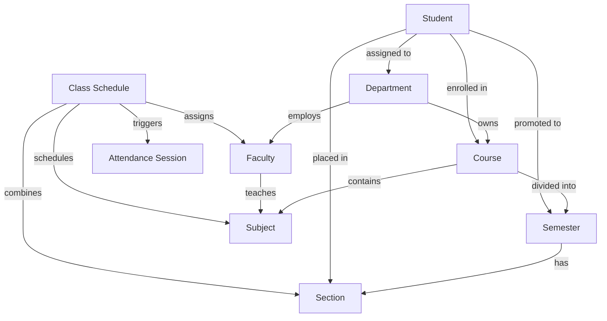
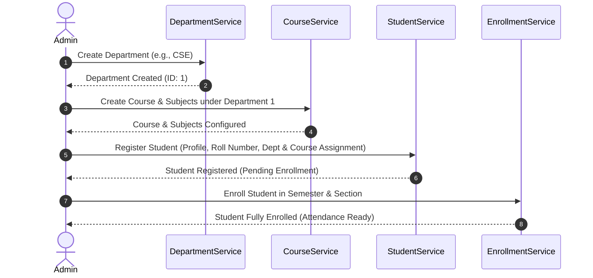

# Student & Faculty Management - Overview

## 1. Purpose
The **Student & Faculty Management** module acts as the core administrative system of the Face Recognition Attendance System. It is responsible for modeling and maintaining institutional structures (departments, courses, semesters, sections, classes) and managing the registration, profiles, and life cycles of both students and faculty. This design documentation acts as a blueprint for implementing the domain models, validation, services, and UI flows in future phases.

---

## 2. Overview
This module integrates with Phase 2 (Database Design) and Phase 3 (Authentication & Authorization) to build a robust domain layer. The core entity relationships form a hierarchical tree:
1. **Departments** own multiple **Courses**.
2. **Courses** are subdivided into academic years, **Semesters**, and cohorts called **Sections**.
3. **Faculty** are assigned to **Departments** and teach individual **Subjects**.
4. **Students** are enrolled in a specific **Course**, **Semester**, and **Section**.
5. **Class Schedules** link **Faculty**, **Subjects**, and **Sections** to concrete slots where attendance sessions occur.

### Entity Relationship Mapping

---

## 3. Responsibilities
- **Organizational Hierarchical Modeling**: Define and persist academic divisions, branches, course schedules, and registration rules.
- **Identity & Life Cycle Operations**: Manage transitions from registration to profile setups, course enrollments, classroom scheduling, transfers, active/inactive statuses, and graduation.
- **Integrity Enforcement**: Ensure data consistency (e.g., preventing duplicate registration numbers, exceeding section capacity limits, or scheduling overlapping classes for a single faculty member).
- **Service Decoupling**: Separate UI presentations from database operations via Domain Services, supporting clean mock testing.

---

## 4. Workflow
The management module coordinates several major workflows. The primary structural workflow starts with institutional setup, followed by personnel onboarding and scheduling, leading to attendance readiness:

---

## 5. Business Rules
- **Structural Integrity**: A course cannot exist without being mapped to a department. A section cannot exist without being associated with a course and a semester.
- **State Validity**: Attendance can only be recorded for students who have an `Active` enrollment status and possess registered face embeddings.
- **Staff Exclusivity**: Faculty assignments to specific subjects must be validated to ensure the teacher belongs to the same department as the subject, or has explicit cross-department permissions.

---

## 6. Design Decisions
- **Anemic Domain Models vs. Rich Domain Models**: Use Rich Services with simple, serialized dataclasses/models. This separation keeps the database layer (SQLAlchemy) clean and lets our Business Logic Services contain all the transaction operations.
- **Extension Fields (Soft Migration)**: Although Phase 2 database schemas were basic, this design plans schema extensions (e.g., emergency contact details, employee designations, active status switches) to meet enterprise compliance standards. These will be added as nullable columns or separate profile metadata tables to avoid breaking backward compatibility.
- **Loose Coupling**: Communication between entities (e.g., Student and Section) is managed through ID references (`course_id`, `section_id`) rather than nested object graphs, making serialization for REST APIs and local database structures clean.

---

## 7. Future Improvements
- **Multi-Campus Isolation**: Prepare database tables for a `campus_id` tenant identifier to partition data across geographical branches.
- **API-First Architecture**: Standardize all service methods to return typed data envelopes (e.g., Pydantic schemas) to allow quick translation into JSON APIs when shifting from CustomTkinter to web frameworks.

---

## 8. References to Related Modules
- [Student Module](file:///c:/GitHub/Attendence-System-Uning-Face-Recognition/docs/management/Student_Module.md)
- [Faculty Module](file:///c:/GitHub/Attendence-System-Uning-Face-Recognition/docs/management/Faculty_Module.md)
- [Department Module](file:///c:/GitHub/Attendence-System-Uning-Face-Recognition/docs/management/Department_Module.md)
- [Course Module](file:///c:/GitHub/Attendence-System-Uning-Face-Recognition/docs/management/Course_Module.md)
- [Enrollment Module](file:///c:/GitHub/Attendence-System-Uning-Face-Recognition/docs/management/Enrollment.md)
- [Business Rules](file:///c:/GitHub/Attendence-System-Uning-Face-Recognition/docs/management/Business_Rules.md)
- [Service Architecture](file:///c:/GitHub/Attendence-System-Uning-Face-Recognition/docs/management/Service_Architecture.md)
