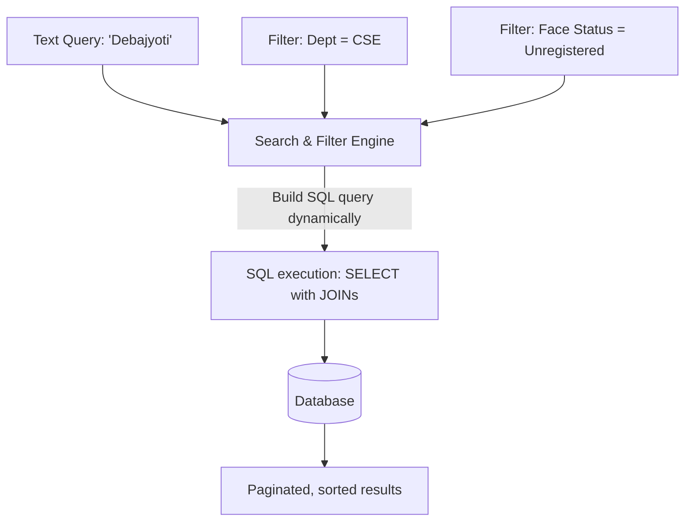
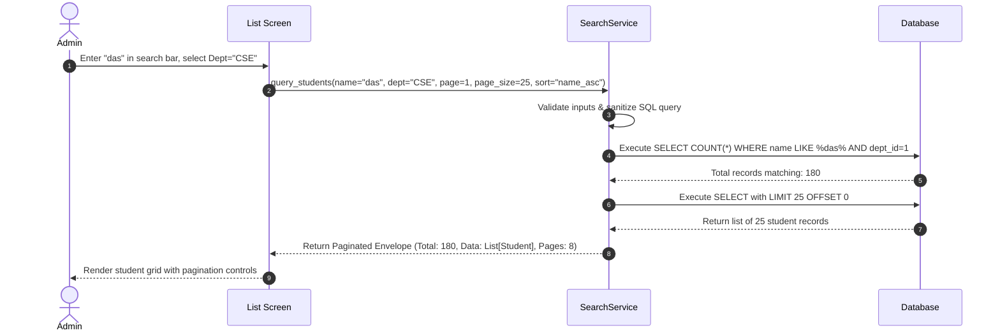

# Search & Filter Design

## 1. Purpose
The **Search & Filter Module** designs search and navigation patterns for student and faculty records. It ensures fast, responsive data lookups, even when handling large institutional databases.

---

## 2. Overview
Administrators and faculty regularly search for records using incomplete criteria. The search engine must support fuzzy matches (e.g., partial name queries) and structured filters (e.g., viewing students in a specific course who lack registered face datasets).

### Multi-Criteria Search System

### Search & Filtering Matrix

| Targeted Entity | Search Fields | Available Filter Criteria | Available Sorting Options |
| :--- | :--- | :--- | :--- |
| **Students** | Name, Roll Number, Student Code, Email | Department, Course, Semester, Section, Academic Status, Face Dataset Status | Name (A-Z, Z-A), Roll Number, Registration Date |
| **Faculty** | Name, Employee Code, Designation, Email | Department, Employment Status, Taught Subject, Role | Name (A-Z), Designation, Joining Date |

---

## 3. Responsibilities
- **Dynamic SQL Query Construction**: Build SQL queries dynamically based on active search parameters to avoid running excessive nested database scans.
- **Pagination Strategy**: Enforce paginated results (e.g., 25 or 50 items per page) to optimize rendering speed in GUI views.
- **Biometric Filtering**: Provide immediate filters for facial recognition statuses, helping administrators quickly identify records that lack biometric data.

---

## 4. Workflow
The workflow below details how the search service processes queries and returns sorted, paginated results to the user interface:

---

## 5. Business Rules
- **Sanitized Search Inputs**: All search string queries must be stripped of punctuation and SQL/script characters to prevent SQL injection risks.
- **Default Result Set**: If no search or filter criteria are specified, the system displays all active records, sorted alphabetically by name.
- **Pagination Bounds**: The UI must restrict page size parameters to a selection of 10, 25, 50, or 100 rows.

---

## 6. Design Decisions
- **Dynamic Query Building (SQLAlchemy Core)**: Use SQLAlchemy's generative query constructor (`query.filter()`) to build search queries dynamically. This keeps database calls clean and avoids complex raw SQL formatting in Python.
- **Composite Index Alignment**: To keep search latency low, we recommend composite database indexes on columns frequently queried together, such as `students(last_name, first_name)` and `students(course_id, is_active)`.

---

## 7. Future Improvements
- **Fuzzy Name Matching**: Implement fuzzy string matching (e.g., using Levenshtein distance or trigram indexes in PostgreSQL) to support searches that contain typos.
- **Saved Searches**: Allow administrators to save frequent filter combinations (e.g., "Active CSE Students missing biometrics") as quick-access dashboard shortcuts.

---

## 8. References to Related Modules
- [Management Overview](file:///c:/GitHub/Attendence-System-Uning-Face-Recognition/docs/management/Management_Overview.md)
- [Student Module](file:///c:/GitHub/Attendence-System-Uning-Face-Recognition/docs/management/Student_Module.md)
- [Faculty Module](file:///c:/GitHub/Attendence-System-Uning-Face-Recognition/docs/management/Faculty_Module.md)
- [UI Planning](file:///c:/GitHub/Attendence-System-Uning-Face-Recognition/docs/management/UI_Planning.md)
