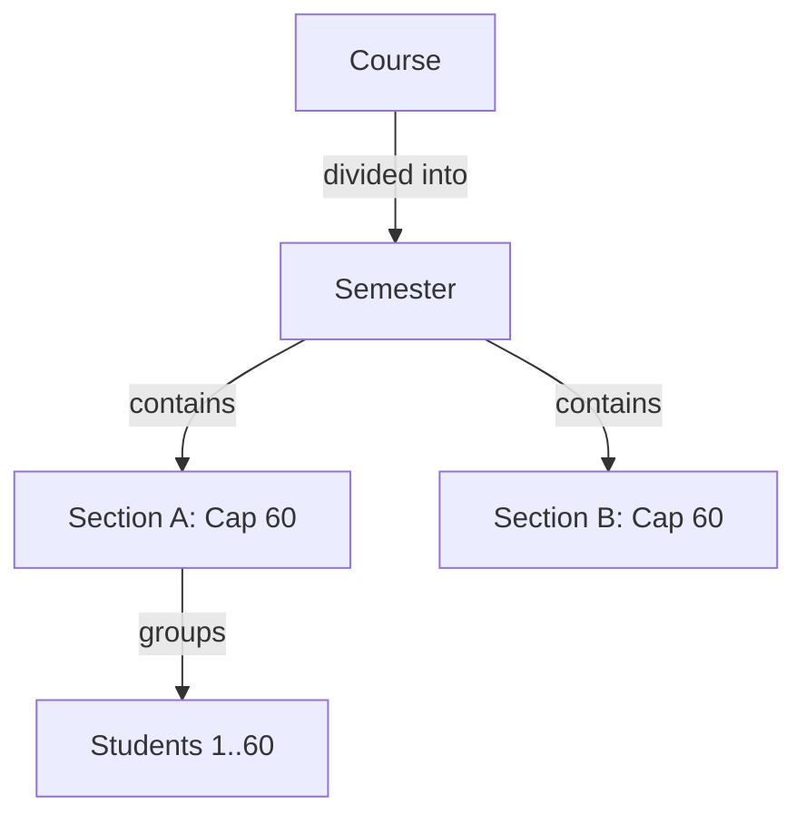
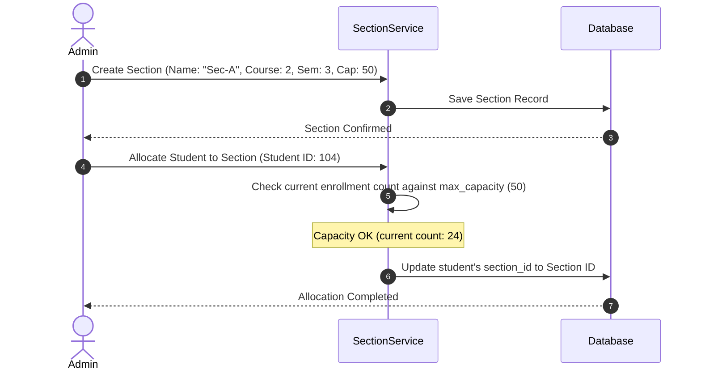

# Section Module Design

## 1. Purpose
The **Section Module** defines the physical or logical cohorts of students within a course and semester (e.g., Section A, Section B). It manages student counts, enforces classroom capacity limits, and provides the grouping structure required to generate timetables and collect class-level attendance records.

---

## 2. Overview
Sections segment large student cohorts into manageable classroom sizes. This makes it easier to assign faculty and schedules, and keeps face recognition camera ranges within practical sizes.

### Hierarchical Relation

### Table Schema Expansion Plans
The `sections` configuration contains the following relational properties:

| Column Name | Type | Constraints | Description & Justification |
| :--- | :--- | :--- | :--- |
| `id` | INTEGER | PK, Auto-increment | Primary key. |
| `name` | VARCHAR(20) | NOT NULL | Section name (e.g., "Section A", "Sec-1"). |
| `course_id` | INTEGER | FK -> `courses(id)` | Bridges the section to its course. |
| `semester_id` | INTEGER | FK -> `semesters(id)` | Bridges the section to its active academic term. |
| `max_capacity` | INTEGER | DEFAULT 60 | Maximum student count limit. |
| `room_number` | VARCHAR(50) | NULLABLE | Default classroom room code. |
| `is_active` | BOOLEAN | DEFAULT TRUE | Allows soft-disabling of sections. |

---

## 3. Responsibilities
- **Cohort Grouping**: Group students for scheduling and attendance reports.
- **Capacity Control**: Enforce class capacity limits during student enrollment and transfer processes.
- **Timetable Mapping**: Act as the target entity for timetables, ensuring all students in a section share the same schedule.

---

## 4. Workflow
The workflow for creating a section and enrolling students within it is shown below:

---

## 5. Business Rules
- **Capacity Constraint**: A student cannot be allocated to a section if its current student count matches or exceeds `max_capacity`.
- **Course Alignment**: A student can only be assigned to a section that belongs to the same `course_id` as the student's registered course.
- **Section Exclusivity**: A student can only belong to one active section per semester.

---

## 6. Design Decisions
- **Unified Cohort Groups**: Rather than mapping students directly to courses, students are mapped to sections. This ensures that attendance tracking, timetabling, and reports remain focused on the actual classroom group.
- **Configurable Class Limits**: Keeping `max_capacity` as a database column allows administrators to adjust limits for individual classrooms without changing global variables or code configuration.

---

## 7. Future Improvements
- **Automated Balancing**: Create a utility that automatically balances student enrollment lists across available sections (e.g., dividing 100 students into two sections of 50).
- **Sub-section divisions**: Plan for sub-sections (e.g., Lab Batches like A1, A2) to handle split practical classes.

---

## 8. References to Related Modules
- [Management Overview](file:///c:/GitHub/Attendence-System-Uning-Face-Recognition/docs/management/Management_Overview.md)
- [Student Module](file:///c:/GitHub/Attendence-System-Uning-Face-Recognition/docs/management/Student_Module.md)
- [Course Module](file:///c:/GitHub/Attendence-System-Uning-Face-Recognition/docs/management/Course_Module.md)
- [Enrollment Module](file:///c:/GitHub/Attendence-System-Uning-Face-Recognition/docs/management/Enrollment.md)
